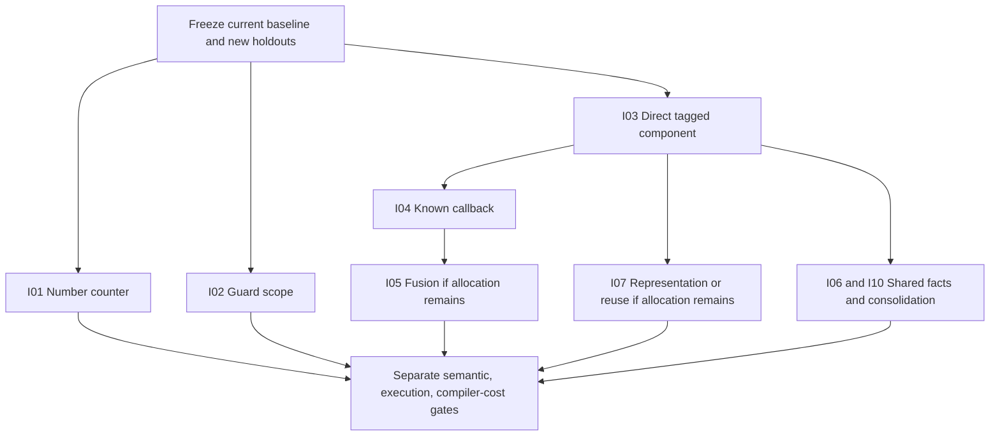

# Mined ideas: gains, risks and order of investigation

These are research conclusions, not implemented improvements. Execution
estimates are **incremental versus installed Phase37**, except explicitly named
controls such as I05's direct unfused worker. They are conditional on eligibility
for the stated workload, and are planning ranges, not statistical confidence
intervals. Null results and regressions remain possible. Read the
[estimate contract](method.md) and [baseline](baseline.md) before using the numbers.

## Priority table

| ID | Idea and literature connection | Gain to investigate | Evidence confidence | Main risk | First probe / production effort |
| --- | --- | --- | --- | --- | --- |
| I01 | Extend existing private Number countdown; TS representation lesson | **1.1–1.5× numeric recurrence** | Medium: exact remaining source pattern, no isolated timing yet | Low/medium: Nat bounds, escaping predecessor, error timing | 1–3 h / about 1 day |
| I02 | One useful proof scope across more closed work; worker/wrapper and JS speculation | **1.15–1.5× active ray** | Medium: guard CPU/counters measured | Medium/high: mutation and reentry; tiny scopes already regressed | 2–4 h / 1–3 days |
| I03 | Direct worker for a recursive component; TS, MLton, GHC, Chez | **1.5–2.5× tree**; transfer to map/BST/lexer unquantified | Medium on tree prototype; low on transfer | Medium/high: demand, saturation, non-tail recursion, sharing | Half day / 3–7 days |
| I04 | Specialize known callbacks/invariant environments; Flambda/MLton | **1.5–3× selected list/closure workloads** | Low/medium: generic traffic measured, no isolated final prototype | Medium/high: captured values, demand/order, clone explosion | Half–1 day / 2–5 days |
| I05 | Fuse proved list producer/consumer after direct-call baseline; stream fusion/join points | **1.2–2× over a direct unfused list worker**, not over current plus I04 | Low: intermediate work not yet isolated | High: demand, termination, sharing, callback order, code growth | 1 day / 3–7 days |
| I06 | Share bounded component facts and request-local analysis; Zig/Flambda/Cranelift | **0–6% checked-request time reduction target** initially | Low: observed added cost, cause not attributed | Medium: stale/context-dependent facts, memory growth | 2–4 h counters / 1–3 days |
| I07 | Eliminate surviving private containers, then consider reuse; MLton/Lean/Koka | **1.1–1.5× on an allocation-bound eligible component** | Low until post-worker allocation profile | High for reuse; medium for existing destination mechanism | Half day / 2–7 days depending proof |
| I08 | Simplify literal materialization inside valid regions; TS/JIT shape | **0–15% numeric time reduction target** | Low: visible decoding, attribution incomplete | Medium: F32 bits, DataView mutation and hook timing | 1–3 h / 1–2 days |
| I09 | Remove repeated representation transitions on a hot map/lexer path; typed specialization | **1.2–2× affected path as a screening hypothesis**, whole-program gain unknown | Low: hot transition must first be counted | Medium/high: words/strings, Unicode, constructor identity, BigInt boundary | Half–1 day / 3–7 days |
| I10 | Consolidate admission and worker lowering into one bounded summary | **5–15% of JS-backend lines as an exploratory deletion target**, no direct runtime promise | Low until duplication inventory | Medium: abstraction can conceal different proofs | 1 day inventory / several days staged migration |
| I11 | Small offline validated rewrite catalog; Cranelift/Alive2/Souper | **0–10% on selected scalar regions** as a speculative ceiling to test | Low: arithmetic is not current dominant overhead | Medium/high: JS coercion, U32/Nat/F32 semantics | 1 day rule discovery / 2–5 days narrow integration |
| I12 | JIT/code-size diagnostics and dead private branch pruning | **0–5% time-recovery target** on affected cases, may be zero | Low: Phase37 list regression is unexplained | Low correctness for truly dead private code; medium performance unpredictability | 2–4 h / 1–2 days |

The narrow I04 effort is additional integration after suitable I03 component,
purity and lifetime machinery exists. It concerns one known callback signature
with dynamic scalar captures and no escaping or recursive environment. Current
JPure excludes function parameters/fields, so this is a real admission change.
The [Flambda study](research/ocaml-flambda.md) assigns **1–3 weeks** to
the broader higher-order component, versus 2–5 days for a bounded first subset.
The synthesis deliberately uses narrower scopes than some chapters' exploratory
upper ranges. I02 is scope amortization; the [JS-engine study](research/js-engines.md)
separately estimates smaller gains for reducing guard requirements. These are
different experiments, not conflicting measurements.

Similarly, I07's short reuse estimate requires one already-private surviving
object with an established lifetime; it excludes a new arena, recursive builder
or general materialization analysis. The broader [Lean proposal](research/lean.md)
allows weeks for those additional obligations. Neither is justified before
direct-call and allocation-elimination experiments.

Hours/days are focused engineering estimates, not benchmark duration. Ordinary
screens remain 20/60 seconds after module acquisition. Larger integration takes
longer and includes semantics, compilation cost, memory and holdouts. The full
45-point suite is currently about 17.6 minutes across bounded chunks.

## Best architectural bet: I03

The strongest cross-compiler result is agreement about **preserving knowledge
across calls**. Our list/tree profiles still pay `apply`, `force`, argument-array,
matcher and wrapper costs. The TS backend proves enough at compile time to emit
direct functions and tail loops. MLton discovers finite function sets; Flambda
specializes known closures; GHC uses demand and worker/wrapper; Chez separates
direct-call and recursive-component facts. These are related solutions to the
same repeated runtime questions.

Use the existing public interface as a wrapper around one proved direct
component. Initially retain tagged objects, arithmetic and algorithm. Change
only saturated internal calls and control transfers. This is the best way to
test whether a reusable abstraction can replace today's narrow special cases.

The saved tree experiment makes this more credible than an untested whole
backend rewrite. Its 2.60–3.56× result used Phase36 as denominator; the same-run
component/finite comparison was about 1.96–2.69×. Our **1.5–2.5× current-tree
range is a forecast**, not a re-labeled historical measurement. Even a 2× gain
would leave a roughly 30× tree gap; it is one architectural step, not parity.

## Best cheap tests: I01 and I02

I01 reuses an existing private Number-counter proof, which is currently limited
to vector loops. The scalar numeric recurrence offers a precise admission gap.
This is less risky than a whole-program Nat representation change and should be
easy to reject if clean timing does not improve.

I02 targets real guard cost, but cannot cache “the host is unchanged” across
arbitrary public calls. V8/JSC have VM-owned invalidation; generated JS does not.
Try a larger synchronous closed scope with no callback opportunity, while keeping
entry/error guards. Dependence-specific guard reduction is a later separate
experiment, because generic residual code may use more protocols than source
operations suggest. Active-ray guard CPU's idealized 1.72× ceiling makes
1.15–1.5× a plausible test range; it does not guarantee sound admission.

Numeric's final private loop already pays one outer guard, so there is no
established nested-scope saving there. For numeric, reducing the sufficient guard
requirements is a separate **1.03–1.2×**, low-confidence hypothesis with roughly
3–7 days of dependency/control work. Never amortize guards across independent
public benchmark calls; the host can change between them.

## Best higher-order bet: I04 before I05

On lists, direct known callbacks can remove dispatch without changing collection
semantics or eliminating intermediate data. That is an easier causal comparison
than fusion. Freeze the callback identity and its environment in the component,
remove only invariant callback parameters from recursive worker calls, and cap
clones. Unknown callbacks retain the generic implementation.

If that wins, measure surviving list construction and then test fusion. The
1.2–2× fusion estimate is against the **new direct unfused variant**. It cannot
be multiplied with I04 as a promised combined result; subsequent profiles may
show there is little left to remove. Source purity alone does not preserve the
timing of host-visible demand, errors or closures.

## Simplicity and compilation are first-class outcomes

I06/I10 should make one set of bounded facts serve emission, refusal diagnostics
and cost estimation. Do not add a large generic optimizer that every experiment
must understand. Start with duplication counters and a behavior-preserving
refactor; newly admitted optimizations come separately.

The line target is **217–652 lines of the 4,345-line JS backend**, if the inventory
finds actual duplication. It is only about 1.2–3.6% of the whole 18,358-line Bend
compiler. This research provides no basis for a 50% compiler reduction while
preserving its current compatibility surface. A shared summary might initially
add lines; it counts as simplification only when obsolete paths are removed.

The 0–6% request-cost target asks whether Phase37's measured overhead can be
recovered. It is not an attribution of that overhead to a particular analysis.
No whole-selfhost or warm-server speed estimate follows from three small sources.

## Deferred approaches and why

| Approach | Why it is deferred | What would change the decision |
| --- | --- | --- |
| General equality saturation / new optimizing IR | Arithmetic rewrites do not yet address dominant generic boundaries; compile cost and maintenance substantial | Two winning experiments cannot be expressed cleanly with bounded current plans |
| Replace JS with native/Wasm backend | New ABI/runtime/IO/memory work; no transferable runtime multiplier | Direct JS plateaus with measured engine-specific limits on representative workloads |
| Global RC, arenas or pooling | JS does not expose unique ownership; reuse can increase retained memory | A bounded private lifetime experiment wins beyond allocation elimination |
| Freeze public descriptors or remove host guards | Changes existing behavior and would invalidate compatibility controls | An explicitly separate future API contract, outside this phase |
| Global Nat-to-Number migration | Large coercion/overflow/host boundary surface | Several narrow proved Number islands demonstrate reusable semantics and material gains |
| Broad inlining or specialization by benchmark name | Prior regressions and code growth; poor transfer | General profitability rule validated on independent families and fresh holdouts |
| Parallel benchmark/compiler jobs | Memory contention and previous OOM risk distort iteration | Separate proven memory budget and isolated resources; not needed for these probes |

No credible positive speed estimate is assigned to these deferred rewrites.
Inventing a multiplier would be less useful than stating the missing experiment.

Two enabling projects remain separate from the execution ranking. The
[Zig/Rust query study](research/zig.md) gives a low-confidence **1.5–5× warm edit
request** hypothesis if most modules can be reused, with roughly 1–3 weeks of
invalidation work; cold requests may worsen. It needs an edit trace and measured
reusable fraction first. A [small translation checker and adversarial generator](research/compiler-engineering.md)
could improve failure detection, but has no defensible runtime multiplier or
known count of conformance failures it would fix.

## Overlap and recommended order

The graph expresses dependencies, not permission to run heavy jobs concurrently.
Run target jobs serially. I08/I09/I11/I12 are conditional probes selected by
fresh counts, not a mandate to implement every idea. Preserve rejected variants.
Choose an architectural change only after at least two independent components
show the same missing fact; then delete superseded machinery deliberately.

None of the proposals claims to fix existing nonconformance. Better boundaries
and full-value tests should reduce optimization bugs, while remaining backend,
native/GPU and proof-kernel gaps continue to have separate owners and evidence.
