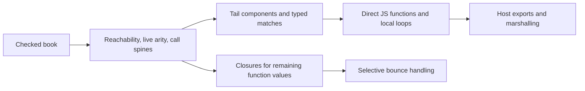

# Bend2's TypeScript backend: the closest architectural reference

This chapter studies **the Bend compiler implemented in TypeScript**, not
Microsoft's TypeScript compiler. Reference commit:
`018751270e800bc222a93dad7f257083ee53a5f7`, after Bend 2.0.34.
Inspected locally on 2026-10-01; no upstream update was performed.

## Sources and scope

- [Pinned comp.ts](https://github.com/bendlang/bend/blob/018751270e800bc222a93dad7f257083ee53a5f7/bend2/comp.ts),
  SHA256 `3bd7ed49d33f1c61334d75a905e38c0345fb15a10b45d85884b77f49833dc5ee`.
  The browser could not fetch this permalink; the exact pinned local checkout
  was read directly. Local path: `selfhost/.bootstrap/upstream-phase23/bend2/comp.ts`.
- [Selfhost emitter](../../../selfhost/src/back/js/emit.bend),
  [private regions](../../../selfhost/src/back/js/region.bend),
  [purity analysis](../../../selfhost/src/back/js/jpure.bend),
  [runtime](../../../selfhost/src/runtime/js/core.mjs).
- Exact numeric/tree outputs and hashes are in the
  [research input manifest](../../../implementation/phase38/local-source-identities.json).
  Measurements come from [Phase37 profiles](../../../implementation/phase37/profile-findings.md)
  and [execution](../../../implementation/phase37/execution/report.md).

This is a static comparison against a frozen version. The TS implementation
has its own limitations and bugs; passing the same outputs does not prove all
public compatibility contracts, and its current development branch was not used.

## The pipeline explains the short emitter

`file_book` (1386) discovers reachable definitions and types. `fun_of` (1253)
derives live arity/layout from checked definitions, including lambdas exposed
under all arms. `term_spine` (738) recognizes saturated calls after erasure;
`call_eta` (781) handles missing arguments. `loop_of` (1312) groups tail cycles.
The JS emitter consumes those facts, then `js_lib` resolves which calls may
need `run_loop`. Host wrappers marshal values at export boundaries.

The direct-emission routines are `js_call` (3060), `js_expr` (3115),
`js_func` (3176), `js_match` (3216), `js_def` (3257), `js_marshal` (3303),
and `js_host` (3360). Shared analysis and native templates precede this section;
runtime helpers follow it. The C compiler's iterative ownership/layout analysis
is not evidence that JS uses an identical multipass optimization pipeline.

## Calls and control flow

The key contrast is where uncertainty is paid. A known saturated TS call is a
named JS call; a match can read its constructor tag and named fields directly.
Tail cycles use local loop state and a program counter. Fresh bindings inside
each loop turn preserve captures. Closure tail calls may still bounce, and the
emitter marks call sites before deciding whether their result needs forcing.

Our generic path uses a descriptor containing arity, code, environment and
bound arguments. `apply` handles saturation, `invokeExact` handles guarded
entry, `force` handles bounce/build messages, and matchers project fields.
These are useful semantic services, but repeated use inside a statically known
recursive component is expensive. A tag-only dispatch rewrite does not remove
all of those layers.

**Transfer:** calculate one component's known saturated edges, leaving its
public descriptor intact. Emit direct private calls on admitted edges and use
the existing loop/frame machinery for recursive transfers. Preserve generic
calls at unknown or host-visible boundaries. Initially keep the same tagged
data layout so the experiment isolates calls/control flow from representation.

**Obligation:** pure source is insufficient to bypass a mutable public code
property or observe a getter earlier. The private component must have a valid
entry proof covering all dependencies, canonical input/data provenance and no
unmodeled callback escape. Tail recursion must not become JS stack recursion.
Non-tail recursion needs its existing stack contract or an explicit frame plan.

## Numeric recurrence: a concrete code comparison

The TS output has a three-slot Number loop. Each iteration performs the F32
roundings, U32 arithmetic and one Number decrement. The installed Bend output
already has a private loop and direct F32-to-U32 conversion, but its countdown
still executes `BigInt` subtraction. It also emits F32 constants through
`bitsFloat`, using the shared DataView, and pays entry validation.

These are three distinct hypotheses: counter representation, literal decoding,
and sufficient-entry-guard reduction. The numeric loop already pays one outer
guard; combining these changes in one prototype would hide causality.
The BigInt difference is visible in source, but the allocation profile does not
prove that all private-loop allocation is BigInt allocation.

The existing `j_region_number_counter` at region.bend:781 already proves a
restricted private vector-loop predecessor. Extending that proof to this scalar
recurrence is much smaller than globally changing Nat. Keep the public BigInt
representation, conversion at a proved boundary, the exact private 48-bit
admission bound, broader public-input fallback and error timing. A source
counter used in stores, arithmetic, closures or results needs
separate reasoning and should initially refuse.

Planning range: **1.1–1.5× numeric**, medium confidence, low-to-medium risk;
1–3 hours for a saved-output discriminator, about one day for a narrow admitted
rule and controls. Literal decoding is a separate **0–15% runtime reduction
target**, low confidence, not an additional promised gain. Any hoisting must
preserve bit identity and mutable DataView observations outside valid proofs.

## Representation is already specialized upstream

TS native templates represent several source primitives with host values.
Nat travels as Number internally; `nat_host` and `js_marshal` mediate the host
interface, while operation checks enforce their own bounds. This is not a
license to equate every accepted host input with a 48-bit primitive value.
Ordinary ADTs use tagged objects with named fields; functions have direct
known-call paths and separate closure machinery.

Our generic Nat uses BigInt and generic constructors often carry an `a` field
array. Existing private regions already use scalars and local slots in some
cases. First identify where representation changes add something beyond the
direct-call experiment; do not assume object layout alone explains a 60× gap.
Public objects, identity and mutation observations constrain replacement.

The stronger architectural idea is **boundary normalization plus a direct
private interior**. Start with one admitted component and preserve original
objects where needed. A whole-program representation migration is high risk,
would require extensive marshalling/alias/error controls, and has no supported
suite-wide speed forecast yet.

## Actual generated sizes

| Complete generated module | TS bytes | Installed Bend bytes | Interpretation |
| --- | ---: | ---: | --- |
| Numeric recurrence | 4,699 | 79,384 | Runtime + fallback dominate size; not executed instruction counts |
| Tree bitonic | 10,593 | 91,332 | Direct TS recursion versus guarded and generic Bend paths |

These files have 196/768 and 367/804 physical lines respectively, but formatting
differs radically. Byte counts are more informative than emitted line counts;
neither predicts dynamic cost without profiles. Tree still allocates much more
under our compiler even after finite-selector improvements.

Pinned comp.ts has 6,468 lines across multiple targets and shared analysis.
The small JS-specific section cannot fairly be compared with the entire
18,358-line selfhost frontend, checking, backends and optimization proofs.
The lesson is to share facts and boundaries, not to copy an arbitrary LOC target.

## What to test next

| Experiment | Falsifiable observation | Planning range / risk |
| --- | --- | --- |
| Extend private Number countdown | Same loop/results, fewer loop allocations, faster clean run | 1.1–1.5× numeric; low/medium |
| Direct recursive worker group | Generic application counts fall within unchanged tagged representation | 1.5–2.5× tree; medium/high |
| Known-callback direct worker | Callback identity fixed once, no repeated generic apply | 1.5–3× selected list/closure cases; medium/high, low confidence |
| Selective forcing by component fact | Only genuinely bouncing results enter force | No standalone estimate before counts; overlaps workers |
| Private literal decoding | Decoding count falls with identical F32 behavior | 0–15% time reduction target on numeric; medium, low confidence |

The worker estimates are conditional and overlap specialization/guard savings.
There is no evidence yet for map/BST/lexer transfer, or for TypeScript parity.
The smallest useful experiment compares unchanged output, direct tagged worker,
and only then specialized representation. Add complete results and adversarial
host controls before calling the result a compiler optimization.

## Simplicity and conformance

A shared component summary could replace repeated helper discovery and several
independent admission walks. It should carry only facts emission consumes:
live arity, known dependency identity, input/result shape, demand and tail edges.
Our proof/fallback obligations remain explicit; deleting them to resemble the
short TS output would change functionality.

Conformance gains are indirect: one source of truth for erased arity, recursive
transfer and constructor layout can prevent disagreement between emitters.
No current failing backend test is claimed fixed by this research. Before any
consolidation, enumerate existing owner controls and prove which old paths the
new summary replaces; measure source, concepts and checked request cost.
