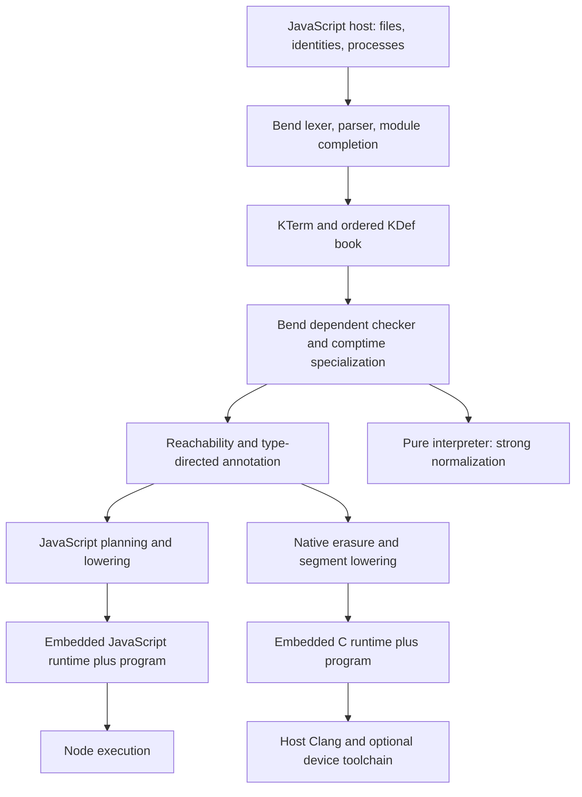

# Compiler architecture: source survey

This survey describes the compiler written in Bend at repository snapshot
`55e5b79dc9ac3e02436a712e34722f2eb519e5df`, inspected on **2026-10-04**.
The selected, installed release is **Phase45 worker23**, targeting upstream
`018751270e800bc222a93dad7f257083ee53a5f7`, after Bend `2.0.34`.
It is a source survey, not a new benchmark or conformance run.

The executable architecture is defined by
[`selfhost/src/compiler.json`](../../selfhost/src/compiler.json), its 85 modules,
the host driver, and the embedded runtimes. In particular,
`selfhost/src/compiler.bend` is **not in the manifest**; the old monolithic file
and its introductory comments do not describe today's compilation boundary.

For detailed JavaScript node contracts and mutation witnesses, use the existing
[JavaScript IR guide](../../selfhost/docs/JAVASCRIPT_IR.md). The companion
[optimization inventory](optimization-inventory.md) distinguishes implemented
passes, specialized lowering, missing general analyses, and unselected experiments.

## End-to-end ownership

[`inspectWithMemo`](../../selfhost/tools/typed-driver.mjs) is the host coordinator.
It requests Bend-owned loading/checking/annotation/emission through a generated
API. JavaScript supplies file bytes, cache integrity checks, foreign-source bytes,
runtime text, and process/toolchain execution. The installed path does not call
the TypeScript compiler to decide how to compile each user program.

The boundary is deliberately broader than “all JavaScript is a runtime.”
`discoverSources` performs physical filesystem discovery and invokes contextual
Bend loader queries; `convertCompilerAbi` marshals the generated compiler API;
the driver chooses CLI modes and assembles output. Parsing, name resolution,
checking, specialization, and emitter decisions live in manifest Bend modules.

## Source loading and frontend

The loader accepts `FSource`, `FCompletedSource`, and `FLocatedSource` values.
`f_source_header` discovers imports; `f_complete_source` completes a source
against its prior imported context; `FLoadTrace` retains exact source snapshots
for diagnostics. Namespace/alias resolution and graph validation are Bend code
in [`load/modules.bend`](../../selfhost/src/load/modules.bend),
[`load/graph.bend`](../../selfhost/src/load/graph.bend), and
[`load/imports.bend`](../../selfhost/src/load/imports.bend).

The physical host traversal does not replace those semantic checks. A parsed
source can be handed back within an invocation through `FCompletedSource`;
`f_complete_seed` separately binds a cached Base book to its exact path/text.
The host's Base-cache key includes compiler and Base identities and validates
source spans and literal payloads before reuse.

The frontend is split by operation:

| Layer | Source and central responsibility |
| --- | --- |
| Tokenization | [`lexer.bend`](../../selfhost/src/front/lexer.bend): cursor, indentation, source offsets and token production. |
| Context-sensitive parsing | [`parser.bend`](../../selfhost/src/front/parser.bend), [`contextual.bend`](../../selfhost/src/front/contextual.bend), [`declarations.bend`](../../selfhost/src/front/declarations.bend): expressions/declarations and the imported declaration scope. |
| Elaboration | [`elaborate.bend`](../../selfhost/src/front/elaborate.bend): names, literals, ordered pattern matrices; [`flatten.bend`](../../selfhost/src/front/flatten.bend): source forms into core structure. |
| Surface features | [`sugar.bend`](../../selfhost/src/front/sugar.bend), [`literals_arrays.bend`](../../selfhost/src/front/literals_arrays.bend), [`parallel.bend`](../../selfhost/src/front/parallel.bend), [`unicode.bend`](../../selfhost/src/front/unicode.bend). |
| Binder and family integrity | [`fresh_work.bend`](../../selfhost/src/front/fresh_work.bend), [`freshen.bend`](../../selfhost/src/front/freshen.bend), [`families.bend`](../../selfhost/src/front/families.bend), [`validate.bend`](../../selfhost/src/front/validate.bend). |

This is not a permanently retained concrete syntax tree followed by a generic
optimization IR. Much of the frontend and elaborated representation uses the
same flexible core node family with string tags and source spans.

## Checked core, normalization, and specialization

[`core/term.bend`](../../selfhost/src/core/term.bend) defines `KTerm`, `KLambda`,
`KLiteral`, and `KDef`. Binder identities are numeric and freshened; quantities
distinguish erased, affine, and unrestricted use. `KLiteral` compactly stores
U32-sized literal payloads and strings. This storage fact does not mean runtime
Nat is only 32-bit: larger values can be computed or constructed.

`KDef` carries a name, declaration kind, arity, template count, type, value,
constructor/metadata children, and native/unsafe provenance. Ordered definition
events are retained for language semantics. `book_context` and the
[`persistent index`](../../selfhost/src/core/index.bend) add exact-name lookup:
a compressed binary hash trie with exact comparison in collision buckets.
The index accelerates a book; it does not change declaration order.

[`check/kernel.bend`](../../selfhost/src/check/kernel.bend) implements
bidirectional dependent inference/checking. `KChecking` returns the checked term,
type, quantity uses, error, world, and consumed arguments; errors are explicit
values. [`quantity.bend`](../../selfhost/src/check/quantity.bend) supplies use
accounting. [`diagnostic/produce.bend`](../../selfhost/src/diagnostic/produce.bend)
drives ordered checking through `dg_check_world` and `dg_check_events` while
retaining diagnostic context.

Comptime specialization is integrated with checking, rather than an arbitrary
late inliner. [`sp_live_args`/`sp_live_memo`](../../selfhost/src/check/specialize.bend)
key instances, freshen binders, check an instance before publishing it, and reject
unbounded/growing instantiation. Limits include 64 nesting levels and a bounded
key size. `sp_assembled` returns the checked canonical book.

The current ABI-2 driver calls
[`check_program_diagnostic`](../../selfhost/src/driver/api.bend), which calls
`dg_check_world(book)` and then `sp_assembled`. Its `validated` parameter is not
used to skip that check. Older exact-prefix APIs and a validated Base cache still
exist; their presence is not evidence that the current ABI-2 path skips checking
the Base prefix. This distinction matters when discussing compiler costs.

Normalization has separate purposes:

- [`wnf`](../../selfhost/src/core/normalize.bend) performs weak-head evaluation
  for checking, conversion, and type queries. Definitions without native
  equations remain opaque.
- `compare`/`norm_compare` first try structural equality, then definitional
  conversion with fresh binder bounds.
- `strong` calls [`graph_strong`](../../selfhost/src/core/graph.bend): shared
  cells in a persistent memo heap avoid copying argument payloads during
  substitution; evaluator frames make demand explicit.
- [`driver_interpret`](../../selfhost/src/driver/api.bend) normalizes and prints
  a pure `main`. IO interpretation instead uses generated execution.

These type-theoretic reductions are not a general generated-code optimizer.
Normalizing a type or comptime argument does not automatically optimize every
runtime function with equivalent beta/constructor rewrites.

After checking, [`reach_book`](../../selfhost/src/core/reach.bend) retains value
references, types, constructor telescopes, and parents. Executable roots start
at `main`; library roots include eligible user definitions. Backend intrinsic
stops retain declarations/types while avoiding replacement bodies. Only then
does [`annotate_selected`](../../selfhost/src/check/annotate.bend) reconstruct
backend type annotations in the original context without repeating validation.

The driver reports `typeAccepted`, `proofTrust`, and `kernelChecked` separately.
Its [`driver_report`](../../selfhost/src/driver/report.bend) traces unsafe/foreign
dependencies; the JavaScript host explicitly reports `kernelChecked:false`.
This report is not an independent Lean/BendTT verification of the compiler.

## JavaScript planning and the two IR domains

[`j_program_selected`/`j_library_selected`](../../selfhost/src/back/js/emit.bend)
first install `j_plan_context`. [`jpure.bend`](../../selfhost/src/back/js/jpure.bend)
caches direct/component proof results in indexed `KDef` metadata. Existing
`JRegion`, `JRootPlan`, `J*` core tags, specialized emitters, and typed IR coexist;
there is no single unified middle end through which every optimization passes.

Legacy regions already perform bounded private-helper inlining through
`j_region_inline_defs` (depth 8, shared 2,048-visit budget). `JInline`,
`JInlineRead`, and `JVirtual` also support narrowly proved projection/vector
forwarding. These capabilities predate JW; their existence does not supply a
general JW inliner or aggregate escape analysis.

Root selection is ordered in `j_l_def` and its helpers:

1. A proved Nat loop worker.
2. A proved tree worker.
3. A supported callback root.
4. A strong scalar-region plan: complete fusion or successfully proved compact
   lowering has priority.
5. A complete contextual/monomorphic private instance graph.
6. A weaker scalar region, U32 worker, finite worker, projection, or ordinary
   emission fallback.

Consequently, admission by one recognizer does not imply the newest worker
backend is selected. Strong older paths remain valuable. “Ordinary fallback” is
also functional compiler output, not a compilation failure.

### Ordinary expression IR: JIR

[`ir/model.bend`](../../selfhost/src/back/js/ir/model.bend) represents locals,
global loads, literals, constructors, primitive calls, applications, parallel
lets, lambdas, matcher construction, and choice. It also has explicit
`JIRLegacy` and `JIRCallPlan` adapters retaining core terms and type environments.

[`j_expr`](../../selfhost/src/back/js/emit.bend) runs
`jir_lower → jir_simplify → jir_emit`. Lowering proves erasure and saturation
chunks before emission: only consecutive leading lambdas permit batching;
matcher/computation boundaries still occur before later argument evaluation.
Erased public argument positions remain null slots, with no erased evaluation.

The simplifier shares bounded local/null copy facts from `ir/facts.bend`, removes
an exact one-binding identity let, and folds nine exact literal U32 operations.
[`jir_emit_return`](../../selfhost/src/back/js/ir/statement.bend) turns return
position lets and choices into blocks/branches instead of closure applications.
Parallel RHSs evaluate in the outer scope before the new bindings exist.

JIR preserves the public runtime: global loads may recompute or observe mutable
descriptors; tail applications make bounce messages; tail constructor fields
remain delayed. A matcher node constructs a function, not a switch over an
already evaluated scrutinee. Opaque adapters prevent broad effect assumptions.

### Private first-order worker IR: JW

[`worker-model.bend`](../../selfhost/src/back/js/ir/worker-model.bend) separates
`JWValue`, `JWInstruction`, and `JWFunction`. Direct calls have explicit target
indices, assignments have slots, and cases/returns have structured control flow.
Unlike JIR, JW exists only after a complete graph and boundary proof.

The selected path is:

`instance collection/replay → complete JPure proof → jw_functions →
jw_simplify_functions → whole-graph Nat-mode decision → jw_components → emission`.

`j_worker_emission` owns that final sequence. The SCC plan is built from the
original simplified graph; the Nat rewrite preserves its call edges. Limits
fail closed: for example, instance/SCC graphs are bounded to 96 functions and
lowering has a depth bound. No unsupported edge is guessed to be safe.

JW emits direct positional functions for acyclic components. Cyclic components
use at most 32 charged native entries before a private PC/continuation fallback;
this is not a bound of 32 JavaScript stack frames. The entry budget is shared and
restored across exceptions. Suspended parent register vectors are retained by
reference; a callee gets a new argument vector. Same-component tail transfers
update locals and continue; tail-only components require neither charged native
depth nor continuation frames. This preserves stack safety without routing every
primitive operation through the public trampoline.

Private representations include one-object tagged records with `_0`, `_1`, …
fields, native tuples/strings/chars/bools, and optional exact Number Nat.
The Nat choice applies to the entire admitted graph; unsupported natives retain
BigInt mode. Public Nat arguments/results remain BigInt. Canonical Unit is
supported internally, including proved Map<Unit> graphs, without admitting
arbitrary public object inputs/results.

This is a useful composable IR, but not typed SSA: values still include literal
JavaScript fragments and string layout names, binding types mostly live during
lowering, and no general def-use/effect/escape/liveness tables survive it.
Its simplification pass currently removes only terminal always-true tuple/Char
cases. Representation and SCC transforms do most of the work.

## Public JavaScript ABI and guards

[`j_library_context`](../../selfhost/src/back/js/emit.bend) exports
`G`, `call`, `list`, and `ctor`, plus default callable wrappers. The runtime uses
mutable `{arity,code,env,bound}` function descriptors. Partial application,
overapplication, `.code.call`, global replacement, getters, and repeated nullary
evaluation are observable. Public ADTs generally use `{ $:tag, a:fields }`, with
special native layouts for primitives and tuples.

[`runtime/js/core.mjs`](../../selfhost/src/runtime/js/core.mjs) implements
`apply`, `callOwned`, `force`, `jump`, `build`, `get`, and the exact-entry protocol.
Private execution requires genuine exact saturation, valid input shapes,
captured definition identities, and host/descriptor guards; otherwise the
ordinary public implementation executes. A complete private graph amortizes
one entry check over many internal direct calls.

Alias-only public roots require recursive work; small Base roots require real
contextual specialization. These profitability gates prevent an otherwise valid
private wrapper from making frequently called tiny helpers slower. Computed
nullary references become zero-argument private calls, never memoized constants;
unsupported nullary graphs refuse the older private adapter.

Worker23 captures standard-initialization reflection/apply and bound WeakSet
membership for exact-entry bookkeeping, while preserving live public
`.call`-then-`env` observation and reentry token order. Nullary wrappers retain
zero formal arity and ordinary function construction behavior. This is a
specified host contract, not unrestricted equivalence under arbitrary pre-import
replacement of JavaScript builtins. Error hooks remain observable: `bad` clears
private proof state before invoking mutable `Error` and restores it on unwinding.
The inherited `exactCodes.add` registration still performs a dynamic lookup;
its separately documented host-hook audit remains unexecuted, not a resolved
universal-equivalence claim.

The embedded runtime is concatenated from `core`, `base`, `effects`, `readback`,
and `foreign` by [`runtime/js/build.mjs`](../../selfhost/src/runtime/js/build.mjs).
It supplies values/effects, not a hidden Bend parser or TypeScript delegation.

## Native backend and external optimization boundary

The native backend starts from the same checked/annotated core, not JIR or JW.
[`nc_erase`](../../selfhost/src/back/native/erase.bend) removes erased arguments,
binders, fields and equality proofs using type annotations. `nc_compile`
in [`book.bend`](../../selfhost/src/back/native/book.bend) discovers reachable
definitions, lowers them, builds constructor/show metadata, validates segments,
and fills the supplied C runtime template.

[`N_Program`/`N_Segment`](../../selfhost/src/back/native/ir.bend) represent shared
CPU/Metal/CUDA dispatch segments: parameters, result arity, frame layout, body
text, reference edges, and host/spin/fork/bang flags. This IR already contains C
body strings; it is not LLVM IR or the JavaScript worker instruction language.

[`bridge.bend`](../../selfhost/src/back/native/bridge.bend) lowers closures,
matches, lets, and continuations. `nc_live_env` filters captures by source
occurrence; `nc_drop_dead`/`nc_share_env` emit ownership sink/keep operations.
[`direct.bend`](../../selfhost/src/back/native/direct.bend) batches exact known
leading-lambda calls into register entries and locally reduces immediate lambda
applications. Packed constructors, native intrinsics, array operations, and
parallel tasks have dedicated lowering modules.

[`native-build.mjs`](../../selfhost/tools/native-build.mjs) only orchestrates
Clang `-O3`, linking, and optional device compilation. Instruction selection,
register allocation, vectorization and most machine-code optimization are
delegated to that external toolchain. A source-level backend test does not by
itself prove Metal/CUDA hardware execution or performance.

## Bootstrap, release, and evidence boundaries

[`assemble.mjs`](../../selfhost/tools/assemble.mjs) deterministically combines
manifest declarations and emits a source map. It handles compiler module
assembly, not user-program semantic parsing. Bootstrap then uses pinned
TypeScript `book_load`, `book_valid`, and `js_lib` in
[`stage0-library.mjs`](../../selfhost/tools/stage0-library.mjs) to check the Bend
compiler and produce the B1 API. No unresolved holes are accepted.

Normal installed requests run that generated Bend compiler API. The selected
release is a checked B1 derivative with recorded source/runtime/API identities;
it is **not a new self-emitted fixed point**. Reproduction and bootstrap lineage
are separate claims. See the [development workflow](../PHASE5_DEVELOPMENT.md),
[usable compiler guide](../BEND-IN-BEND.md), and
[Phase45 release report](../../implementation/phase45/README.md).

## Size and measured costs are different axes

The manifest contains **23,007 physical lines**, **18,983 nonblank/noncomment
lines**, **2,594 `def` declarations**, **87 `type` declarations**, and **85
modules**. The JavaScript backend is 8,994 physical lines; native is 2,092.
The inventory provides a reproducible count and grouping. These are syntax
counts, not counts of independent concepts, proof obligations, or runtime cost.

Selected output is **3.0787× TypeScript** by the 45-point geometric mean, versus
6.0867× for Phase44. Source- and family-weighted means are 4.1467× and 4.7340×;
the weighting and maintained-corpus limitations matter. This is generated-program
execution, not how fast the compiler itself runs.

The four sampled checked compiler requests remain **4.547–15.957× TypeScript**
and became 1.20–28.55% slower than Phase44. Output specialization has a compilation
cost. The existing reports distinguish request time, process startup, integrity
checks, import, profiling, and clean generated execution; this survey adds no
timing claims. See [results](../../implementation/phase45/results.md),
[compiler costs](../../implementation/phase45/compiler-cost.md), and
[profile limitations](../../implementation/phase45/diagnostics.md).

The practical architecture frontier is shared semantic facts and wider proved
coverage: general local-function transport, Array effects/ownership, private
aggregate forwarding, and public-result adapters are not all solved by the
current worker IR. Its complete-graph admission and observable library ABI must
remain explicit when adding those capabilities.
