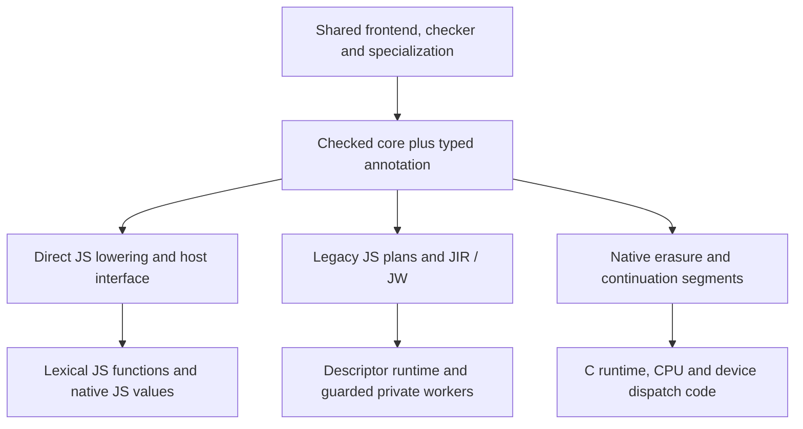

# Backend boundaries and the next native extension

The reusable boundary today is the **checked, specialized, annotated Bend core**.
The compiler does not yet have one target-neutral executable IR. Its JavaScript
and native representations serve different runtime contracts; moving them into a
shared directory would not make those contracts interchangeable.

Phase54 graph02 is installed, retaining the direct JavaScript default introduced
in Phase53 for emitted programs, libraries and compiled runs. Explicit legacy
JavaScript and native targets remain available. See the
[direct guide](../../selfhost/docs/direct-javascript.md) and
[Phase54 qualification](../../implementation/phase54/qualification.md) for exact
interfaces and tested scope. This architecture document is not an independent
conformance, performance or fixed-point result.

Phase54 separates source ownership and reusable facts. Its helper extraction and
scalable graph implementation are present in installed graph02. Graph controls,
scoped semantic/release gates and emitted-byte retention pass; full direct
compiler-image emission and self-reproduction remain
**unqualified**. The future runtime representation is explicitly a proposal,
not an unused module added to the compiler. See the
[source accounting](../../implementation/phase54/architecture.md) and
[bootstrap scope](../../implementation/phase54/bootstrap.md).

## The shared compiler boundary

The [manifest](../../selfhost/src/compiler.json) defines the live Bend source
graph. Loading, parsing, dependent checking, quantity checking, specialization,
diagnostics and normalization are shared by all output targets.

[KTerm and KDef](../../selfhost/src/core/term.bend) carry binder IDs, quantities,
types, values, constructor telescopes and native/unsafe provenance. Compact F32
literals retain their bits. A same-spelled user datatype is not a native type;
lowering must retain the checked owner rather than infer layout from its name.
Quantities distinguish erased, affine and reusable source use. This is semantic
input to lowering, not a machine register or memory-ownership representation.

[annotate_selected](../../selfhost/src/check/annotate.bend) reconstructs types for
selected terms in a validated, specialized book without re-running validation.
The original checked context remains available for dependent telescope queries.
Backend selection must not weaken checking or substitute a generated-code
heuristic for those facts.

The host driver supplies files, effect-source bytes, artifact integrity and
process/toolchain execution. It is not a second implementation of the Bend
checker. Native C compilation invokes the external C toolchain; ordinary Bend
compilation does not delegate semantic decisions to the TypeScript compiler.

## Which facts can be shared

Sharing follows a fact's meaning and consumers, not its existing `j_` or `nc_`
prefix. Phase54 extracts 27 existing semantic helpers into three common modules
and seven target-text helpers into one shared JavaScript utility module. Existing
names and bodies are retained; this is an ownership change, not a new inference
or optimization pass. The [extraction report](../../implementation/phase54/shared-helpers.md)
records the exact-body audit and its separate integration gates.

| Source module | Extracted responsibility |
| --- | --- |
| [common/literals.bend](../../selfhost/src/back/common/literals.bend) | Six helpers for annotation stripping, U32/Word decoding and finite-binary32 classification. |
| [common/queries.bend](../../selfhost/src/back/common/queries.bend) | Nineteen checked type/environment, telescope, application-spine, binder, constructor and whole-IO-type queries. |
| [common/native-facts.bend](../../selfhost/src/back/common/native-facts.bend) | Two exact checked Base-owner predicates for the U32/Word/Bool representation. |
| [js/shared-text.bend](../../selfhost/src/back/js/shared-text.bend) | Seven JS-specific quoting/escaping, finite-float expression spelling and foreign-path helpers shared by direct and legacy emitters. |

Shape readers such as `j_u32` and `j_word` do not independently grant native
representation permission. Their consumers still need the corresponding checked
owner and type proof. Moving them does not broaden which programs an optimizer
admits. Native lowering has not been rewritten to use every new common helper.

| Shared fact or future extraction candidate | Required boundary |
| --- | --- |
| Checked type lookup and telescope instantiation | Preserve the original context, substitution and erased-slot policy. |
| Constructor ownership and specialized field types | Return checked declarations/fields; do not select JS objects or native heap layout. |
| Live argument/field accounting | Preserve the precise quantity and dependent telescope rules; backend arity raising remains distinct until equivalence is established. |
| Graph validation, SCC membership and ordered component IDs | Consume explicit edges; do not guess which source references execute. |
| Primitive identity and semantic operation metadata | Separate arithmetic meaning from JS templates, C runtime names and FFI availability. |

The extracted type/telescope and constructor queries previously lived in legacy
JavaScript files. Their existing consumers keep the same API. Other layout
validation remains in [validate.bend](../../selfhost/src/back/js/validate.bend).
A safe extraction preserves established results; it does not merge superficially
similar algorithms with different semantics.

For example, direct `jd_arity` raises common lambda prefixes through matcher
arms, whereas native `nd_arity` currently uses a leading-lambda path. Unifying
their names would not establish that their call layouts agree. Similarly,
generic SCC discovery is reusable, but direct JavaScript's unknown-closure-tail
seeds and selective `run_loop` forcing are runtime-specific facts.

The scalable graph implementation stays in
[direct/calls.bend](../../selfhost/src/back/js/direct/calls.bend). Explicit
forward/reverse worklists compute SCCs, ordered member lists and unknown-tail
reach once, replacing a transitive closure per definition. Graph visits and
retained graph data are `O(V + E)`; name-index costs and source normalization
remain separate. The public query interfaces and component member order stay
unchanged. Its graph data still uses direct-backend indexed metadata and has one
consumer. A common abstraction can wait for a second real consumer.

Checked graph02 shares a **4,096-definition** budget between initial call planning
and exact emitted reach. Independent limits remain: 8,192 tail nodes per
definition, 4,194,304 input edge occurrences, 65,536 queued exact-reach names and
2,097,152 emitted characters per definition. Admission therefore expands beyond
Phase53's 512 definitions; this is not an unchanged-refusal claim. Sparse graph
controls and explicit refusal tests do not establish worst-case dense-graph
memory use or successful whole-compiler emission. The
[scaling report](../../implementation/phase54/scaling.md) preserves those scopes.

Exact runtime reachability is also more than ordinary source-reference closure.
[Direct reachability](../../selfhost/src/back/js/direct/reach.bend) follows emitted
`JD_REF` metadata so erased arguments and undemanded lets do not import foreign
module initializers. Its metadata scan is an implementation bridge. A future
structured `{code, references}` result must preserve the same demand decisions;
replacing it with a conservative reference walk changes observable behavior.

## Existing backend-local representations

| Representation | Actual purpose | Why it is not a shared native IR |
| --- | --- | --- |
| Checked KTerm/KDef | Dependent terms, declaration identity and type/provenance facts | It still contains compile-time types and source demand; runtime scheduling/layout are unresolved. |
| [JIR](../../selfhost/src/back/js/ir/model.bend) | Legacy descriptor expressions and local simplification | Global loads observe mutable G; matches construct delayed matcher values; tail application means a trampoline message. |
| [JW](../../selfhost/src/back/js/ir/worker-model.bend) | Proved closed first-order workers inside legacy entry guards | Literal nodes contain JS text; layouts, Number-Nat choices and native boundaries depend on the private JS runtime. |
| [JDOrdered](../../selfhost/src/back/js/direct/ordered.bend) | Direct JS statement prefixes, pending expressions and fresh temporaries | Prefix/value fields are JS strings; sequencing follows the selected direct JS contract. |
| [N_Segment](../../selfhost/src/back/native/ir.bend) | Native continuation/function segments shared by CPU and device printers | Segment bodies are C text, values are runtime words, and frames follow the existing native ABI. |

Neither JIR nor JW is SSA. JW's explicit calls, slots and cases are useful design
experience, but its narrow admission proof is not a general runtime language.
The [legacy IR guide](../../selfhost/docs/JAVASCRIPT_IR.md) retains those contracts
and historical qualification links. Direct output bypasses that pipeline.

Direct JavaScript uses lexical functions, native closures, named constructor
fields, Number Nat internally and typed public conversion. Its ordered emitter
collects child prefixes before holding pending operands at intrinsic boundaries.
Erased work, closures, partial calls and lazy views keep their own scopes.
The [evaluation-order design](../../design/phase53/ordered-prefix-evaluation-order.md)
records why a presumed universal left-to-right rule was incorrect for this target.
That policy must not silently become the definition of every future backend.

Legacy JavaScript retains its stronger mutable-descriptor interface and guarded
fallbacks. Explicit compatibility clients and maintained private compiler-image
workers still use it. Direct becoming the default is not evidence that those
modules are dead, nor permission to remove their tests or runtime protocols.
The [compiler-image routing audit](../../implementation/phase54/routing.md)
records the maintained commands that explicitly request legacy output. Its
host-only checks do not establish a new self-emitted compiler fixed point.

## What native code must retain

The existing native backend is implemented, not a planned C target.
[book.bend](../../selfhost/src/back/native/book.bend) coordinates selected
definitions, [erase.bend](../../selfhost/src/back/native/erase.bend) consumes typed
erasure, and [bridge.bend](../../selfhost/src/back/native/bridge.bend) lowers to
continuation segments. [direct.bend](../../selfhost/src/back/native/direct.bend)
provides a saturated known-call path alongside ordinary closure application.

The current runtime uses immediate/tagged words, heap constructor and closure
nodes, explicit continuation frames, and task scheduling. The
[emitter](../../selfhost/src/back/native/emit.bend) prints allocation, sealing,
register transfer and stack operations. [Parallel lowering](../../selfhost/src/back/native/parallel.bend)
retains sequential and task paths. These are execution choices that LLVM cannot
recover merely by receiving an equivalent C string in another wrapper.

A replacement or additional native target needs explicit answers for:

- **Numbers:** widths, signedness, wrap/range checks, shift/division boundaries,
  F32 rounding, signed zero and bit reinterpretation. JavaScript Number is a
  host representation, not the language's universal arithmetic type. Do not
  assume fast-math identities or lossless arbitrary NaN payload transport.
- **Closures and calls:** live arity, erased formals, partial and overapplication,
  captures, demanded computation and stack-safe tail transfers. A known callee
  does not by itself specify a calling convention or bounded stack use.
- **Memory and ownership:** allocation identity, aliases, array mutation,
  escaping captures, retained/released values and lifetimes. Preserve quantity
  information or derived ownership facts until the memory plan has consumed them;
  “erased source types” must not mean “discarded ownership evidence.”
- **Effects:** IO/FFI calls, exceptions/fail-stop behavior, atomics, task/fork
  boundaries and observable sequencing. Pure arithmetic facts do not authorize
  moving a load, allocation or callback across one of those boundaries.
- **Identity and ABI:** constructor identity, live field offsets, public argument
  conversion, effect registration, readback and target limits. Native validation
  currently checks [16-bit IDs and 8-bit arities](../../selfhost/src/back/native/validate.bend);
  these are runtime limits, not properties of an eventual universal IR.

The native runtime contains CPU/Metal/CUDA support, but source presence and C
compilation do not establish fresh GPU execution or full backend conformance.
Use [CONFORMANCE.md](../../selfhost/CONFORMANCE.md) for qualified target scope.

## Proposed incremental runtime representation

There is no new implementation of this proposal. Add it only when a real second
consumer needs the boundary; avoid building a universal IR without an executing
vertical slice.

Start with a small typed block/value representation between checked lowering
and target text. It should represent exact numeric constants, local values,
primitive operations, direct/closure calls, blocks with parameters, branches,
returns, and explicit aggregate construction/projection. Add allocation,
load/store and ownership operations when the first memory-bearing slice needs
them. Operations carry semantic type/layout identity and an explicit sequencing
contract rather than JavaScript or C expression strings.

Keep the following layers separate:

1. **Demand and erasure lowering:** decide which source computations exist and
   when they execute, preserving the selected language/FFI contract.
2. **Reusable runtime facts and transforms:** call graph, constant propagation,
   copy/aggregate simplification and later use/escape analysis, operating only
   on explicit operations with verified preconditions.
3. **Target layout and ABI:** JS values, native word/heap layout or LLVM types;
   closure/environment layout, calling conventions, memory management and FFI.
4. **Printing/code generation:** direct JS, C, or LLVM IR. LLVM can then provide
   machine optimization and register allocation; a custom assembly emitter is
   a separate backend commitment, not a prerequisite for this cleanup.

Use a scalar/known-call slice to establish the representation and compare its
results against the existing C path. Add branching, recursion, aggregates and
closures incrementally with retained differential controls. Keep existing output
as the reference/fallback while each slice is qualified. Do not infer a native
speed gain from direct JS parity or from changing the IR's name.

## Small cleanup steps now

Keep routing and documentation unambiguous: direct default, explicit legacy,
native target, shared checked core. The confirmed helper extraction and graph
replacement are integrated in graph02; their scoped validation is recorded
separately from the architectural claims.
Require unchanged admitted output/behavior for a pure ownership move; any newly
admitted larger graph needs separate boundary and resource evidence.

Keep historical reports and failed experiments in place. Remove helpers only
after a whole-manifest caller audit, including host-exported compiler API entry
points. Defer broad file moves and a wholesale IR conversion until the smaller
seams are checked. The objective is fewer competing definitions of each fact,
with explicit backend contracts, rather than fewer directories at any cost.
