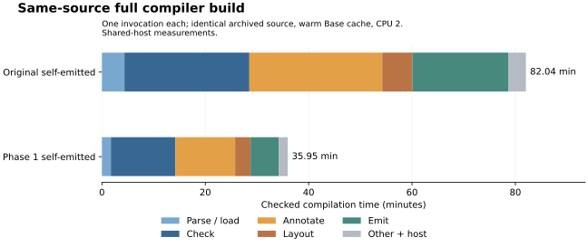

# Phase 1 implementation: faster checked bootstrap

Status: performance measurements complete; whole-corpus validation remains in
progress. This is an interim implementation report. The same-source full build
improves **2.28×**, meeting its 2× timing target; the three uncached Base workloads
improve **2.50–2.57×**, missing their 3× target. The candidate remains experimental.

## Implemented scope

The [design](../../design/phase1/faster_bootstrap.md) identified repeated host work,
expensive generated calls, primitive dispatch and missing backend indexes. This
implementation addresses those concrete costs without changing the dependent
checker or moving compiler algorithms into JavaScript.

| Area | Change | Preserved contract |
|---|---|---|
| Measurement | Explicit compiler/runtime/host selection, immutable input hashes, separate cache modes, raw per-phase and process measurements | Full checking and output validation; failures remain failures |
| Parsed source | `FParsedSource` carries the discovery parse into graph loading and main-name reporting | Raw `FSource`, import/alias/cycle/error behavior and seed fallback |
| Backend context | `book_context` prepares one index after specialization and reuses it in annotation, layout and emission | Immutable first-match lookup, fresh-binder bound, full type context |
| Repeated selections | Reuse full JS roots/stops within the invocation | Annotation retains its existing full-context call; native selection remains separate |
| Primitive dispatch | Preserve Base `String.contains`, `starts_with`, `reverse`, `is_empty` | Same intrinsic classification for reachability/emission; user definitions preserved |
| Choice calls | Structurally prove Boolean/Unit choice and inline fully applied literal thunks | Condition/branch order, partial and dynamic arguments, erased slots, trampoline |
| Record accessors | Prove complete live-field matching and select one field through a direct worker | Generic ABI, field-copy/read order, function fields; eta-short/effect/erasure fallbacks |
| Matcher initialization | Cache pure top-level matcher wrappers | Delayed arm bodies, live globals, computed initializer effects and application order |
| Deep closures | Keep factory-marked thunks on the generic call path | Existing depth protection and lexical captures |

An intermediate CPU profile attributed about 31% of samples to generic `apply`,
with further time in forcing, matching and global initialization. Record accessors
were repeatedly passing through those paths. That observation motivated the
projection worker; it is not a speculative argument-array ownership change.

The original compiler artifacts, source snapshot, baseline measurements and tag
remain historical evidence. The new compiler must earn its own compatibility and
fixed-point evidence. The complete implementation remains under `selfhost/`.

## Why these changes reduce work

The host previously parsed a file during import discovery and then supplied its
text to a loader that parsed it again. The new
[`FParsedSource`](../../selfhost/src/load/modules.bend) carries that first parse
through the existing source ABI. Graph qualification, validation, alias handling
and binder freshening still run. This saves a parse, not a check. Differential
loader cases compare complete results and errors; two emitted fixtures preserved
bytes before introducing the intentional backend changes.

[`book_context`](../../selfhost/src/core/index.bend) prepares the existing
persistent name index and fresh-binder bound after specialization. The host
passes this full context into annotation, layout and selected emission. The
selected output list remains separate from the lookup context; pruning must not
remove type or constructor information needed by later phases. The immutable
index is reused only with its own book.

[`choice.bend`](../../selfhost/src/back/js/choice.bend) replaces the repeated
construction and application of literal branch thunks with a conditional after
proving the combinator's body. It retains factory-marked closures on the generic
path. [`projection.bend`](../../selfhost/src/back/js/projection.bend) emits 66
one-argument record access workers in the final compiler, retaining the runtime's
field copy. Pure matcher-wrapper caching removes another initializer/force path;
it does not cache arm results or computed initializers. These changes reduce the
cost of the compiler executing its own generated JavaScript.

The final assembled source is 557,709 bytes across 59 modules. It contains all
1,391 original definitions plus 21 support definitions. No declaration or checker
stage was removed to improve a timing. Component verification passed all 19
groups, and the orchestration/harness suite passed its 23 existing tests plus
three new merge-safety tests and an explicit worker-resource propagation test.

## Checked self-hosting result

The final bootstrap API emitted stage 2 in **767.922 seconds** (12.80 minutes).
Stage 2 then fully checked and emitted the same frozen source in **2,366.759
seconds** (39.45 minutes). The two outputs are byte-identical, SHA-256
`44227e5e9aa714682c3a5f042cbf38fce86cc6bc510265aeda75103ed242579a`.
The chain completed at 06:45:16 UTC on September 21, 2026; its two checked
compilations took 52.24 minutes in total. This is the changed-source correctness
proof, not the same-source speedup measurement.

The [distributed artifacts](../../selfhost/dist/phase1/README.md) include the
bootstrap API, self-emitted API, frozen source/map, runtime and provenance.
The [fixed-point report](evidence/fixedpoint-final.json) records launch arguments,
source/runtime/host hashes, both successful exits and both output hashes.

## Correctness evidence

Focused checks cover parsed-source equivalence for valid, aliased, repeated,
cyclic, missing and malformed modules; indexed context idempotence; 4,004 new
string comparisons against pinned Base; user overrides; partial calls; computed
thunk evaluation; both Boolean branches; 50,000 tail calls; and 70 nested choices
with captured values. The existing component, backend, foreign-function, layout,
provenance, string-equality and argument-ownership regressions also run.

A first candidate build was deliberately interrupted during checking after code
review found that choice inlining could bypass the existing closure-depth guard.
The corrected candidate has a dedicated regression. An intermediate stage 2
then passed focused and backend checks and supplied the CPU profile. Its second
build and partial corpus run were stopped after the profile motivated projection
workers, freeing resources for the final candidate. These interrupted attempts
remain separate and are not completed fixed points or performance samples.

The projection-worker candidate subsequently completed a byte-identical stage
2/stage 3 fixed point (SHA-256 `bbf05713efe49dca6f4d9716d59d23c8f57e1aa2f864311aee3afe97590e04fe`). Its native `base/string_kit.bend`
probe exceeded the existing 300-second limit, including a repeat on a dedicated
physical core. That failed gate prompted pure matcher-wrapper caching. The
partial 408-probe corpus run and both timeouts remain separate evidence; neither
is counted as completed final validation. The final candidate passed this probe in **246.908 seconds**, with the
unchanged 300-second limit. This is regression evidence, not a controlled
old/new native benchmark. The filtered report correctly remains incomplete as a
whole-corpus conformance claim.

The final corpus is partitioned into 64 disjoint fixture groups, with unchanged
300-second per-probe deadlines. Historical probe durations guide scheduling only.
The merger checks every expected `(fixture, lane)` exactly once, identical
inventories and artifact hashes, and unchanged timeout policies; it retains every
verdict. Raw group reports and their checksums accompany the combined report.
An initial two-worker run was stopped to adopt this scheduling; its partial rows
are excluded, not mixed with later outcomes. The first shard attempt then exposed
a configuration error: workers used Node's default stack rather than the 4 MiB
stack already used for self-builds and measurements. The large cubic literal
fixture exhausted that default stack. The runner now accepts explicit worker
stack and heap limits and records them; the full run uses 4 MiB and 4 GiB, with
the same 300-second timeout. The previously failing cubic-literal fixture passed checking in 99.091 seconds
with the documented stack. Default-stack results remain separate failed
evidence, not candidate passes.

## Measurement protocol

All comparisons use pinned upstream `6018e28ecc67cf1fffc0c20c64b11023474c2df8`,
Node 24.18.0, the same source and Base paths, fresh processes and CPU affinity 2.
Small workloads use a 4 MiB JS stack and 4 GiB old-space ceiling; full compiler
runs use the same stack and a 12 GiB ceiling for both control and candidate.
Compilation excludes imports, output-file writing and generated-program execution;
process wall time and import latency are recorded separately. Peak RSS is a
process high-water mark, not per-phase allocation.

The original five workloads are retained. The matrix includes pinned upstream,
old/new upstream-emitted Bend APIs and old/new self-emitted Bend APIs. Seven
repetitions rotate variant order. Separate cold/warm Base-cache comparisons use
the tree/IO input; scaling adds 64 and 1,024 declarations around the original 256.
Cache priming is a separately recorded invocation. Full-source comparison uses
the exact archived compiler source on both sides; rebuilding the changed source
is a separate correctness proof.

This is a shared development machine, not an isolated performance lab. The long
control ran while development and candidate verification used other cores. One
short backend test batch used the control core's SMT sibling. Intermediate
validation used other cores, including SMT siblings. Final validation begins on physical cores 0 and 3, while its self-build uses
CPU 1 and benchmark processes remain serial on CPU 2. Disjoint fixture groups
add CPU 1 after the self-build and final profile, and CPU 2 after measurements
finish. The scheduling log records every assignment. The corpus avoids SMT
contention between its workers so that per-probe deadlines remain meaningful. Memory bandwidth,
shared caches, GC scheduling, CPU frequency and unrelated host activity remain
sources of variation. A single full-build measurement is descriptive, not a
statistical confidence interval or a cross-machine comparison.

## Controlled small-workload results

All 175 samples succeeded and passed result validation, with all frozen inputs
unchanged. Values are median compilation seconds across seven fresh processes
per cell; all use cache-off mode. Bootstrap and self-emitted artifacts are
different execution modes, so both comparisons are shown.

| Workload | Pinned TS | Old bootstrap | New bootstrap | Old self-emitted | New self-emitted | Self speedup |
|---|---:|---:|---:|---:|---:|---:|
| No Base (check) | 0.0062 | 0.0528 | 0.0485 | 0.1184 | 0.0775 | 1.53× |
| 256 declarations (check) | 0.0265 | 1.524 | 1.133 | 4.235 | 1.853 | 2.29× |
| Base U32 | 0.3828 | 8.805 | 7.134 | 43.979 | 17.608 | 2.50× |
| Tree / IO | 0.3956 | 9.110 | 7.466 | 45.952 | 17.873 | 2.57× |
| List sort | 0.4923 | 11.357 | 8.578 | 53.191 | 21.073 | 2.52× |

The three Base workloads improve **2.50–2.57×** in the self-emitted compiler and
**1.22–1.32×** in the bootstrap API. All three miss the initial 3× self-emitted
target. Upstream remains substantially faster; for example, its Base compile
median is 0.383 seconds versus 17.608 seconds for the new self-emitted artifact.
Fresh-process wall medians for that case are 0.680 and 17.795 seconds respectively.
The distinction matters particularly for the tiny no-Base case, where startup
and TypeScript module import cost dominate upstream's process time.

Self-emitted observed compile ranges are 41.903–44.524 → 16.017–17.795 seconds
for Base, 45.304–46.162 → 17.761–18.081 for tree/IO, and 51.232–62.015 →
20.828–24.238 for list sort. These are sample ranges, not confidence intervals.
Median process peak RSS stays broadly similar: Base 325.3 → 322.7 MiB, tree/IO
335.5 → 337.9 MiB, and list sort 355.9 → 371.4 MiB. The latter increases about
4.4%; this is a time improvement, not a general memory-reduction claim.

[Raw samples, phase counts, import/process timing, output checks and hashes](evidence/matrix-final.json)
retain every run, including variability. The intermediate v3 matrix remains
separate and is not mixed with final-candidate samples.

## Cache and declaration-size comparisons

All 28 cold/warm samples and 14 separate priming invocations succeeded, with
unchanged frozen inputs. These tree/IO figures are seven-run median compilation
seconds for the self-emitted artifacts:

| Cache policy | Original | Phase 1 | Speedup |
|---|---:|---:|---:|
| Off (original matrix) | 45.952 | 17.873 | 2.57× |
| Cold persistent cache | 59.630 | 27.462 | 2.17× |
| Warm persistent cache | 11.988 | 3.872 | 3.10× |

Cold means an empty persistent Base cache at invocation start, so that invocation
pays for cache construction. It is slower than cache-off because first-use
preparation currently duplicates graph loading: both artifacts call
`f_load_graph` twice. Warm means a fresh process after a separate checked Base
prime; the median prime process cost is 29.987 seconds for the original and
17.569 seconds for phase 1. Those costs are recorded separately, not silently
included in or discarded from a cold measurement. The warm 3.10× result does not
satisfy the design's **uncached** 3× target.

[Raw cache samples and priming invocations](evidence/caches-final.json) include
phase counts, output checks, process timing and artifact/input hashes.

The declaration-size experiment checks independent constant definitions without
Base. It retains all 18 successful samples for the 64- and 1,024-definition
inputs, with three fresh processes per cell. The 256-definition row below is the
seven-run original matrix; these are different repetition counts, not pooled
samples. Values are median compilation seconds:

| Definitions | Pinned TS | Original self-emitted | Phase 1 self-emitted | Self speedup |
|---|---:|---:|---:|---:|
| 64 | 0.0184 | 1.043 | 0.521 | 2.00× |
| 256 | 0.0265 | 4.235 | 1.853 | 2.29× |
| 1,024 | 0.0853 | 27.240 | 10.470 | 2.60× |

Increasing the generated definitions 16× increases the observed self-emitted
compilation time about 26.1× before the changes and 20.1× after them. This small
experiment suggests remaining costs grow faster than the input count over this
range; it does not establish an asymptotic complexity bound. See the
[raw scaling measurements](evidence/scaling-final.json) for all samples and
frozen input hashes.

## Small-workload phase evidence

Across seven uncached Base samples, the old/new self-emitted median compilation
is 43.979 / 17.608 seconds (**2.50×**). The combined changes reduce median graph
loading from 12.109 to 2.507 seconds, checking from 16.265 to 8.637 seconds, and
stop-set construction from 4.617 to 0.006 seconds. Preparing the indexed context
costs 0.305 seconds. These are per-phase medians, which need not sum to the median
of complete invocations; they are not independent optimization multipliers.

The public `f_parse` count remains two (program and Base). Reuse removes the
loader's internal reparsing. Full-root computation drops from two public calls
to one, and full-stop computation from three to two. The stop-set classifier calls `String.contains` on its intrinsic-name table;
that operation now retains its audited native implementation in the self-emitted
compiler. Its timing reduction therefore includes the repaired primitive path
and generated-worker improvements, rather than just one fewer traversal.

The original 3× uncached-program target is **not met** on this workload. Parsing
and checking now account for most of its remaining time. This does not justify
weakening checking or changing the benchmark to hide first-use cost.

## Controlled full-source result

Both self-emitted compilers fully checked and emitted the **same archived
548,538-byte, 1,391-definition source**, using a warm persistent Base cache and
one fresh process each on logical CPU 2. The source SHA-256 is
`ec9014bc182c3c454be5f5ebd73d00d4278020c7b9d8d7d8863e8d0943ba65a9`.
The stack and heap limits are identical: 4 MiB and 12 GiB. Both invocations
succeeded, their generated libraries passed JavaScript syntax validation, and all
frozen inputs remained unchanged.

| Metric | Original self-emitted | Phase 1 self-emitted |
|---|---:|---:|
| Compilation | 4,922.363 s (82.04 min) | 2,157.110 s (35.95 min) |
| Process wall time | 4,923.625 s | 2,157.977 s |
| Process peak RSS | 10,245.1 MiB | 9,371.5 MiB |
| Generated library size | 1,202,877 bytes | 1,097,290 bytes |

This is **2.28× faster**, or **56.2% less compilation time**, meeting the design's
2× full-build timing target in this comparison. Peak process RSS is 8.5% lower.
These are single observations on a shared host, not repeated-run medians or
confidence intervals. The old and new generated libraries differ intentionally;
syntax validation of these benchmark outputs is not a replacement for the
separate changed-source fixed-point proof or the unfinished corpus validation.

The largest remaining phases are checking and annotation: together they consume
66.9% of the candidate's compilation time. Per-phase observations in seconds are:

| Phase | Original | Phase 1 | Speedup |
|---|---:|---:|---:|
| Parse | 79.380 | 47.108 | 1.69× |
| Seeded graph loading | 182.161 | 57.005 | 3.20× |
| Check from exact prefix | 1,450.270 | 749.045 | 1.94× |
| Annotation | 1,542.507 | 693.436 | 2.22× |
| Runtime layout validation | 349.966 | 179.346 | 1.95× |
| Library emission | 1,116.484 | 329.391 | 3.39× |

Other phases and host work remain included in the total and in the figure. Phase
ratios describe the combined implementation changes, not independent speedup
factors. The [original report](evidence/control-full.json) and
[candidate report](evidence/candidate-full.json) retain exact launch arguments,
priming runs, phase timing, output hashes and frozen artifact/input identities.
The [plot script](figures/full-build.py) regenerates the figure from those reports.

The pinned TypeScript compiler compiled the same source with all 1,391 exports
in **48.718 seconds**, with a **1,731.65 MiB** peak RSS. It has no equivalent Base
cache and ran with caching off, so this is a reference observation rather than a
matched-cache ratio. Library wrappers are backend-specific: upstream explicitly
requests all source definitions, while the port also retains Base foreign roots
under its normal library policy. Its [raw reference report](evidence/upstream-full.json)
records the scope and output validation.

## Final profile and distribution smoke

A separate final tree/IO CPU profile recorded 16,887 samples. Generic `apply`,
`force`, `call` and `get` account for 8,106 samples (**48.0%**); garbage collection
accounts for 600 (**3.6%**). This profile includes worker startup and is not a
speedup sample. Its raw profile, compiler hash and measurement configuration are
in [the profile evidence](evidence/profile-final.json). Function-name aggregation
and generated global source-line attribution are both retained.

Both the bootstrap and self-emitted APIs also passed the five-route smoke after
copying the compiler files to a fresh `/tmp` directory and blocking Node filesystem
reads of the original checkout. Each used a fresh Base cache and no upstream
checkout. The [relocation report](evidence/relocation-smoke.json) retains the guard
source, artifact hashes and outputs. This is a Node filesystem guard, not an OS
sandbox; native toolchain and system-library access remain available. The
existing default API separately passed those five routes with the updated host.

## Promotion status

The candidate is published as an explicit experimental artifact. The supplied
`dist/typed-api.mjs` remains the default while phase 1 targets and corpus gates
remain unmet. The new host retains compatibility with the old API through
capability checks. Source improvements, focused correctness evidence and a
successful self-build do not turn a timed-out native fixture into a pass.

## Deferred work

Source inspection corrected one detail in the design: the original host already
passed `j_stops(contextBook)` to annotation, rather than a stop set from selected
definitions. This implementation preserves that call and reuses the first full
stop set for reachability and layout; one redundant annotation stop computation
therefore remains.

First-use Base preparation still repeats graph loading: both measured cold-cache
variants call `f_load_graph` twice. A follow-up should reuse the freshly prepared
Base state in the requesting invocation, with explicit first-use, invalidation,
Base-as-main and alias tests. This change does not broaden persistent cache trust
or change cache schema. Constructor-owner indexes, checker
book maintenance, general direct-call workers, ownership-based argument-vector
elision, a lowering IR and lexer buffers are separate follow-ups. The next bounded priorities are:

1. Introduce compiler-owned known-call workers, beginning with hot stable global
   calls. Preserve partial application, intermediate evaluation order, lexical
   environments and the trampoline. Public `apply` and foreign argument vectors
   must retain their ownership contract.
2. Profile `nc_compile` specifically on the timed-out native fixtures. Their
   traces were still in native emission at the deadline. The tree/IO JS profile
   identifies runtime overhead but cannot distinguish native emitter algorithms.
3. Use full-build checking/annotation phase shares to select the next traversal
   or book-maintenance change. For uncached small programs, separately measure
   lexer/cursor work because parsing is now a substantial share.

These priorities follow observed remaining costs. They are not independent
speedup factors to multiply together.

Public `apply` still copies argument vectors as required by its mutation-isolation
contract. The checker still validates the actual declaration sequence. No cached
verdict is substituted for a complete candidate self-build, and no GPU execution
is inferred from native CPU or JavaScript results.

## Reproduction and use

See the [compiler guide](../../docs/BEND-IN-BEND.md), linked from the repository
README, for explicit artifacts, bootstrap and fixed-point commands. See the
[performance harness](../../selfhost/tools/performance/README.md) for configuration
and the original [baseline protocol](../../selfhost/tools/performance/BASELINE.md)
for historical measurements. The linked raw performance reports are complete; whole-corpus validation is
still in progress and remains a separate promotion gate. The
[performance evidence manifest](evidence/performance-final-files.json) records
checksums for the measured reports and the reproducible full-build figure.
