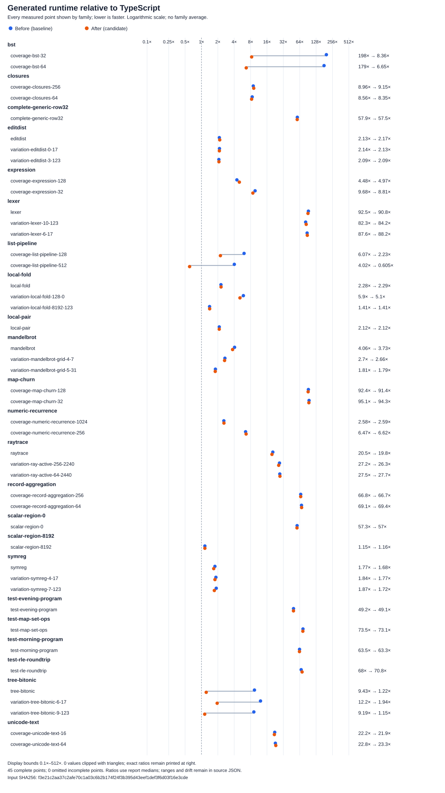

# Phase42: faster generated programs

**Phase42 checked16 is installed and qualified.** The campaign implemented the
[roadmap](../../design/phase42/README.md), used seven parallel owner/review roles,
compared the complete maintained catalog, and preserved unsuccessful experiments.
All commits are on `rom1504/bend`, branch `selfhost/bootstrap`. No PR comment was posted.

The largest gains are substantial, but **overall TypeScript parity was not reached**.
Fresh same-run measurements compare Phase41, checked16 and pinned TypeScript:

| Workload | Speedup over Phase41 | Current time / TypeScript time |
| --- | ---: | ---: |
| Tree, three input sizes | 6.27–8.02× | 1.15–1.94× |
| BST, two sizes | 23.66–26.96× | 6.65–8.36× |
| List pipelines, two sizes | 2.72–6.65× | 0.605–2.23× |
| Full 45, equal-point geometric mean | 1.42× | 8.86×, previously 12.57× |
| Same catalog, equal-source geometric mean | 1.35× | 11.42×, previously 15.40× |

Lower time ratios are better. The list512 point beats TypeScript; no full-catalog
point reaches half its time. These statistics describe 45 points from 23 source
programs, not the distribution of arbitrary Bend applications. Maps, lexer,
records and several other families retain large gaps. The [results](results.md),
[full table](full-results-table.md), [machine data](full-results.json) and
[figure](runtime-ratios.svg) preserve every point, sample range and drift metric.
All 669 fresh samples pass. One expression point's original 10.98% slower median
and its separate 2.51% slower confirmation remain visible; neither is discarded.

## What changed

Prove a complete private computation once, then execute ordinary direct JavaScript
inside it. The retained implementation combines direct helper calls, owned
constructor literals, private flat tree layouts, bounded native recursion with
deep iterative fallback, total list-pipeline fusion, native List/product component
proofs, and exact request-local planning reuse. [Mechanisms and decisions](mechanisms-and-decisions.md)
explains eligibility, rejected alternatives and causal experiments; the
[architecture reference](../../docs/PHASE42_GENERATED_JS.md) describes the source.

Profiles support the representation/dispatch finding. Tree sampled allocation is
now close to TypeScript, and fused lists allocate less. Map, lexer and ray tracing
still allocate far more and spend substantial time in generic dispatch.
[Profile findings](profile-findings.md) separates those observations from clean
timing and identifies the next targets.

## Correctness, cost and usable release

[Integration](integration.md) records 3,026 main and 196 broader frontend
observations with zero differences, 81 matching backend outcomes, 154 application
observations, inherited/new optimizer controls, 227 exact canonical bindings,
42 CLI checks and all 15 postinstall audit groups. The four shared check failures
and eight nonapplicable backend outcomes remain explicit. This is a checked B1
derivative, not a new self-emitted fixed point or universal backend proof.

[Compiler request costs](compiler-cost.md) change by −6.17% for tree, −6.03%
for numeric recurrence, +5.79% for pair and +6.69% for list.
[Complexity](complexity.md) grows from 18,898 to 20,056 physical Bend lines
(+1,158), with 141 added definitions and three added runtime lines. There is no
simplification claim. [Performance admission](performance-admission.md) makes
these tradeoffs explicit.

The [installed release](../../selfhost/dist/release.json) has API SHA256
`63ddb2dd35554aafafc26dbdff4aba86b5d3774cd0d99a9509ccf237d210ba54`, on unchanged
upstream pin `018751270e800bc222a93dad7f257083ee53a5f7`. Use the
[compiler guide](../../docs/BEND-IN-BEND.md) and
[portable benchmark guide](../../selfhost/tools/performance/phase42/README.md).
The [current bundle](../../selfhost/tools/performance/phase42/current/manifest.json)
contains all 45 points; short selections, complete three-batch comparisons,
profiles and side-by-side generated-JavaScript analysis are documented.

The campaign also exposed costly validation plumbing. [Failure lessons](failure-lessons.md),
[integration corrections](integration-corrections.md), and
[iteration efficiency](iteration-efficiency.md) distinguish compiler defects from
invalid fixtures and stale instrumentation. The [time account](accounting.md) records5.08hours through execution closure,
88.79minutes in335 recorded jobs, and216.27minutes of unclassified time.
The [evidence index](../../selfhost/tools/performance/phase42/evidence/README.md)
publishes the independently reopened34,982-file raw archive, including failures.
All 103 unrelated starting files remain unchanged.
