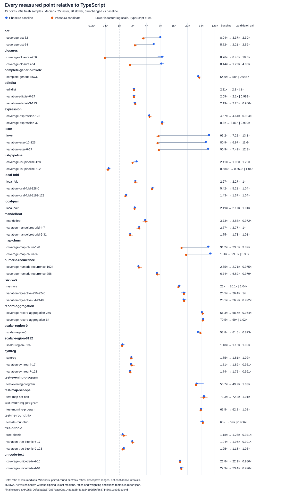

# Phase43: complete-operation direct execution

Phase43 checked14 improves the maintained 45-point generated-program corpus by
1.441 times over Phase42 checked16. Its point-weighted geometric time relative to
pinned TypeScript falls from 8.876 to 6.161 times. Lexer, Map, known scalar
callbacks and BST improve substantially; 20 points have slower medians, and
complete applications still retain large gaps. Compiler requests become more
expensive on several sources, and production source grows 6.9%.

**Installed and verified:** checked14 is the current release, API
`222902e565253ae20c628301a9191c6d71e47b211f1dc463da4e8eb1b51c86eb`.
All 34 selected mechanism owners, 15 installed integration gates, 227 canonical
source bindings and 42 ordinary/relocated CLI checks pass. The
[release manifest](../../selfhost/dist/release.json) and
[integration report](integration.md) identify the exact artifact and scope.

The previous release is Phase42 checked16, commit `714c5f5`, API
`63ddb2dd35554aafafc26dbdff4aba86b5d3774cd0d99a9509ccf237d210ba54`.
Upstream remains `018751270e800bc222a93dad7f257083ee53a5f7`. The compiler source
and selected API are a checked B1 derivative, not a new self-emitted fixed point.
The human-written language checker and closed historical evidence are preserved.

## Final generated-program results

The [complete results](results.md) and [machine-readable evidence](results.json)
cover 45 points across 23 sources, with 669 fresh-process samples from three
serial batches. No saved-JavaScript experiment or exploratory screen is pooled
with this comparison.

| Geometric time relative to TypeScript | Phase42 | Phase43 | Phase42 / Phase43 |
|---|---:|---:|---:|
| Equal point weighting | 8.875959× | 6.161075× | 1.440651× |
| Equal family weighting | 11.533923× | 8.543621× | 1.350004× |
| Equal source weighting | 11.430604× | 8.433917× | 1.355314× |

There are 25 strict median wins, 20 regressions and no exact ties against
checked16. Closure256 and list512 are faster than TypeScript. These counts are
descriptive: small median differences do not establish statistical significance.
The corpus is exposed development coverage, not an unseen application
population; these results do not establish general TypeScript parity.

The [family chart](families.svg), [win/regression chart](family-wins.svg) and
[full table](results.md) retain every point, absolute time, paired-round range
and half drift. Greater-than-one candidate/TS ratios mean slower execution.
Selected changed-family results are:

| Family | Points | Geometric gain over Phase42 | Phase43 / TS geometric time |
|---|---:|---:|---:|
| Lexer | 3 | 12.295× | 7.223× |
| Map churn | 2 | 3.620× | 26.477× |
| Known closures | 2 | 9.440× | 0.911× |
| BST | 2 | 2.486× | 2.728× |
| List pipeline | 2 | 1.129× | 1.051× |

The closure geometric mean hides a meaningful input difference: size64 takes
1.728 times TS and size256 takes 0.480 times TS. Map32/128 improves 3.381/3.875
times and remains 29.790/23.532 times TS. Earlier checked14 screens measured the
larger closure at 0.422 times TS and Map gains of 1.862/3.088 times; those screens
remain evidence but do not replace these final same-run results. The actual
checked08 lexer screen exceeded ten times baseline speed; its saved manual
prototype was closer to five times TS. Only final compiler output determines
the delivered ratios above.

Regressions remain visible. The complete generic row is 5.8% slower by median;
the zero-work scalar entry is 14.6% slower. Other families have smaller mixed
changes and overlapping paired ranges. All 45 full modules change because they
embed runtime support, so a changed hash alone does not establish a new executed
optimizer path or explain a timing difference.

## Seven implementation findings

1. **String operations need complete typed and host coverage.** Exact native
   String/Char layouts, alias-normalized types and nested data fields establish
   the required host family. Ordinary lexer entries execute a complete private
   graph while retaining materialized strings, Unicode projections, intermediate
   values and constructor order. Exact literal-only nullary definitions are
   admitted; computed nullary bodies remain generic.

2. **Map needs contextual typed instances.** Specializing erased arguments
   creates private workers without replacing public definitions, full arity or
   fallback. Exact Map, Maybe, comparison and tuple proofs retain quantities and
   canonical layouts. Source-emitted library functions can be native-marked;
   runtime intrinsic overrides require a different admission rule. A native flag
   alone identifies neither case.

3. **Known scalar callbacks can remove an intermediate graph.** Under exact
   total-U32 and no-escape proofs, construction and application fuse into private
   execution. Captured values and noncommutative composition order remain explicit;
   unknown or escaping functions use the original behavior.

4. **Numeric countdowns require a range proof.** Eligible callback loops use
   Number arithmetic for proved U32 counts, with the original BigInt countdown
   outside that domain. Both paths are tested; arbitrary-precision Nat semantics
   are unchanged.

5. **Pair state can stay private while escaping data retains its layout.**
   Eligible loops hold two local state slots, return the original value at zero
   iterations and reconstruct fresh positive state. Both right-hand sides run
   before either update. Tree/path aliases and stronger scalar-worker selection
   keep their existing behavior.

6. **Guard costs follow capabilities.** Exact U32 callback and fusion proofs
   select a smaller integer host check; String graphs retain String checks.
   Dependencies remain live at entry. Success is not cached across public calls,
   and errors/reentry cannot inherit unearned permission.

7. **Proof and emission must agree on transformed terms.** Explicit conditional
   branches fence recursive proofs because Bend evaluates Boolean operands
   eagerly. Lowered direct calls preserve the original source proof and recursive
   App shells needed by continuations. Scope-aware audits reject unresolved
   private calls, empty argument vectors and unbound saved temporaries.

These changes extend existing checked terms, bounded plans and request-local
facts rather than adding another general intermediate representation. Unsupported
shapes or exhausted proofs refuse optimization. The
[technical overview](../../docs/PHASE43_DIRECT_EXECUTION.md),
[prospective design](../../design/phase43/README.md) and
[independent review](review.md) describe the shared boundaries. Family detail is
in [Strings](strings.md), [Map](map.md), [callbacks](callbacks.md),
[products](products.md) and [guards](guards.md).

## Semantic evidence and its limits

The selected frontend agrees exactly on 3,026 main and 196 broader observations,
with zero result or extra-field differences. Four shared main-corpus raw checking
failures remain failures; agreement does not relabel them as accepted programs.
Selected backend renewal has 81 exact paired observations, with retained shared
failures and unavailable platforms. Expanded application/catalog/small correctness
passes 154 untimed observations. Counts overlap and must not be summed into a
unique-test total. The [integration report](integration.md),
[validation report](validation.md) and [conformance scope](../../selfhost/CONFORMANCE.md)
retain the exact distinctions; final preinstall and postinstall aggregation passes.

Focused controls require actual private worker execution through ordinary public
roots, full values and aliases, partial application, dependency and post-import
host mutation, error callbacks/reentry, demand order and deep stack behavior.
The standard host at initialization contract persists. Pure source admission
alone does not grant permission to bypass observable boundaries.

The main actual Map profile checks 16 value groups, six aliases, 699 boundaries
and three ABI controls; each independent annotated literal/renamed fixture checks
19 values, six aliases, 645 boundaries and three ABI controls. Ordinary owned
2,048-element execution and a separate 12,000-depth private probe qualify distinct
paths. Numeric callbacks retain 22 oracle groups, 40 boundaries and 85 independent
fixture observations. String controls retain 439 values, 113 boundaries and three
admission checks, plus independent renamed, literal and computed-nullary fixtures.
Inherited owners remain mandatory alongside these new controls.

## Compiler and complexity costs

The [compiler-cost report](compiler-cost.md) compares eight sources, three roles
and three fresh-process samples per source/role: 72 requests. Normal request
cost includes checking/emission and ordinary lazy API/Base handling; host import
and whole process wall time are reported separately. It is not emitter-only
attribution or generated-program timing.

Core request medians rise 8.7% for local pair, 21.1% for tree and 14.0% for list;
numeric recurrence is approximately unchanged at +0.8%. Changed-family request
medians rise 71.5% for lexer, 310.5% for Map and 31.0% for BST; closures are
approximately unchanged at +0.7%. Map's request rises from 2.302 to 9.450 seconds,
while complete process time rises from 7.301 to 14.240 seconds. These are explicit
costs of the selected rules, not compiler-throughput improvements.

The same maintained 70-module production graph grows from 20,056 to 21,440
physical lines and from 2,249 to 2,413 definitions: +1,384 lines (+6.9%) and
+164 definitions. The selected equality-derivative API grows from 1,333,053 to
1,460,868 bytes (+9.6%). Map's full generated module grows from 122,580 to
271,639 bytes; lexer grows from 107,625 to 176,148 bytes. Runtime fragment and
assembled bundle inventories are not counted twice. The
[accounting report](accounting.md) separates source, tools, emitted images and
recorded campaign intervals; unclassified wall time is not model or idle time.

## Surviving gaps and next experiments

[Profiles](profile-findings.md) sample Map128 allocations at about 105.78 MB per
call in Phase42, 29.10 MB in checked14 and 2.18 MB in TS. Generic applies fall
from 259,965 to 49,807, but wrappers, mutual recursion and continuation storage
remain significant. Closure256 samples about 441.90 kB, 8.69 kB and 159.37 kB
respectively; after removing its environment graph, entry guards dominate more
of the residual cost. These are sampled allocation estimates, not retained heap,
exact allocation counts or a forecast of further speedup.

Complete applications have not inherited the same benefits. Morning takes
62.19 times TS and RLE roundtrip 69.02 times TS in the final comparison. Static
[application analysis](application-gap.md) finds ordinary generic roots: private
workers exist but lack an enclosing entry proof. Readback is a primitive string
or number, not a separate serialization traversal. The smallest next falsifier
is ordinary-entry instrumentation, then separate controlled experiments for
entry dispatch, enclosing graph execution, representation and bounded Nat
arithmetic. Do not cache or constant-fold the nullary fixture result.

For Map, investigate residual mutually recursive String/bit edges and private
continuation/projection arrays separately, retaining mutable dependency boundaries
and deep fallback. For small closures, isolate exact guard capabilities and
fixed entry cost. Instrument first, change one mechanism, run complete controls,
then measure actual compiler output before broad integration.

Optional lexer dead-resume prefix/projection removal and the extra wrapper remain
deferred after mixed timings. Repeating scalar checks after a full host guard
provided only a small gain and duplicated machinery. The earlier per-edge Map
guard experiment regressed 30–44%; it is not selected.

Failures remain preserved: eager recursive predicate timeout, stale runtime
assembly, duplicate helpers/annotations, missing ordinary activation, lowered
prefix and continuation defects, binder shadowing and invalid affine fixtures.
Reviewed inherited-controller successors retain old behavioral assertions while
qualifying the intended four-owner fold inventory and exact literal0 admission.
Per-root dependency controls permit independently safe nested roots while still
requiring every affected root to refuse and full event/value parity. Historical
checkpoints, frozen tool versions and raw failures are retained rather than
rewritten as successful outcomes.

## Reproduction and release evidence

Use the [portable Phase43 guide](../../selfhost/tools/performance/phase43/README.md)
and [validation commands](../../selfhost/tools/performance/phase43/validation/README.md).
The final protocol uses Node 24.18.0, CPU3, serial fresh processes, a 1 GiB heap,
a 2 GiB ordinary process-tree RSS cap and a 2 GiB free-memory floor. The inherited
full frontend retains its reviewed two-worker CPU3/4, 3 GiB combined supervisor
exception and runs alone. Regenerate the runtime from its fragments before
building and verify exact selected-snapshot agreement.

Budgets are **20, 60, 300 and 600 seconds**, independent of case selection. Use a
small changed-family falsifier and complete activation/boundary controls before
larger timing. Full45 uses three serial 15-point preset600 batches, retaining
669 samples and the frozen warmup/round design; one 600-second full run cannot
fit the cumulative warmup floors. Acquisition, semantic controls, compiler cost,
profiles and runtime measurement stay separate. The final
[results JSON](results.json) preserves final corpus identities and samples.
Portable [selected-release evidence](../../selfhost/tools/performance/phase43/evidence/selected-release.json) binds
the runtime closure, exact selected modules, semantic owners and installed
release without requiring the original build directory.

Installation and ordinary/relocated CLI verification are complete. Portable bundle
verification and smoke receipts are indexed with the final evidence. No PR comment
was posted.
