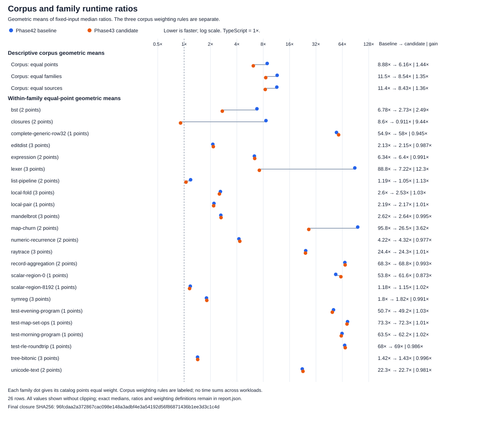
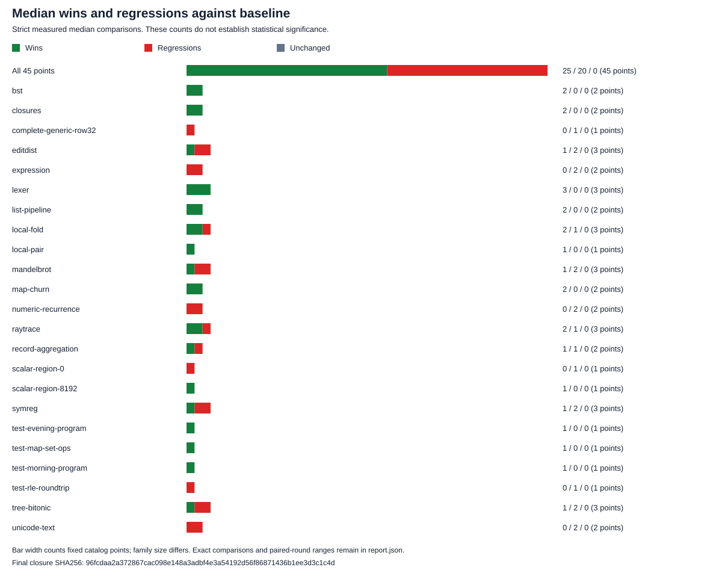

# Phase43 final corpus runtime evidence

45 catalog points, 23 exact sources, 669 fresh role samples from the complete final serial batches. No exploratory screen is combined with these results.

Ratios describe these inputs and protocol; they do not establish general TypeScript parity, statistical significance, semantic admission or installation.

Candidate medians: 25/45 faster, 20/45 slower, 0/45 unchanged against baseline.

| Ratio | Equal points | Equal families | Equal sources |
| --- | ---: | ---: | ---: |
| baseline/typescript | 8.87596× | 11.5339× | 11.4306× |
| candidate/typescript | 6.16108× | 8.54362× | 8.43392× |
| baseline/candidate | 1.44065× | 1.35× | 1.35531× |

| Family | Points | Faster | Slower | Unchanged | Baseline/candidate geometric mean | Candidate/TS geometric mean |
| --- | ---: | ---: | ---: | ---: | ---: | ---: |
| bst | 2 | 2 | 0 | 0 | 2.48645× | 2.72785× |
| closures | 2 | 2 | 0 | 0 | 9.43965× | 0.910829× |
| complete-generic-row32 | 1 | 0 | 1 | 0 | 0.945354× | 58.032× |
| editdist | 3 | 1 | 2 | 0 | 0.986824× | 2.15472× |
| expression | 2 | 0 | 2 | 0 | 0.991437× | 6.3954× |
| lexer | 3 | 3 | 0 | 0 | 12.2953× | 7.22307× |
| list-pipeline | 2 | 2 | 0 | 0 | 1.12877× | 1.0508× |
| local-fold | 3 | 2 | 1 | 0 | 1.02764× | 2.52753× |
| local-pair | 1 | 1 | 0 | 0 | 1.00876× | 2.17222× |
| mandelbrot | 3 | 1 | 2 | 0 | 0.994554× | 2.63925× |
| map-churn | 2 | 2 | 0 | 0 | 3.61984× | 26.4766× |
| numeric-recurrence | 2 | 0 | 2 | 0 | 0.976817× | 4.32216× |
| raytrace | 3 | 2 | 1 | 0 | 1.00595× | 24.2776× |
| record-aggregation | 2 | 1 | 1 | 0 | 0.992898× | 68.8366× |
| scalar-region-0 | 1 | 0 | 1 | 0 | 0.87272× | 61.6275× |
| scalar-region-8192 | 1 | 1 | 0 | 0 | 1.01912× | 1.15478× |
| symreg | 3 | 1 | 2 | 0 | 0.991464× | 1.81525× |
| test-evening-program | 1 | 1 | 0 | 0 | 1.032× | 49.1617× |
| test-map-set-ops | 1 | 1 | 0 | 0 | 1.01414× | 72.3123× |
| test-morning-program | 1 | 1 | 0 | 0 | 1.02046× | 62.1928× |
| test-rle-roundtrip | 1 | 0 | 1 | 0 | 0.985648× | 69.0232× |
| tree-bitonic | 3 | 1 | 2 | 0 | 0.995888× | 1.42891× |
| unicode-text | 2 | 0 | 2 | 0 | 0.980856× | 22.7448× |

| Point | Baseline ms | Candidate ms | TS ms | Baseline/candidate [paired min,max] | Candidate/TS [paired min,max] | Maximum available absolute half drift B/C/TS % | Missing halves B/C/TS |
| --- | ---: | ---: | ---: | ---: | ---: | ---: | ---: |
| coverage-bst-32 | 0.197737 | 0.082776 | 0.0245912 | 2.38882 [2.28527,2.41765] | 3.36608 [3.12375,3.76803] | 6.62/4.88/3.75 | 0/0/0 |
| coverage-bst-64 | 0.325097 | 0.125614 | 0.0568225 | 2.58807 [2.39634,2.6499] | 2.21064 [2.19614,2.43727] | 5.71/1.33/6.74 | 0/0/0 |
| coverage-closures-256 | 0.194631 | 0.0106643 | 0.0222139 | 18.2507 [18.0222,19.0112] | 0.480073 [0.385256,0.512058] | 1.48/9.15/11.9 | 0/0/0 |
| coverage-closures-64 | 0.050819 | 0.0104087 | 0.0060232 | 4.88238 [4.40719,5.21114] | 1.72809 [1.5958,1.82601] | 9.46/18.2/13.9 | 0/0/0 |
| complete-generic-row32 | 0.380413 | 0.402402 | 0.00693415 | 0.945354 [0.939838,1.09697] | 58.032 [56.27,58.323] | 1.73/2.04/11 | 0/0/0 |
| editdist | 10.9769 | 10.9541 | 5.20748 | 1.00208 [0.971316,1.08995] | 2.10353 [1.97824,2.1421] | 4.34/9.62/7.4 | 0/0/0 |
| variation-editdist-0-17 | 2.71847 | 2.73694 | 1.30295 | 0.993251 [0.90375,1.11079] | 2.10057 [1.96343,2.1788] | 7.27/4.36/5.41 | 0/0/0 |
| variation-editdist-3-123 | 22.0709 | 22.8593 | 10.0967 | 0.965512 [0.882332,1.09889] | 2.26404 [2.05505,2.36191] | 2.43/4.88/2.28 | 0/0/0 |
| coverage-expression-128 | 0.0427564 | 0.0434375 | 0.00935571 | 0.984321 [0.901514,1.00668] | 4.64288 [4.52742,5.20363] | 5.1/7.86/6.69 | 0/0/0 |
| coverage-expression-32 | 0.019472 | 0.0194992 | 0.00221345 | 0.998604 [0.919614,1.16154] | 8.80942 [8.53029,9.15146] | 12.8/3.73/9.93 | 0/0/0 |
| lexer | 163.935 | 12.5431 | 1.72182 | 13.0698 [11.359,14.4063] | 7.28481 [6.45412,7.95561] | 13.9/6/8.94 | 0/0/0 |
| variation-lexer-10-123 | 560.232 | 48.2623 | 6.92183 | 11.6081 [10.8953,12.0701] | 6.97249 [6.39064,7.86809] | NA/3.68/1.7 | 5/0/0 |
| variation-lexer-6-17 | 38.9637 | 3.1803 | 0.428655 | 12.2516 [11.9172,13.9248] | 7.41924 [6.27253,7.653] | 18.6/5.22/2.39 | 0/0/0 |
| coverage-list-pipeline-128 | 0.0158828 | 0.0129329 | 0.00659531 | 1.2281 [0.988798,1.31936] | 1.96092 [1.88321,2.11747] | 5.31/8.96/4.43 | 0/0/0 |
| coverage-list-pipeline-512 | 0.0176227 | 0.0169862 | 0.0301658 | 1.03748 [0.973198,1.15173] | 0.563094 [0.520451,0.612074] | 8.07/4.23/2.96 | 0/0/0 |
| local-fold | 0.0933434 | 0.0933679 | 0.041193 | 0.999738 [0.877219,1.03949] | 2.2666 [2.14853,2.52397] | 13.9/7.66/8.85 | 0/0/0 |
| variation-local-fold-128-0 | 0.00793508 | 0.00763747 | 0.00146526 | 1.03897 [0.947322,1.15988] | 5.21237 [5.03882,5.42646] | 11.1/7.87/3.92 | 0/0/0 |
| variation-local-fold-8192-123 | 0.187797 | 0.179745 | 0.131516 | 1.04479 [0.976271,1.06612] | 1.36672 [1.35278,1.51448] | 5.97/3.19/2.04 | 0/0/0 |
| local-pair | 2.77815 | 2.75402 | 1.26784 | 1.00876 [0.903541,1.0402] | 2.17222 [2.13963,2.34189] | 11.7/2.87/5.48 | 0/0/0 |
| mandelbrot | 0.177214 | 0.182262 | 0.0475284 | 0.972307 [0.916833,1.00469] | 3.8348 [3.26878,4.20387] | 3.37/3.66/3 | 0/0/0 |
| variation-mandelbrot-grid-4-7 | 0.0453381 | 0.0453483 | 0.0163894 | 0.999774 [0.951427,1.13812] | 2.76693 [2.40385,2.81672] | 13.5/10/6.07 | 0/0/0 |
| variation-mandelbrot-grid-5-31 | 0.440451 | 0.435229 | 0.251199 | 1.012 [0.989139,1.03604] | 1.73261 [1.64126,2.00797] | 3.14/4.91/8.41 | 0/0/0 |
| coverage-map-churn-128 | 72.4233 | 18.6899 | 0.794233 | 3.87499 [3.48294,4.29104] | 23.532 [21.2534,26.1746] | 24.6/8.89/11.1 | 0/0/0 |
| coverage-map-churn-32 | 14.8073 | 4.37894 | 0.146995 | 3.38148 [3.16969,3.80051] | 29.7897 [28.247,30.0984] | 12.4/16.7/5.38 | 0/0/0 |
| coverage-numeric-recurrence-1024 | 0.0209958 | 0.0215367 | 0.00793771 | 0.974883 [0.829738,1.01886] | 2.71322 [2.61871,3.17651] | 2.52/1.97/7.39 | 0/0/0 |
| coverage-numeric-recurrence-256 | 0.0139298 | 0.0142321 | 0.00206707 | 0.978755 [0.829557,1.11091] | 6.88519 [6.69662,7.81799] | 9.88/7.25/11.2 | 0/0/0 |
| raytrace | 744.333 | 712.641 | 35.3699 | 1.04447 [0.982065,1.07642] | 20.1482 [19.8992,21.7225] | NA/NA/1.74 | 3/3/0 |
| variation-ray-active-256-2240 | 34.0623 | 33.9821 | 1.28545 | 1.00236 [0.961521,1.15355] | 26.4359 [22.9985,27.2471] | 3.48/8.11/4.69 | 0/0/0 |
| variation-ray-active-64-2440 | 9.0937 | 9.35265 | 0.348137 | 0.972313 [0.955641,1.02499] | 26.8649 [24.8128,30.2578] | 21.2/11/13.2 | 0/0/0 |
| coverage-record-aggregation-256 | 83.7033 | 86.8051 | 1.26324 | 0.964268 [0.916628,0.974898] | 68.7162 [67.3043,72.387] | 22.4/25.2/9.8 | 0/0/0 |
| coverage-record-aggregation-64 | 22.1559 | 21.6709 | 0.314266 | 1.02238 [0.984606,1.07385] | 68.9572 [65.4468,74.0527] | 29.6/35.4/9.08 | 0/0/0 |
| scalar-region-0 | 0.00396572 | 0.00454409 | 7.37348e-05 | 0.87272 [0.806812,1.00063] | 61.6275 [61.1062,64.65] | 8.79/6.71/1.38 | 0/0/0 |
| scalar-region-8192 | 0.122831 | 0.120526 | 0.104372 | 1.01912 [0.908729,1.11338] | 1.15478 [1.11473,1.27339] | 6.49/6.17/6.02 | 0/0/0 |
| symreg | 2.11946 | 2.07111 | 1.14356 | 1.02334 [0.924864,1.11113] | 1.8111 [1.73136,1.99464] | 11.1/7/5.02 | 0/0/0 |
| variation-symreg-4-17 | 1.05909 | 1.10202 | 0.58441 | 0.96105 [0.871368,1.02899] | 1.88569 [1.70266,2.18946] | 15.2/12.6/6.14 | 0/0/0 |
| variation-symreg-7-123 | 3.41207 | 3.44313 | 1.96589 | 0.990978 [0.899925,1.10066] | 1.75144 [1.6852,1.8984] | 3.6/6.61/12.6 | 0/0/0 |
| test-evening-program | 0.139008 | 0.134697 | 0.00273987 | 1.032 [0.98328,1.64192] | 49.1617 [43.9923,51.765] | 44.5/11.6/1.89 | 0/0/0 |
| test-map-set-ops | 1.54463 | 1.5231 | 0.0210628 | 1.01414 [0.788159,1.12343] | 72.3123 [61.4721,87.9187] | 15.3/29.8/7.34 | 0/0/0 |
| test-morning-program | 0.214323 | 0.210026 | 0.00337701 | 1.02046 [0.954428,1.14782] | 62.1928 [58.3858,66.3486] | 40.2/52.9/13.5 | 0/0/0 |
| test-rle-roundtrip | 0.0399662 | 0.0405481 | 0.000587456 | 0.985648 [0.870276,1.02632] | 69.0232 [61.5302,75.6416] | 6.09/11.8/6.23 | 0/0/0 |
| tree-bitonic | 0.351376 | 0.373569 | 0.296885 | 0.94059 [0.802755,0.989534] | 1.2583 [1.11182,1.49062] | 8.34/6.33/7.28 | 0/0/0 |
| variation-tree-bitonic-6-17 | 0.0773026 | 0.0780404 | 0.039819 | 0.990545 [0.933058,1.00978] | 1.95988 [1.93137,2.15183] | 8.69/8.88/9.88 | 0/0/0 |
| variation-tree-bitonic-9-123 | 0.954905 | 0.900749 | 0.761385 | 1.06012 [0.974633,1.1456] | 1.18304 [1.13144,1.32655] | 15.6/9.9/7.21 | 0/0/0 |
| coverage-unicode-text-16 | 0.495235 | 0.502378 | 0.0227367 | 0.985783 [0.912414,1.03497] | 22.0954 [21.3758,24.1395] | 12.5/11.7/6.31 | 0/0/0 |
| coverage-unicode-text-64 | 2.07184 | 2.12288 | 0.09067 | 0.975955 [0.95953,1.07721] | 23.4133 [22.428,24.0397] | 6.85/5.14/4.13 | 0/0/0 |

- pointWeighted: Geometric mean of the45 per-point quotients of role medians; each catalog input point has equal weight.
- equalFamilyWeighted: Within each family take the geometric mean of point quotients, then give each family equal weight.
- equalSourceWeighted: Within each of23 exact catalog source paths take the geometric mean of point quotients, then give each source equal weight.
- pairedRoundRatios: Same-number fresh role processes paired within each balanced round; median/min/max are descriptive ranges, not confidence intervals.
- halfDrift: Raw signed halfDriftPercent preserves unavailable measurements as null. Maximum uses only available finite values; all-missing maximum is null/NA. Known/missing counts do not infer stability from unavailable halves.
- moduleBytes: Per-point module bytes include runtime/Base support. Unique-content inventory counts each SHA once; changed sources means any selected point from that source changed.
- winnerCounts: Strict median comparisons; <=1.1 is a descriptive threshold, not statistically demonstrated parity.

SVG files are standalone: fixed white background, local system fonts, no scripts, external assets or linked styles. Keep these three images beside this Markdown file for GitHub rendering.

Exact input/module identities, role medians, signed/missing drift and all paired-round ratio values remain in report.json. Earlier failed measurements are retained outside this complete closure and are not averaged here.
