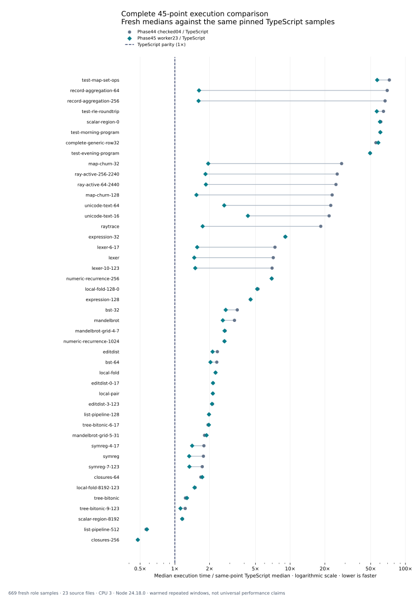

# Phase45 complete execution comparison

All 669 samples passed across 45 points and 23 source files. Fresh equal-point execution time changes from **6.0867×** pinned TypeScript for Phase44 checked04 to **3.0787×** for worker23: a **1.9771×** geometric improvement. Equal-source weighting gives **4.1467×** TypeScript and **1.9947×** improvement. Overall execution is about 2× faster, but the target of TypeScript parity has not been reached. These are complete selected-image runtime results, not a claim of release installation or full semantic conformance.

Each connected pair uses the same fresh TypeScript denominator. Points to the left of 1× execute faster than TypeScript. The chart is logarithmic and ordered by the old ratio; line distance encodes multiplicative change, not absolute milliseconds.

## Protocol and aggregate weighting

The three complete 600-second-preset batches took 1143.51s combined. Each ordinary point has five fresh rounds per role; raytrace has three, giving 669 samples. The pinned catalog and every source/point identity match the acquisition manifests. Samples use Node 24.18.0 on CPU 3, 1024MiB heap, 2048MiB process-tree RSS cap and available-memory floor, a 4096KiB stack, 1000ms warmup, 50ms calibration and 300ms sample target. These are warmed repeated-execution windows; compilation, import and first-call latency are separate.

| Weighting | Phase44 / TypeScript | Worker23 / TypeScript | Phase44 / worker23 |
| --- | ---: | ---: | ---: |
| Equal point | 6.0867× | 3.0787× | 1.9771× |
| Equal source | 8.2713× | 4.1467× | 1.9947× |
| Equal family | 8.4316× | 4.7340× | 1.7811× |

Equal-point weighting takes the geometric mean of the 45 same-point median ratios. Equal-source weighting first combines points sharing the exact source SHA-256, then weights the 23 source groups equally. Family weighting uses the catalog's family field and is a separate partition. No historical samples are pooled and no elapsed-time-weighted throughput is inferred.

## All 45 point medians

Times are milliseconds per call. An improvement ratio above 1× means worker23 is faster than Phase44; a TypeScript ratio below 1× means the selfhost output is faster than TypeScript. Small differences are descriptive observations, not statistical significance claims.

| Point | TypeScript ms | Phase44 ms | Worker23 ms | Phase44 / TS | Worker23 / TS | Improvement |
| --- | ---: | ---: | ---: | ---: | ---: | ---: |
| `local-pair` | 1.232341 | 2.631184 | 2.629966 | 2.135× | 2.134× | 1.000× |
| `local-fold` | 0.039705 | 0.089409 | 0.089441 | 2.252× | 2.253× | 1.000× |
| `scalar-region-0` | 0.000067 | 0.004113 | 0.004043 | 61.162× | 60.117× | 1.017× |
| `scalar-region-8192` | 0.099728 | 0.116208 | 0.115216 | 1.165× | 1.155× | 1.009× |
| `complete-generic-row32` | 0.006782 | 0.376072 | 0.394599 | 55.450× | 58.181× | 0.953× |
| `mandelbrot` | 0.051676 | 0.169941 | 0.134694 | 3.289× | 2.606× | 1.262× |
| `editdist` | 4.944453 | 11.553599 | 10.499040 | 2.337× | 2.123× | 1.100× |
| `tree-bitonic` | 0.283662 | 0.350205 | 0.361228 | 1.235× | 1.273× | 0.969× |
| `lexer` | 1.670756 | 11.923401 | 2.459971 | 7.137× | 1.472× | 4.847× |
| `symreg` | 1.105941 | 1.955956 | 1.471297 | 1.769× | 1.330× | 1.329× |
| `test-morning-program` | 0.003279 | 0.197718 | 0.198779 | 60.291× | 60.614× | 0.995× |
| `test-evening-program` | 0.002636 | 0.130355 | 0.130006 | 49.460× | 49.328× | 1.003× |
| `test-rle-roundtrip` | 0.000563 | 0.036315 | 0.031776 | 64.473× | 56.415× | 1.143× |
| `test-map-set-ops` | 0.020515 | 1.487372 | 1.166426 | 72.501× | 56.857× | 1.275× |
| `raytrace` | 34.206364 | 630.424925 | 59.552787 | 18.430× | 1.741× | 10.586× |
| `variation-editdist-0-17` | 1.231829 | 2.645721 | 2.636118 | 2.148× | 2.140× | 1.004× |
| `variation-editdist-3-123` | 9.946377 | 21.084317 | 20.868341 | 2.120× | 2.098× | 1.010× |
| `variation-lexer-6-17` | 0.409745 | 3.024853 | 0.639665 | 7.382× | 1.561× | 4.729× |
| `variation-lexer-10-123` | 6.620280 | 46.125680 | 9.943015 | 6.967× | 1.502× | 4.639× |
| `variation-tree-bitonic-6-17` | 0.037070 | 0.071891 | 0.073094 | 1.939× | 1.972× | 0.984× |
| `variation-tree-bitonic-9-123` | 0.731906 | 0.899868 | 0.818423 | 1.229× | 1.118× | 1.100× |
| `variation-symreg-4-17` | 0.550234 | 0.982668 | 0.776624 | 1.786× | 1.411× | 1.265× |
| `variation-symreg-7-123` | 1.867078 | 3.226417 | 2.495686 | 1.728× | 1.337× | 1.293× |
| `variation-local-fold-128-0` | 0.001443 | 0.007590 | 0.007464 | 5.261× | 5.174× | 1.017× |
| `variation-local-fold-8192-123` | 0.117043 | 0.175347 | 0.173331 | 1.498× | 1.481× | 1.012× |
| `variation-mandelbrot-grid-4-7` | 0.015729 | 0.042868 | 0.042457 | 2.725× | 2.699× | 1.010× |
| `variation-mandelbrot-grid-5-31` | 0.232316 | 0.420155 | 0.437483 | 1.809× | 1.883× | 0.960× |
| `variation-ray-active-64-2440` | 0.301493 | 7.528297 | 0.560013 | 24.970× | 1.857× | 13.443× |
| `variation-ray-active-256-2240` | 1.245125 | 31.864052 | 2.294758 | 25.591× | 1.843× | 13.886× |
| `coverage-closures-64` | 0.005624 | 0.009446 | 0.009719 | 1.680× | 1.728× | 0.972× |
| `coverage-closures-256` | 0.020757 | 0.009873 | 0.009908 | 0.476× | 0.477× | 0.996× |
| `coverage-list-pipeline-128` | 0.006420 | 0.012682 | 0.012690 | 1.975× | 1.977× | 0.999× |
| `coverage-list-pipeline-512` | 0.027720 | 0.015601 | 0.015867 | 0.563× | 0.572× | 0.983× |
| `coverage-unicode-text-16` | 0.021317 | 0.464115 | 0.091654 | 21.773× | 4.300× | 5.064× |
| `coverage-unicode-text-64` | 0.085979 | 1.933961 | 0.230372 | 22.493× | 2.679× | 8.395× |
| `coverage-map-churn-32` | 0.142599 | 3.985165 | 0.277506 | 27.947× | 1.946× | 14.361× |
| `coverage-map-churn-128` | 0.760825 | 17.602431 | 1.170368 | 23.136× | 1.538× | 15.040× |
| `coverage-numeric-recurrence-256` | 0.001984 | 0.013751 | 0.013713 | 6.931× | 6.911× | 1.003× |
| `coverage-numeric-recurrence-1024` | 0.007628 | 0.020453 | 0.020574 | 2.681× | 2.697× | 0.994× |
| `coverage-bst-32` | 0.021955 | 0.076339 | 0.060614 | 3.477× | 2.761× | 1.259× |
| `coverage-bst-64` | 0.050789 | 0.117304 | 0.103403 | 2.310× | 2.036× | 1.134× |
| `coverage-expression-32` | 0.002089 | 0.018866 | 0.019008 | 9.032× | 9.100× | 0.993× |
| `coverage-expression-128` | 0.008973 | 0.040565 | 0.040739 | 4.521× | 4.540× | 0.996× |
| `coverage-record-aggregation-64` | 0.297663 | 20.686189 | 0.481869 | 69.495× | 1.619× | 42.929× |
| `coverage-record-aggregation-256` | 1.203494 | 80.118051 | 1.931801 | 66.571× | 1.605× | 41.473× |

## Interpretation and limits

Worker23 has a lower median than Phase44 on 32 of 45 points and beats TypeScript on 2. These counts do not express statistical confidence. The largest improvements are:

- `coverage-record-aggregation-64`: 42.929× improvement; 1.619× TypeScript time.
- `coverage-record-aggregation-256`: 41.473× improvement; 1.605× TypeScript time.
- `coverage-map-churn-128`: 15.040× improvement; 1.538× TypeScript time.
- `coverage-map-churn-32`: 14.361× improvement; 1.946× TypeScript time.
- `variation-ray-active-256-2240`: 13.886× improvement; 1.843× TypeScript time.

Thirteen points have higher candidate medians; the largest increases are:

- `complete-generic-row32`: 4.93% more time.
- `variation-mandelbrot-grid-5-31`: 4.12% more time.
- `tree-bitonic`: 3.15% more time.

These small regressions require interpretation alongside run variation; no statistical-significance claim is made. The slowest remaining TypeScript ratios are:

- `test-morning-program`: 60.614× TypeScript time; 0.198779 ms per call.
- `scalar-region-0`: 60.117× TypeScript time; 0.004043 ms per call.
- `complete-generic-row32`: 58.181× TypeScript time; 0.394599 ms per call.
- `test-map-set-ops`: 56.857× TypeScript time; 1.166426 ms per call.
- `test-rle-roundtrip`: 56.415× TypeScript time; 0.031776 ms per call.

Maximum absolute half-window drift is 47.9% for Phase44, 52.3% for worker23 and 13.4% for TypeScript. One-call windows have undefined half-drift and are excluded from these maxima, not interpreted as zero. Drift, small call durations and JIT/allocation effects limit precise causal attribution. This maintained benchmark informed development; it is not an untouched holdout or a distribution of every Bend program. The complete combined candidate includes multiple changes; intermediate paired experiments supply narrower causal evidence.

## Bound evidence

All paths below are local raw receipts preserved for the final evidence archive; they are not links to ignored GitHub paths. Summary `selfhost/build/phase45/qualification23/runtime-summary.json` has SHA-256 `da0e85bb7f80497ba4c76054001b76065b8268e8ec27e54158f1ec6dc1493934`. The three consumed report hashes are:

- `selfhost/build/phase45/qualification23/runtime-0/report.json`: `5f28b423506840077943a7181d73beed93c0024a764e2577f98dd8ff9529a900`.
- `selfhost/build/phase45/qualification23/runtime-1/report.json`: `8e28cdec3fd52090f38ee3ed7db34d8fcab44e2f36ddb1e7cc3f0aaca64927c6`.
- `selfhost/build/phase45/qualification23/runtime-2/report.json`: `97ceccf39455933e7f289cf4a2a882956204f6bcab398982dcd6202cc75bd2eb`.

Worker23 API is `e77c504a9c91d9ae9d43e52f4f4899711eb7a8ebe707ee565348df2708488b4c`; runtime is `4f057842e476d01be5cfa06ad7984fea55ad2537b2fe6e861965a782e8b94c26`. See the [phase report](README.md) for separate semantic, host-observation, compiler-cost, complexity and release status.

Renderer `selfhost/build/phase45/render-runtime-report23-v4.py` SHA-256: `d4bc45877ac67752c90e94e9376db9d243c01c760f2c09b05ce557ce97b902bf`.

The final workflow summary is byte-identical to the earlier validated preview; its path was updated only after direct byte comparison.
