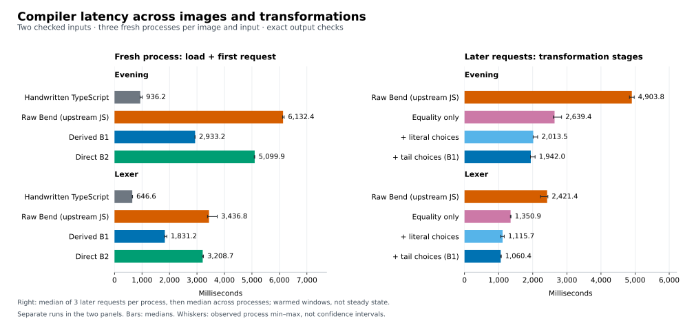

# Phase57: where compiler execution time goes

This investigation keeps the Phase56 compiler installed and unchanged. It
compares four implementations, gathers CPU/allocation/V8 evidence, and separates
existing bootstrap transformations before choosing another optimization.
The [design](../../design/phase57/compiler-performance-attribution.md) was
committed before measurement. No upstream PR comment is posted.

## First findings

The apparent regression from B1 to B2 is not evidence that the direct backend
generates slower code than upstream. **B2 beats the unmodified upstream-emitted
Bend compiler on both measured inputs.** Installed B1 is a separately optimized
image with equality and branch transformations that the other images do not all
share. It remains faster than B2.

| Ordinary compiler request | Evening | Lexer |
| --- | ---: | ---: |
| Handwritten TS, import + first request | 0.936 s | 0.647 s |
| Raw upstream-emitted Bend, import + first | 6.132 s | 3.437 s |
| Optimized B1, import + first | 2.933 s | 1.831 s |
| Direct B2, import + first | 5.100 s | 3.209 s |
| B2 / optimized B1, later request | 1.830× | 1.807× |
| B2 / raw upstream-emitted Bend, later request | 0.704× | 0.766× |

These are three-process medians, not language constants. The 24-process screen
checks all 96 requests against prepared output oracles. Later requests continue
warming up; they are not claimed steady-state throughput. The Bend images emit
identical complete JavaScript for both inputs. See [latency](latency.md) for
individual sequences, timing boundaries, cache differences and exact receipts.

API loading is about 0.10 s for B2, only 2–3% of its first-request total. Its
continued disadvantage on later requests rules out startup as the complete
explanation. All three measured Bend images expose the named API and bypass the
old `G` conversion adapter.

## Separating the existing transformations

A second 24-process/96-request comparison restores the exact intermediate B1
images. Native string equality removes **44–46%** of later-request time;
literal-choice lowering removes **another 17–24%**; the narrower returned-choice
rewrite removes **another 3.6–5%**. These are conditional, sequential effects,
not percentages to add together. B2 already has native string equality, so the
largest step cannot be claimed as a new B2 opportunity.

The [transformation report](transformation-ablation.md) includes every sequence,
image hash and output oracle. Transferring the branch optimization into the Bend
backend is promising, but its B2 benefit remains unmeasured.

## Allocations and execution are separate costs

The lexer allocation profiles include collected objects and normalize sampled
bytes by completed requests:

| Image | Estimated allocated MB/request |
| --- | ---: |
| Handwritten TS | 59.02 |
| Raw upstream-emitted Bend | 4,384.68 |
| Optimized B1 | 927.36 |
| Direct B2 | 2,177.76 |

These are decimal MB of allocation churn, **not peak memory or exact byte counts**.
B2 allocates about 2.35× B1's sampled bytes per request. Term substitution, child
access and callback transport contribute; `run_clo` itself accounts for only
3.68% of B2's self-attributed allocations. It would be misleading to call all of
the excess callback-wrapper allocation.

CPU sampling gives a different ranking. B2's trampoline `run_loop` has 15.15%
weighted self samples and its generic KTerm constructor `kt` has 9.28%. In the
complete compiler-source check, `kt` again has 9.32%. Trampoline implementation
bodies are byte-identical across raw/B1/B2, so differences in calls, forcing and
V8 execution matter more than the runtime function's source text alone.
See [profiles](profiles.md) for independent sample-count views and all GC,
driver, runtime, compiler and unmapped costs. Diagnostic durations are not clean
speed measurements.

All three whole-source checks passed the exact type-acceptance oracle for 3,012
definitions and retained the expected `@unsafe` trust refusal. They establish
type acceptance under that workflow, not kernel proof validity. Source discovery
accounts for 51.86% of B2's inclusive time weights, with `f_complete_aliases`
underneath at 44.96%; that wrapper includes parsing and completion, not just an
alias loop. The two percentages overlap.

## What the V8 and source inspections add

**Constant computed property names survive as extra construction work.** In a
filtered dump of hot `kt`, B2's `["tag"]`-style field syntax becomes 103 bytes
of bytecode and 788 bytes of TurboFan instructions, versus 38 and 532 for B1's
ordinary literal fields. B2 retains successive map updates and three runtime
calls at property-definition sites. The ordinary literal starts with a fuller
object shape. Both still allocate; this does not prove an allocation-byte saving
or a whole-request speedup. A plain-field emission experiment, retaining computed
semantics for `__proto__`, is now a particularly small and concrete next step.
V8 removes the extra aliases and trivial loop from B2's optimized constructor;
their source presence alone is a weaker lead.

[V8 traces](v8-findings.md) show continuing optimization after the three warmup
requests, but only two or three later-window deoptimizations per Bend role.
Recorded GC pauses occupy about 3–5% of those windows. Neither observation
supports attributing most of the gap to repeated deoptimization or GC pauses.
Allocation work and dispatch can still be expensive outside GC pauses.

The [source comparison](implementation-comparison.md) identifies concrete
follow-ups:

- `sk_char` escapes canonical serialization keys. It already uses scalar U32
  row tests, but reconstructing the residual/default binding creates temporary
  32-bit Word lists. Both backends show this behavior. Preserve scalar origin
  through partial views/reconstruction; merely adding a switch table would not
  cover the demanded default expression.
- Declaration lookup uses a trie to reject missing local names, then scans the
  event list on hits. The compiler's 629 early laws followed by definitions
  expose repeated growing-list scans. Count those visits before changing the
  event-sensitive lookup contract.
- First-order substitution reconstructs term trees; quantity merging repeatedly
  searches lists. Upstream uses different representations. These are plausible
  algorithmic costs, not measured whole-compiler speedup promises.
- Emitted reachability renders definitions, scans textual reference metadata,
  then final emission renders definitions again. A structured reference result
  could avoid work, but must preserve the emitter's exact demand rules and
  context-dependent call/SCC decisions.

## Evidence map

- [Compiler latency and reproducible commands](latency.md).
- [Allocation/CPU profiling method](profiling.md), including preserved failures.
- [Generated code shapes and exact corresponding functions](code-shapes.md).
- [Bend versus handwritten TypeScript algorithms](implementation-comparison.md).
- [Bounded V8 diagnostics](v8-plan.md).
- [V8 findings](v8-findings.md).
- [Ordered transformation experiment](transformation-ablation.md).
- [Investigation commands and approximate budgets](../../selfhost/tools/performance/phase57/README.md).

The full-emission diagnostic is being consolidated.
No production optimization or fresh generated-program speed claim is made by
this information-gathering phase.
