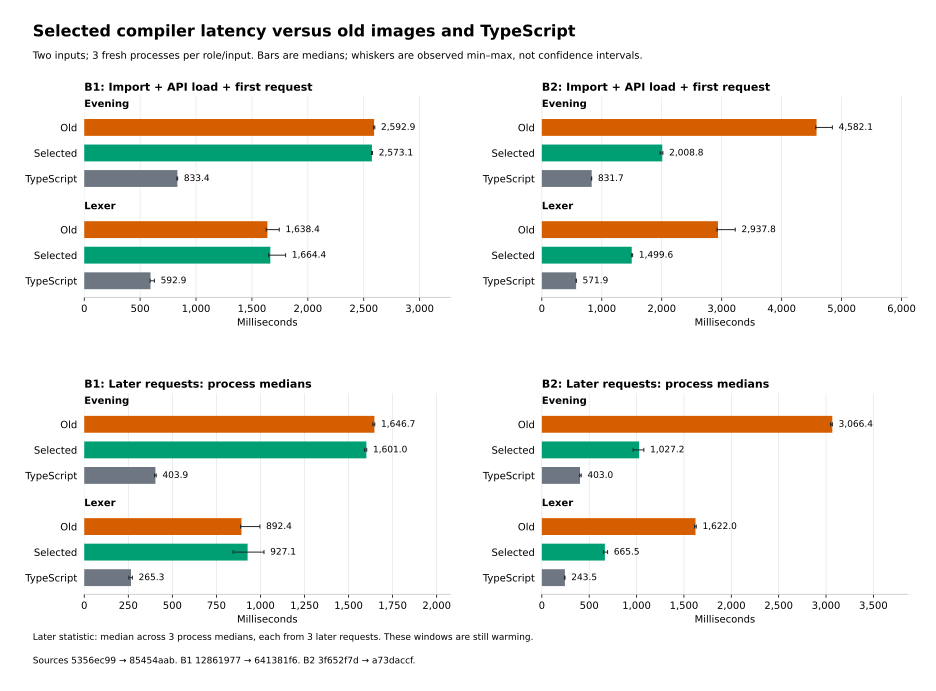
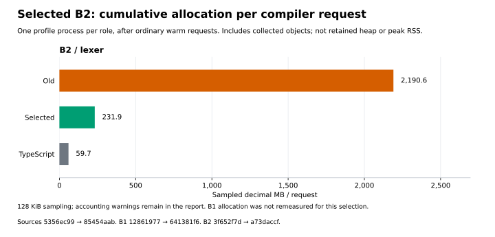

# Final selected compiler measurements

All seven compiler-measurement jobs in `comparison-last01` passed for the final
`checked-last01` source. Compared with old B2, selected B2 takes 49–56% less time
for import plus a first request and 59–67% less time in the later-request windows.
Lexer sampled allocation falls 89.41%. B1 changes are small and mixed, including
a 3.89% later-request lexer regression. Selected B2 still takes 2.4–2.7× the
same-campaign TypeScript time on these two inputs.

The earlier [shared-body candidate report](latency.md) and its figures remain
separate evidence. These are compiler-request measurements, not measurements of
generated-program execution, and they do not establish installation status.

The final source is `85454aab7a6ef25d1e78970b1c24d68ac2a90a23a4b39b64a30de311c2fc5091`.
Its checked B1 API is `641381f638f1f4c1c8b349bef06502b42738c1c7feff0391f2e09b90f4ef282a`;
its genuine direct B2 is `a73daccf86a807092a334d5f3121745e0b91c3054164c25462f1658644b7b081`.
The old source is Phase56 string01 `5356ec9963db7b300e8cbdf5474328b72150f582df96b01aeea29d6a07868244`.
This is a comparison of changed compiler implementations, not an isolated
field-syntax experiment or a fixed-source code-generation comparison.

## Clean ordinary requests

Each compiler-image matrix uses Evening and lexer, old/new/pinned TypeScript,
three rotated fresh-process rounds, and one first plus three later ordinary
library requests per process. Preparation executes each role's complete catalog
output oracle. Every measured request then checks fresh source syntax and must
reproduce its role's prepared module bytes. API-specific private Base caches are
primed before the measured workers.
There is no persistent inspector. Import, actual API load and first request are
measured separately, with their sum as the primary fresh-process measure because
TypeScript performs substantial work during import.

Times below are milliseconds. Later statistics are medians of three process
medians, each derived from its three later requests. They are not steady-state
rates, and these small samples establish neither significance nor universal
compiler throughput.

| Image / input | Window | Old | Selected | Same-campaign TS | Selected / TS | Selected time change |
| --- | --- | ---: | ---: | ---: | ---: | ---: |
| B1 / Evening | Import + API + first | 2,592.93 | 2,573.14 | 833.38 | 3.088× | −0.76% |
| B1 / Evening | Later process median | 1,646.73 | 1,601.02 | 403.94 | 3.963× | −2.78% |
| B1 / lexer | Import + API + first | 1,638.43 | 1,664.40 | 592.92 | 2.807× | +1.59% |
| B1 / lexer | Later process median | 892.36 | 927.06 | 265.32 | 3.494× | +3.89% |
| B2 / Evening | Import + API + first | 4,582.11 | 2,008.85 | 831.66 | 2.415× | −56.16% |
| B2 / Evening | Later process median | 3,066.42 | 1,027.17 | 402.99 | 2.549× | −66.50% |
| B2 / lexer | Import + API + first | 2,937.79 | 1,499.60 | 571.89 | 2.622× | −48.95% |
| B2 / lexer | Later process median | 1,622.03 | 665.51 | 243.55 | 2.733× | −58.97% |

[PNG](figures-last01/compiler-latency.png) ·
[Exact plotted values and identities](figures-last01/comparison.json).

The B1 result is mixed: a small Evening improvement and a lexer regression.
Selected lexer later process medians span 844.42–1,020.03 ms; the old range is
887.04–996.55 ms. These observed ranges are not confidence intervals. API load is
about 50.6 ms on selected Evening and 50.4 ms on selected lexer; it does not explain
most request time. B2 API load is 82.69 ms for Evening and 83.32 ms for lexer;
its gains also arise mainly after loading the API.

B2's first-request speedups are 2.281× for Evening and 1.959× for lexer; later
speedups are 2.985× and 2.437×. Selected later process medians span
963.07–1,077.12 ms for Evening and 649.09–694.02 ms for lexer. Warmup continues:
one selected Evening process has later requests of 1,343.69, 1,077.12 and
835.69 ms; one lexer process has 770.41, 649.09 and 501.36 ms. These are
observations of specific windows, not asymptotic rates. Excluded preparation,
provenance checks and inter-request output saving can affect process state.

The two clean matrices contain **36 processes / 144 requests** and take
139.608 + 159.293 = 298.902 s including measurement orchestration. Preparation
remains outside the request clocks. All comparisons use the TypeScript samples
from their own campaign; the two matrices are not pooled into a common TS baseline.

## Fresh B2 allocation and CPU attribution

Allocation uses one separate lexer process per role after its first and three
later ordinary requests. Inspector sampling is 128 KiB, including objects
collected by minor and major GC. Decimal MB below are cumulative estimates,
not retained heap or peak RSS. Profiles include output validation and are not
clean timing observations.

| Role | Profiled requests | Samples | Total sampled MB | Sampled MB/request |
| --- | ---: | ---: | ---: | ---: |
| Old B2 | 3 | 49,901 | 6,571.650 | 2,190.550 |
| Selected B2 | 11 | 18,858 | 2,551.407 | 231.946 |
| TypeScript | 32 | 14,523 | 1,909.354 | 59.667 |

Selected allocation is **9.444× lower than old B2 (89.41% reduction)** and
**3.887× TypeScript**. Workload windows are 5.319, 5.275 and 4.094 s respectively;
TypeScript reaches the 32-request cap before the requested five seconds. Different
sample counts and one process per role do not supply an uncertainty estimate.

[PNG](figures-last01/compiler-allocation.png).

All allocation warnings are retained. Sample-weight totals exceed tree totals by
707,240 bytes for old B2, 989,176 for selected B2 and 28,824 for TypeScript
(0.01076%, 0.03877% and 0.00151%). One old sample / 554,696 bytes and two selected
samples / 663,688 bytes have absent tree nodes and remain unattributed. These
observed accounting differences are not sampling-error bounds or evidence of a
particular cause.

Selected exclusive allocation frames include the `subst$scc` dispatcher
(24.803 MB/request), `index_node` (20.331), `index_remove` (16.032), the
`String.contains.if$scc` dispatcher (11.865), and the
`jd_reach_refs_unique$scc` dispatcher (8.370). A shared dispatcher frame identifies
the emitted component, not one uniquely responsible source member or object kind.
These weights do not predict savings from eliminating a named operation.

Only selected B2 receives a fresh lexer CPU profile: 11 requests, 3,768 samples,
5,167,744 weighted µs. The weighted view is admitted without negative deltas or
correction. Its profiler duration exceeds the summed weights by 892 µs
(0.0173%); this residual remains recorded and is not assigned to a function.
Exclusive weights are 9.01% `validateSpanCache`, 7.15% `readBaseCache` and 5.84%
`validateSpanBook` (**22.00% together**), 9.21% GC, 4.51% `jd_primitive_table`,
2.06% `subst$scc`, and 1.97% `index_find$scc`. Inspector/harness frames remain in
the denominator. This profile locates work; it does not establish an old/new CPU
ratio or a removable fraction of clean request time.

**B1 allocation is not measured again for this final source.** The earlier
905 MB/request shared-candidate number must not be relabeled as a final-selected
result. Full frame tables and all warnings are in the frozen allocation and CPU
presentation receipts listed below.

## Own-source emission with a retained baseline

Selected B2 emits its own full compiler source in **36.058487 s**, compared with
the earlier **223.475242 s** old-B2 observation under the exact same
`emission-method02`: a descriptive 6.198× ratio / 83.86% time reduction. Both
successfully reproduce their own exact B3 bytes. This is a comparison of changed
compiler sources and algorithms, not isolated attribution to lookup, choices,
field syntax or shared dispatchers. It measures emission, not a fresh complete
source type-check or a proof of kernel validity.

| Emission stage | Retained old B2, s | Selected B2, s |
| --- | ---: | ---: |
| Load own source | 15.953 | 6.319 |
| Specialize loaded book | 8.264 | 3.153 |
| Source reachability | 1.070 | 1.019 |
| Annotate selected definitions | 3.665 | 1.680 |
| Emitted reachability | 83.376 | 8.016 |
| Layout proof | 4.557 | 1.770 |
| Unsplit library emission | 100.522 | 8.466 |
| Complete worker | 223.475 | 36.058 |

The old supervisor ran **2026-10-06 09:12:03.900–09:15:47.897 UTC**; selected ran
**11:02:12.213–11:02:48.892 UTC**. The baseline report and supervisor are pinned
with `freshlyReexecuted:false`; this is **not a fresh consecutive pair**. Supervisor
wall times are 223.996 and 36.679 s, and observed process-tree peaks are
1,057.215 and 1,066.340 MiB. Those peaks do not demonstrate a memory reduction.

The failed old full-image allocation capture remains preserved. It is neither
retried nor used as an allocation denominator. No new own-source allocation
claim follows from this final queue. Earlier successful shared-candidate
own-source profiles remain diagnostic evidence for that distinct image.

## Frozen saved-data evidence

The analyzer rejoined actual worker, configuration, preparation, source, API,
profile and output identities; recomputed statistics; and rehashed inputs after
reading. It imported no compiler or generated program. All paths below are under
`selfhost/build/phase58/` unless specified otherwise.

| Receipt | SHA-256 |
| --- | --- |
| `latency-last-clean01/report.json` (both B1 and B2) | `0c1aba910032b580561f38bcd93b71258e3d89d8f32a5a39511673d27e548225` |
| `latency-last-allocation01/report.json` (B2 only) | `7030dffae9c08100415dd73928b471320e8cb4b83e7ff4719c71d9b00597ad26` |
| `latency-last-cpu01/report.json` (selected B2 only) | `21a15628a4484337aa22716af450fe6588c9625b253c4efb9d5b5c1397797db4` |
| `latency-last-emission01/report.json` (retained old + selected) | `9d074eedd5fd78c853991cf735e775e2899d48f0ff4ce5d4cf04390eb74d9c74` |
| `allocation-last-presentation01/report.json` | `1e6c54368205088396a98390e76c7d4fd7480385f129f2898f0e51a33c7057c7` |
| `cpu-last-presentation01/report.json` | `f105222de58a41215f1ff37c1360dfaa6ddc4edeed181929faf0d90fbfba7194` |

The data-only [analyzer](../../selfhost/tools/performance/phase58/latency/summarize.py)
is unchanged. The [final chart renderer](../../selfhost/tools/performance/phase58/latency/plot-selected.py)
is a reviewed successor that accepts B2-only allocation, never filling the missing
B1 measurement from history. Its [figure receipt](figures-last01/comparison.json)
has SHA `107bba7dd6dd5b8ce615171f387abb635b2301556a6c812e823d6c978a038504`
and binds all 27 plotted rows and four SVG/PNG files.

The launch recipe is `selfhost/build/phase58/comparison-last01/selected-matrix.json`,
SHA `fe2aebb0045d86b2bcd2d40950443cef8447eb12cfd83c88cdb124b9197fed78`.
It derives seven commands from the preserved ten-command parent without modifying
the frozen measurement workers or old receipts.
