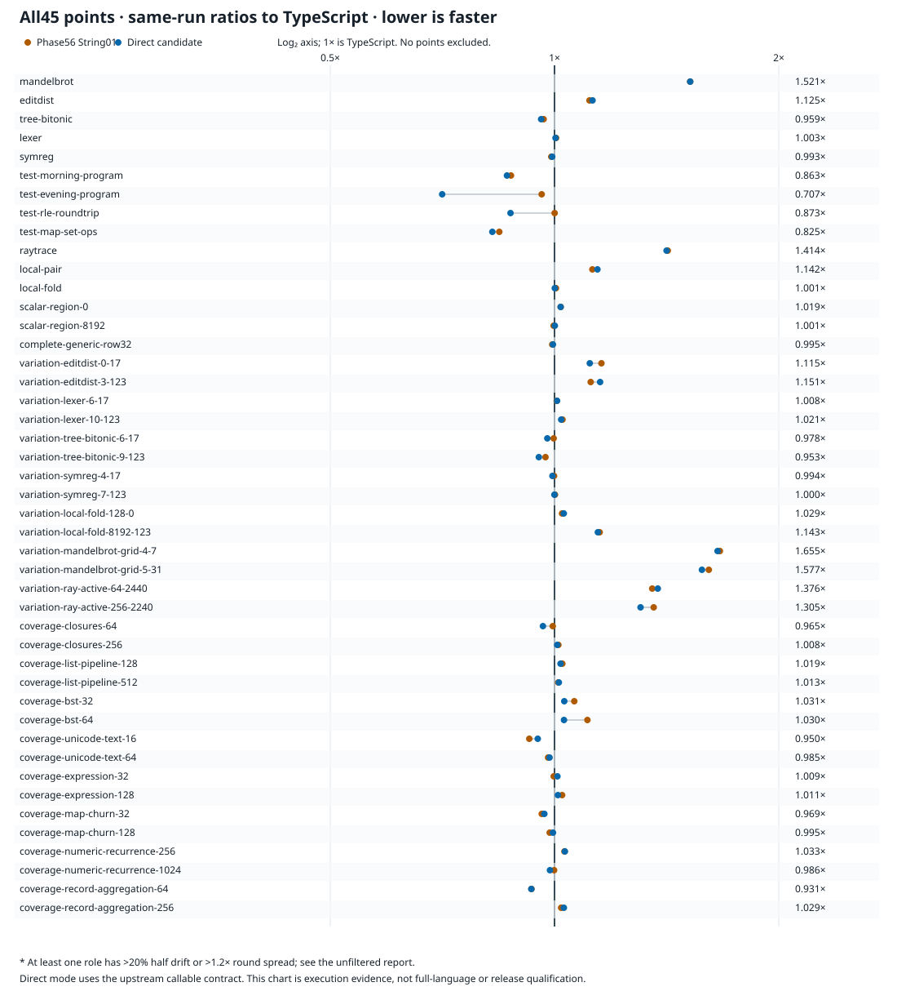

# Final last01 generated-program performance

The genuine checked-last01 compiler passes all **45 points, 23 source programs
and 669 fresh samples**. Against the same-run Phase56 String01 baseline, its
geometric mean runtime is **1.47% lower with equal point weights** and **2.43%
lower with equal source weights**. These are the final source compiler's emitted
programs, not the earlier saved-JavaScript last-key diagnostic.

The [exact aggregate](../../selfhost/tools/performance/phase58/evidence/program-performance-last01.json)
is complete and passed, SHA256
`c8a7e9699ea99fdd839b67f630400650e6570aca09cfbc9ba4fa53a3fa875231`. Its three source reports and every consumed
input remain pinned in that receipt. The [copy identities](../../selfhost/tools/performance/phase58/evidence/program-performance-last01-artifacts.json)
bind this exact JSON and the unmodified generated SVG to the raw originals.

## Same-run comparison

| Weighting | Phase56 / TypeScript | Last01 / TypeScript | Phase56 / last01 |
|---|---:|---:|---:|
| Equal point, 45 points | 1.061731× | 1.046110× | 1.014933× |
| Equal source, 23 source hashes | 1.066364× | 1.040502× | 1.024855× |

Phase56/last01 above one favors last01. Last01/TypeScript above one means last01
is slower than the pinned TypeScript output. Last01 wins 18 of 45 points against
TypeScript; 30 are within ±10% and 38 within ±20%. It remains 4.61% slower under
equal point weighting and 4.05% slower under equal source weighting. The largest
TypeScript gap is the small Mandelbrot variation at 1.655366×.

All **19 slower-than-Phase56 points** remain included. The largest regression is
`variation-editdist-3-123`, +2.949%; none exceeds 10%. Near-equality is retained
as measured, including Mandelbrot's +0.000092%. Evening improves by 26.479%, RLE
by 12.747%, MapSet by 2.130% and Morning by 1.233%. These observations do not
isolate any one source change or prove a JIT mechanism.

There are **zero configured flags across 135 role-points**. The descriptive
flags are absolute sample half-drift above 20% or maximum/minimum fresh-round
time above 1.20. No rows were excluded. Absence of these flags does not prove
JIT convergence, statistical significance or that a small difference repeats.

## Method and scope

The candidate is checked-last01 derived B1 API
`641381f638f1f4c1c8b349bef06502b42738c1c7feff0391f2e09b90f4ef282a`, source
`85454aab7a6ef25d1e78970b1c24d68ac2a90a23a4b39b64a30de311c2fc5091`.
The baseline is the actual installed-at-start Phase56 String01 acquisition;
the reference is pinned upstream `018751270e800bc222a93dad7f257083ee53a5f7`.
All roles use the existing callable benchmark interface and unchanged catalog
arguments/full expected values. The complete-row observer is included.

The unchanged execution worker ran three serial 600-second-preset batches of
15 points. Every ordinary point has five balanced role rotations; raytrace has
three, producing 669 samples overall. Warmup requires at least three calls and
1,000 ms, except raytrace's one-call minimum; calibration is 50 ms and target
measurement 300 ms. Import and first-call observations are separate. The timed
operation includes export invocation, exact result checks and checksum work.
No compiler acquisition or inspector profiling is included.

Node24.18.0 used CPU3, a 1 GiB heap, 2 GiB tree-RSS bound and 4 GiB available-memory
floor. Actual batch wall times were 365.903, 376.317 and 377.561 seconds:
**1119.781 seconds total**. The largest recorded sample process-tree RSS was
**130,822,144 bytes (124.76 MiB)**. These are measured supervised walls and
a maximum observed tree peak, not CPU usage or a sum of memory.

The geometric means use medians from these fresh samples only. Equal-source
weighting first takes a geometric mean of point ratios within each source hash,
then weights the 23 sources equally. Earlier choice/shared ablations and the
three-point last-key diagnostic remain separate campaigns; no samples are pooled
or historical timings substituted. The actual saved case order is recorded,
not claimed to match a different historical batch ordering.

All 23 source emissions were freshly checked before timing. Relative to Phase56,
39 point modules changed and six were byte-identical. Last01's actual MapSet,
editdist and Morning modules separately matched the screened diagnostic bytes;
that correspondence does not turn the diagnostic into a checked compilation.
The final result here comes from genuine last01 acquisition and fresh full timing.
Generated module totals include runtime support and the observer: 24 distinct
modules occupy 1,032,396 bytes for last01, 1,045,800 for Phase56 and 543,407 for
TypeScript. These are emitted code sizes, not process memory or compiler source
complexity. [Validation](validation.md) records semantic/B2 gates separately;
this performance report does not by itself establish installation or publication.

## All point medians

Times below are microseconds per checked benchmark invocation. Direct means
last01. Every regression remains visible.

| Point | TS µs | Phase56 String01 µs | Direct µs | Direct / TS | Direct / Phase56 String01 | Flags |
|---|---:|---:|---:|---:|---:|---|
| mandelbrot | 45.292870 | 68.891144 | 68.891207 | 1.521017× | 1.000001× | none |
| editdist | 4983.083672 | 5551.996741 | 5604.577623 | 1.124721× | 1.009471× | none |
| tree-bitonic | 274.411101 | 265.321150 | 263.287257 | 0.959463× | 0.992334× | none |
| lexer | 1696.810555 | 1705.060955 | 1702.175542 | 1.003162× | 0.998308× | none |
| symreg | 1116.395367 | 1105.314371 | 1108.382355 | 0.992822× | 1.002776× | none |
| test-morning-program | 3.248011 | 2.839047 | 2.804047 | 0.863312× | 0.987672× | none |
| test-evening-program | 2.573050 | 2.473112 | 1.818256 | 0.706654× | 0.735210× | none |
| test-rle-roundtrip | 0.566963 | 0.567187 | 0.494890 | 0.872880× | 0.872535× | none |
| test-map-set-ops | 20.877581 | 17.602400 | 17.227525 | 0.825169× | 0.978703× | none |
| raytrace | 34322.688556 | 48711.535857 | 48529.465143 | 1.413918× | 0.996262× | none |
| local-pair | 1233.336139 | 1386.513115 | 1408.256681 | 1.141827× | 1.015682× | none |
| local-fold | 41.205159 | 41.388071 | 41.240340 | 1.000854× | 0.996431× | none |
| scalar-region-0 | 0.066837 | 0.068116 | 0.068122 | 1.019234× | 1.000083× | none |
| scalar-region-8192 | 99.735556 | 99.453362 | 99.835213 | 1.000999× | 1.003839× | none |
| complete-generic-row32 | 6.726017 | 6.679335 | 6.693574 | 0.995176× | 1.002132× | none |
| variation-editdist-0-17 | 1237.476453 | 1430.566682 | 1380.082349 | 1.115239× | 0.964710× | none |
| variation-editdist-3-123 | 9921.111968 | 11095.425500 | 11422.631333 | 1.151346× | 1.029490× | none |
| variation-lexer-6-17 | 409.667114 | 412.432943 | 412.924404 | 1.007951× | 1.001192× | none |
| variation-lexer-10-123 | 6605.014000 | 6770.281689 | 6742.555289 | 1.020824× | 0.995905× | none |
| variation-tree-bitonic-6-17 | 36.884414 | 36.788726 | 36.073597 | 0.978017× | 0.980561× | none |
| variation-tree-bitonic-9-123 | 719.531713 | 699.773228 | 685.463792 | 0.952653× | 0.979551× | none |
| variation-symreg-4-17 | 557.354839 | 556.599757 | 553.787728 | 0.993600× | 0.994948× | none |
| variation-symreg-7-123 | 1865.884123 | 1868.679994 | 1865.378566 | 0.999729× | 0.998233× | none |
| variation-local-fold-128-0 | 1.422849 | 1.456419 | 1.464323 | 1.029149× | 1.005427× | none |
| variation-local-fold-8192-123 | 113.693581 | 130.728509 | 129.997889 | 1.143406× | 0.994411× | none |
| variation-mandelbrot-grid-4-7 | 15.690418 | 26.158178 | 25.973384 | 1.655366× | 0.992935× | none |
| variation-mandelbrot-grid-5-31 | 232.459891 | 374.545850 | 366.642625 | 1.577230× | 0.978899× | none |
| variation-ray-active-64-2440 | 303.560285 | 410.566967 | 417.714604 | 1.376052× | 1.017409× | none |
| variation-ray-active-256-2240 | 1243.919612 | 1690.171434 | 1622.872049 | 1.304644× | 0.960182× | none |
| coverage-closures-64 | 5.649781 | 5.619384 | 5.451083 | 0.964831× | 0.970050× | none |
| coverage-closures-256 | 21.088729 | 21.342235 | 21.266364 | 1.008423× | 0.996445× | none |
| coverage-list-pipeline-128 | 6.399485 | 6.556374 | 6.520033 | 1.018837× | 0.994457× | none |
| coverage-list-pipeline-512 | 27.468105 | 27.787415 | 27.838798 | 1.013495× | 1.001849× | none |
| coverage-bst-32 | 21.953719 | 23.337605 | 22.626390 | 1.030640× | 0.969525× | none |
| coverage-bst-64 | 50.673492 | 56.099113 | 52.181241 | 1.029754× | 0.930162× | none |
| coverage-unicode-text-16 | 21.313713 | 19.716322 | 20.238706 | 0.949563× | 1.026495× | none |
| coverage-unicode-text-64 | 85.995622 | 84.304273 | 84.684624 | 0.984755× | 1.004512× | none |
| coverage-expression-32 | 2.086877 | 2.081831 | 2.105619 | 1.008981× | 1.011427× | none |
| coverage-expression-128 | 8.747840 | 8.955915 | 8.840405 | 1.010582× | 0.987102× | none |
| coverage-map-churn-32 | 141.539224 | 136.060704 | 137.169333 | 0.969126× | 1.008148× | none |
| coverage-map-churn-128 | 755.867982 | 744.718816 | 752.266815 | 0.995236× | 1.010135× | none |
| coverage-numeric-recurrence-256 | 1.978627 | 2.040361 | 2.043221 | 1.032646× | 1.001401× | none |
| coverage-numeric-recurrence-1024 | 7.768166 | 7.758504 | 7.659580 | 0.986022× | 0.987250× | none |
| coverage-record-aggregation-64 | 299.770803 | 279.167880 | 279.013185 | 0.930755× | 0.999446× | none |
| coverage-record-aggregation-256 | 1209.329224 | 1234.388902 | 1244.835828 | 1.029361× | 1.008463× | none |
