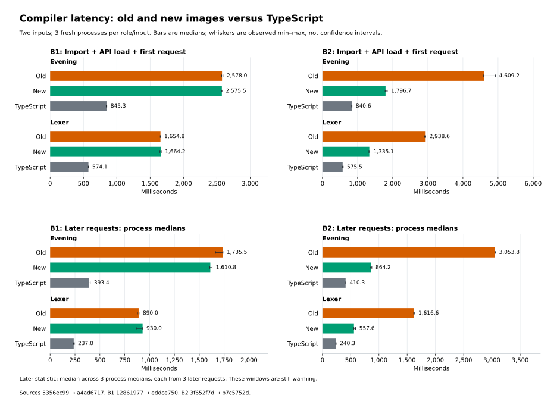
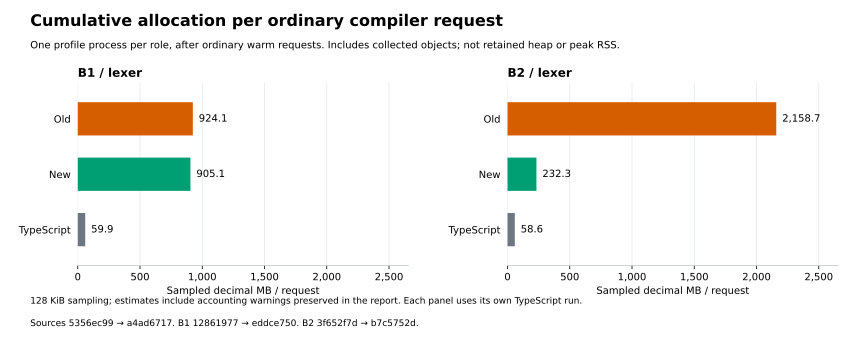

> Historical shared01 checkpoint, superseded by the final report in [README.md](README.md).
> Promotion was held for generated-program regressions; this image was not installed.

# Phase58: allocation and generated-code improvements

**Selected compiler: shared01; program timing complete, regression review and installation pending.**
All selected B1/B2 correctness gates pass. Six general source changes reduce
the self-emitted compiler's allocation and execution cost substantially, while
the checked B1 compiler's request latency remains approximately flat.

| Measured compiler cost | Phase56 baseline | Phase58 shared01 | Scope |
| --- | ---: | ---: | --- |
| B2 import + first request / pinned TypeScript | 5.11–5.48× | **2.14–2.32×** | Two inputs, three fresh processes per role/input |
| B2 later-request speedup over baseline | — | **2.90–3.53×** | Medians of three later requests per process; still warming |
| B2 lexer sampled allocation/request | 2,158.69 MB | **232.32 MB** | 89.24% less cumulative allocation; not peak memory |
| B2 reproduces its own complete compiler image | 223.475 s | **36.018 s** | 6.20× faster; one fresh matched-method pair, changed sources |
| Checked B1 import + first request / TS | 2.88–3.05× | **2.90–3.05×** | Separate paired B1 matrix; no broad B1 speedup |

The installed artifact remains checked B1 until the final release gate. The
faster B2 is independently qualified, with a fresh source check, byte-identical
B3 and complete benchmark-output equality. Installing it as the default requires
the distinct lineage support documented in the
[B2 installation follow-up](b2-installation-followup.md); Phase58 does not relabel
an emitted image as checked B1.

The [design](../../design/phase58/compiler-allocation-and-code-generation.md)
sets admission criteria. The main finding so far is that **representation and
emission choices carry substantial cost**: computed literal fields, intermediate
missing records, residual Word reconstruction, callback closures and copied SCC
switches create avoidable work. These observations do not show that Bend is
inherently slow, nor that all allocation/JIT activity is harmful. Each mechanism
has its own semantic proof and measured scope.

## Baselines and selected identities

Phase56's installed checked string01 release is the production comparator.
Pinned TypeScript at `018751270e800bc222a93dad7f257083ee53a5f7` remains the
independent reference, after Bend 2.0.34. It is not a fallback compiler. Retained
reference NaN defects remain explicit: source candidate96 versus TS95, and numeric
candidate34 versus TS28, where those existing gates apply. No additional candidate
mismatch may be waived using those historical defects.

| Binding | SHA256 |
| --- | --- |
| Phase56 checked B1 API | `128619779fb5e29138bd33273bc5de6b81f39bdb54c2cebb93e69f3ca63acaea` |
| Phase56 source | `5356ec9963db7b300e8cbdf5474328b72150f582df96b01aeea29d6a07868244` |
| Phase56 qualified B2/B3 | `3f652f7d3e26e06fe74da18bf8709195c54e4620906ffb7c1d0643c96ecbd57e` |
| Selected shared01 checked B1 API | `eddce7504207d91735e8369e7142f73ede8f77d8d2353b1ad6548796bdfd4569` |
| Selected shared01 source | `a4ad6717934a8596c6bf707ecabf11346f57ca5b4e4e08cdcbdaac7921546d9a` |
| Genuine shared01 B2 | `b7c5752d66ae4eaa8619e06b5a12655b370fba9d745d223660fbbb73da68fec8` |

The genuine B2 is newly emitted from the selected source by its own checked B1;
it is not the saved-image field or SCC diagnostic. Actual attempt, subject,
generator, runtime, Base, driver and Node bindings remain required alongside API
hashes. Separate completed gates establish the selected B2→B3 fixed point and
fresh source type acceptance; generation and driver observations alone do not.
The [qualification index](../../selfhost/tools/performance/phase58/evidence/qualification-shared01.json)
joins their exact report identities and overlapping scopes.

## Six production changes

| Change | General rule and retained boundary | Completed evidence |
| --- | --- | --- |
| [Literal fields](literal-fields.md) | Quoted ordinary keys for constructor/ordered/host-clone fields; exact `__proto__` stays computed. Values, own-property semantics and evaluation order remain unchanged. | Actual checked-source controls: 17 groups per role, complete values/prototypes/aliases/effects, and exact constructor/clone AST activation. |
| [Constructor lookup](lookup.md) | Skip intermediate missing KDef/KTerm construction on child misses; use checked annotated owner where proven, retaining global fallback and first-match semantics. | 135 actual annotated queries plus four fallback rows; synthetic malformed/cached/global controls; exact source oracles. |
| [Scalar residuals](scalar-residual.md) | Carry private U32 provenance through Word residual binders only when reconstruction covers all 32 positions of one origin. Refuse mixed/unproved/F32 shapes. | 1,728 counted observations per role across baseline, candidate and TS; arithmetic, aliases, callbacks, float bits and actual activation/refusal. |
| [Literal choices](literal-choices.md) | Structurally proved Bool/Unit selector with saturated literal callbacks becomes the selected continuation, preserving condition/prefix order and tail transfers. | 36 value/error oracles, nine host observations per image, eight function-shape checks, default-stack self/mutual tails through 100,000 steps. |
| [Reachability deduplication](validation.md#completed-choice-reach-and-shared-checkpoints) | Deduplicate repeated target references within one emitted definition; preserve validation, encounter order and all existing resource limits. | 22 scanner and 21 graph observations per role; reach01 full emission and its own fresh source check. |
| [Shared mutual-tail dispatch](shared-scc.md) | One private switch worker per multi-function SCC; original entries retain formals and fixed PCs, complete refs and per-call local state. | Original choice controls plus shared shape checks; nine supplemental library oracles, 12 host observations per role, one three-role program oracle and three component checks. |

These counts overlap and are not a unique source-program total. The direct
runtime, legacy runtime, ordinary driver and all **17 native modules** remain
byte-identical to Phase56. No native representation change, new runtime cache,
TypeScript fallback or relaxed frontend gate is introduced. Bootstrap and
private-image legacy clients are not retired by these direct-output changes.

## Isolated measurements and what they establish

The [compiler latency record](latency.md) separates saved-image causal ablations
from genuinely changed-source images and from generated-program execution.

| Experiment | Completed result | Limit |
| --- | --- | --- |
| Literal-field syntax, fixed Phase56 B2 source | Three rounds, six fresh processes: import/API/first median **3,147.51→2,373.32 ms (24.60% less)**; median of per-process later-request medians **1,778.88→1,377.90 ms (22.54% less)**. All emitted lexer bytes match. | Saved syntax derivative is explicitly unchecked; one source fixture, primed Base disk cache, continuing warmup; no memory reduction established. |
| Constructor-query hooks | Across 139 actual/fallback rows, `missing` calls **4,248→3**; annotated subset **2,391→0**. | Counts are query-local helper invocations, not total allocated bytes or an equivalent request speedup. One-pair lexer timing is essentially flat. |
| Reach01 genuine B2 lexer pilot | Import/API/first **3,291→1,531 ms**, sole later request **2,221→755 ms**, versus baseline B2. | One process per role and changed compiler source; promising diagnostic, not repeated selected-image throughput. |
| Shared-dispatch saved-image pilot | API load **174.890→95.616 ms**; sole later request **749.915→750.518 ms**. | Large code-size saving, essentially flat later-request observation; one pair, no isolated parsing/JIT/memory attribution. |

The first single-pair field pilot remains retained separately; it is not pooled
with confirmation. First requests, API imports, later requests and complete
process wall time are distinct denominators. No profiled or traced duration is
put into clean timing. The final B1/B2/TS matrices complete 36 fresh processes
and 144 checked ordinary requests. Separate CPU/allocation processes never enter
their clean ratios. B1's later Evening median improves 7.18%, while its Lexer
median increases 4.50%; all individual sequences and ranges remain in the
[latency report](latency.md). No fresh program-speed result is inferred from
these compiler-request studies.

The new B2's sampled Lexer allocation is still about 3.96× TypeScript. Its
remaining exclusive allocation sites include substitution and persistent index
operations. Driver span validation and Base-cache loading together account for
24.97% of sampled CPU self weights on this workload. Those profile shares are
directions to investigate, not promised speedups or summed inclusive costs.
The small host key-reuse proposal remains deferred: no measured hot path
justifies adding it to this selected compiler. Substitution sharing also needs
a reduction proof because `core_rebuild` may reduce terms even when no variable
replacement occurs.

Full-image profiles expose a different remaining cost. The candidate allocates
an estimated 20.453 GB during emitted reachability and 15.869 GB during library
emission, cumulatively at 1 MiB sampling. String search over generated use-marker
text and reference-marker scanning dominate those stage allocations; no usable
old-image allocation capture exists for a before/after ratio. The unsplit CPU
profile's timestamp-weighted view is refused by the existing jitter policy, so
its concentrated sample counts are not treated as elapsed-time shares.

The next small experiments are proof-backed string-view reconstruction
cancellation and faster canonical string search. A blind JavaScript `includes`
replacement is incorrect for some surrogate-boundary inputs because Base walks
whole Unicode characters. Exact origin reuse or a proved input domain must come
before an optimization. See the precise callers and falsifiers in
[the profile findings](latency.md).

## Generated-program execution and promotion hold

The fresh full campaign completes **45 points / 23 sources / 669 samples**, with
all output oracles passing. Equal-point geometric means are **1.061620× TS** for
Phase56 and **1.056043× TS** for shared01; equal-source means are 1.065430× and
1.058515×. Aggregate execution cost is essentially unchanged.

Individual results require review: Morning is 18.26% slower than Phase56,
Map/Set 11.28%, and edit-distance 11.23%. The other edit-distance sizes and
local-pair regress about 8.5–8.9%. Evening improves 27.51%. All points and drift
flags remain in the full report; these are not selected into a new aggregate.
The edit-distance TypeScript samples have a large round spread, while its
baseline/candidate spreads are below the inherited descriptive threshold.

Installation is held for a bounded causal comparison. Exact saved-module
comparison already establishes that Map/Set, edit-distance and local-pair are
unchanged between pre-sharing choice01 and shared01, so shared dispatch cannot
explain their difference from Phase56. Morning's generated module does change.
Two fresh paired choice01/shared01 runs with unchanged-byte controls now pass
72 observations. Morning and Evening differ by about ±1%, providing no support
for changing the shared-dispatch policy. A separate 36-observation repeat against
Phase56 preserves Morning's slowdown at about 10%, but Map/Set changes direction
under the shorter warmup. Neither replaces the full campaign or turns a
diagnostic derivative into a qualified release.

The [exact source analysis](program-regressions.md) isolates ordinary record-key
syntax as the entire Phase56-to-shared01 difference for Map/Set, edit-distance
and local-pair. The next fixed-source experiment reverses that syntax in the
current B2, testing whether the original compiler benefit remains after other
changes eliminated its hot constructor-miss path. A uniform rollback may be
simpler and more robust than retaining a locally beneficial optimization whose
cost now falls on other programs. No source rollback has yet been selected.

The inherited 10% listing is a review trigger, not a preregistered universal
admission threshold. Measurement completion and semantic correctness do not
by themselves establish the design's generated-program non-regression goal.

## Source growth versus emitted-image duplication

[Selected source accounting](source-complexity-shared.md) uses unchanged Phase47
counting rules and frozen attempts. Manifest Bend source grows **26,246→26,555
physical lines: +309 (1.18%)**, with +234 code lines, +42 definitions, one type
and one module. Selected totals are 21,819 code lines, 3,054 definitions, 101 types
and 108 modules. This is not source simplification or a smaller compiler-source
claim. Ninety-eight original modules retain exact bytes; support/native identity
is verified independently.

Literal-choice lowering exposes additional mutual-tail edges. The existing
emitter originally copied each complete SCC switch into every entry. After
reachability deduplication allowed the full source through, reach01's genuine
B2 grew to **8,671,962 bytes**. The static census found 133 repeated loop groups
across 437 entries, including a 70,138-byte loop repeated 34 times.

Sharing those components produces a genuine shared01 B2 of **3,815,480 bytes**,
including 3,393,116 definition bytes and 409,081 export bytes. This is distinct
from the 3,812,483-byte saved diagnostic derivative. It also compares with the
Phase56 3,896,951-byte image: **2.09% smaller than the starting release image**.
The 56% SCC saving is against the expanded intermediate, not against Phase56.
Source line growth and emitted-file shrinkage measure different things; neither
alone determines runtime allocation, latency, correctness or maintainability.

## Checked and bootstrap checkpoint progression

Fields01 and lookup01 builds pass their 36 initial paired witnesses with zero
exact differences, but their configurations omitted `strictExact`, defaulting
to false. Image-admission controllers that demanded the flag refused them before
target observations. Preserved successors verify the actual completed exact
results and record the flag honestly. Scalar01 and later builds explicitly set
strict exact checking; no checked receipt is rewritten to change its scope.

Choice01 then completes a 14-job checked integration stage: source96, numeric34,
composition18, overapplication2, direct census26, maintained8, all45 program-value
smoke checks and three native output/byte pairs. Its full compiler-image emission
subsequently refuses the unchanged reachability edge budget after 54.450 seconds.
The checked-stage pass is valid for choice01; the refused bootstrap is not passed
or silently transferred to a successor.

Reach01's scoped deduplication preserves the **4,096-definition / 65,536 queued-
dependency / 2,097,152-character per-definition** limits. Its genuine full B2
emission completes in 104.416 seconds, and tiny comparison, both eight-observation
driver roles and image join pass. Its fresh own-source ordinary type check passes
in 10.451 seconds internally, 17.090 seconds in the worker; expected unsafe
proof-trust failure is recorded separately. This is not a mathematical proof or
new fixed point.

Shared01's checked build and strict36 exact agreement pass. Its genuine full B2
emission completes in **75.638 seconds**, with 13.939 seconds in emitted
reachability and 7.694 seconds in definitions. Tiny comparison, both driver roles
and the image join pass. These are individual instrumented pipeline observations
over different sources, not a controlled clean emission-speed ratio. Reach01's
self-check cannot qualify the new shared image automatically. Shared01's own
fresh source check subsequently passes in 9.977 seconds internally; all 3,054
explicit unsafe definitions retain the expected proof-trust refusal. Its
separate fixed-point gate completes in 39.431 seconds. The later matched-method
clean pair in the results table has different timing boundaries and yields
36.018 seconds; those observations are not pooled.

Selected shared01 passes all 14 checked integration jobs and its own B2 semantic
matrix: source96, numeric34, composition18 and overapplication2. B2 checks all 23
benchmark sources and emits exactly B1's 45 final point modules. Known reference
NaN failures, unqualified GPU behavior and native coverage limits remain visible.

## Preserved failures and diagnostic limits

Failures remain alongside successful successors; details and exact identities
are in the linked owner reports and raw recipes.

- Field fixture v1 fails baseline quantity checking because a duplicated shared
  product was declared Type. V2 changes that declaration to Data and retains the
  sharing oracle. No candidate code had run at the failure.
- Field controls-v2 count unrelated `prototype:true` export metadata as a field.
  V3 scopes exact constructor/Nat-clone routes and retains all runtime/prototype
  gates; the failure remains preserved.
- Lookup admission v1 rejects the pilot's `strictExact:false` flag. The successor
  checks genuine completed 36-case exact results without relabeling the flag.
- The initial scalar TS acquisition hits a sandbox `git` spawn refusal; a fresh
  permitted acquisition succeeds without changing source or expected values.
  Consumed paired-producer bytes are preserved; hardened tooling is versioned.
- The initial choice negative fixture uses reserved Bool/Unit names and is
  rejected by the frontend. Its successor uses legal OpaqueBool/OpaqueUnit,
  retaining an ordinary-layout refusal test rather than claiming valid shadowing.
  Review also caught condition-prefix ordering in an early unbuilt draft; it was
  fixed before any choice compiler build.
- Choice01 full-image emission refuses its reachability budget. Deduplication
  solves repeated edges without increasing limits or ignoring malformed metadata.
- Shared choice controls first pass their values/host checks but fail a VM-array
  prototype assertion. The successor copies AST arrays into the host context,
  retaining identifier/structural expectations; no compiler fix is credited.
- Supplemental shared controls first pass library/host observations, then fail
  child launch with sandbox `spawnSync EPERM`. A fresh permitted run passes with
  unchanged source/controller; the environment refusal is not a semantic pass.

The failed data-only field derivation's initial missing output-parent-directory
refusal is also retained. None of these unsuccessful attempts is pooled into
passing counts, omitted from evidence, or repaired in place. Final time accounting
and publication must include remaining failed attempts and report their scopes.

The optional old-B2 whole-source allocation diagnostic also stops at the
unchanged process-tree RSS guard while exporting its first sampled profile.
The profile is empty and supplies no usable baseline allocation total. Its
124.707 seconds and failure remain recorded; the clean emission comparison and
successful ordinary-request allocation profiles are separate evidence.

## Remaining admission and publication

| Selected shared01 obligation | Status at this report checkpoint |
| --- | --- |
| Checked source build and initial strict36 agreement | **Pass** |
| Focused changes, shared dispatcher controls, full own-source B2 generation and eight-driver joins | **Pass**, with scopes above |
| Final selected checked-B1 broad semantic/maintained/census/native/program-value matrix | **Pass**, all 14 jobs |
| Selected B2 broad semantics, fresh source self-check and exact B2→B3 reproduction | **Pass**, including raw23/all45 equality |
| Repeated selected B1/B2/TS compiler latency and ordinary-request allocation | **Pass**; optional full-source baseline allocation capture failed separately |
| Full selected 45-point generated-program timing / 669 samples | **Complete**; aggregate flat, three >10% regressions under review |
| Install, integrity, 42 legacy + 24 default ordinary/relocated interfaces | **Pending**; installed release remains Phase56 |
| Raw writer closure, protected-file verification, complete archive and reproducibility index | **Pending** |

The [qualification plan](validation.md) keeps correctness, compiler latency,
allocation, generated-program execution and release interfaces separate.
[Timing accounting](timing-accounting.md) describes the eventual occupancy ledger;
it is not a completed end-of-campaign result. Root runs targets serially on CPU3
under the existing heap/tree-RSS/available-memory limits. All historical
Phase54–57 raw evidence, prior release files and 103 protected unrelated files
remain preservation obligations. No commit/install/publication claim follows
from this report skeleton.
