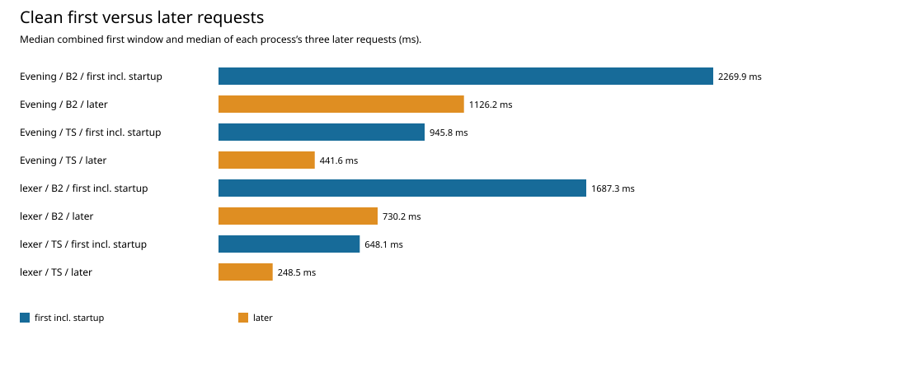
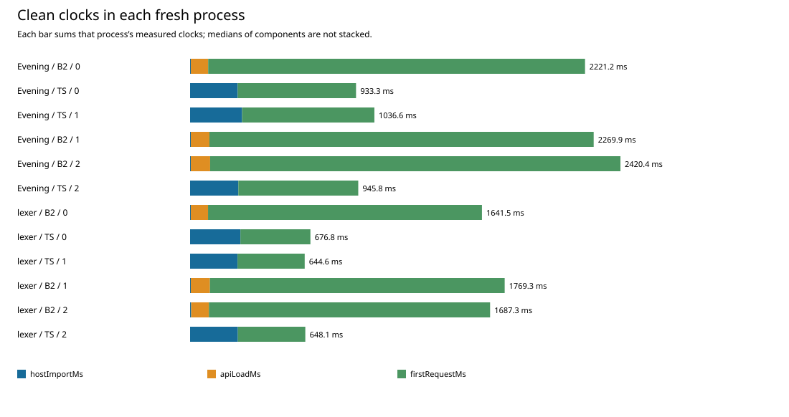
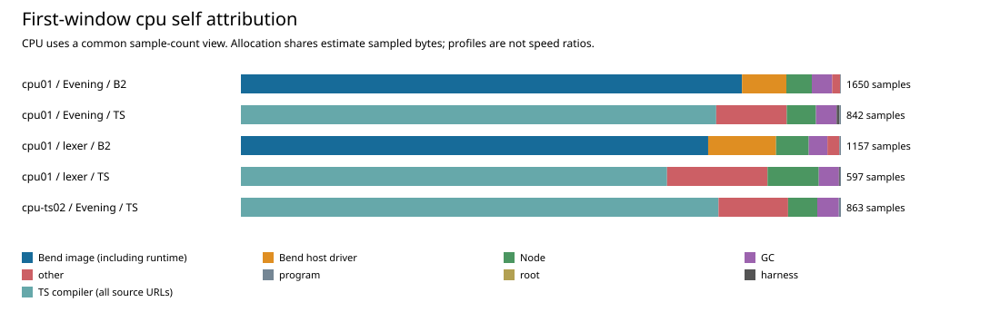
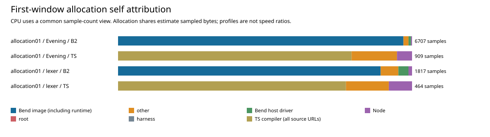

# First-request measurements

The fresh clean run reproduces a substantial first-request gap with the unchanged
Phase58 B2: **2.604× TypeScript for lexer and 2.400× for Evening**, including
compiler import and explicit API loading. B2 startup is shorter; the ordinary
compilation request accounts for the difference in direction. Profiles identify
work to investigate but do not assign a causal share of that clean latency gap.
No compiler or installed artifact changed in this campaign.

The [data-only analysis](../../selfhost/build/phase59/measurements-analysis01/report.json)
passed all receipt, prepared-output and arithmetic checks. Its SHA-256 is
`0a9392a4ebc8e6ba04f87a695c62dcac9def56bfa7392665310d7e5e7195e514`.
The [producer](../../selfhost/tools/performance/phase59/summarize.py) reads four
completed campaigns: one clean run, the original CPU run, allocation, and the
separate TypeScript Evening CPU retry. It does not execute compiler requests.
The [figure receipt](../../selfhost/tools/performance/phase59/evidence/measurement-artifacts.json)
binds the exact standalone SVG copies below to that analysis.

## Clean clocks

[clean01](../../selfhost/build/phase59/clean01/report.json) contains 12 fresh
processes and 48 successful ordinary compilation requests: two inputs, two roles,
three cyclically rotated rounds, and first plus three later requests per process.
Preparation separately checked each generated library against its complete
catalog value oracle. Every measured output matches its role's prepared bytes.
Bend and TypeScript generated text need not match each other.

| Input | Role | Startup median, ms | First compile median, ms | Combined first median, ms | Combined B2 / TS |
|---|---|---:|---:|---:|---:|
| Lexer | B2 | 105.868 | 1,581.436 | 1,687.305 | 2.604× |
| Lexer | TypeScript | 268.757 | 379.329 | 648.086 | — |
| Evening | B2 | 108.782 | 2,161.127 | 2,269.909 | 2.400× |
| Evening | TypeScript | 271.349 | 674.476 | 945.825 | — |

Startup is import plus explicit API load in each process. Each column is its own
median; adding two medians need not give the median combined clock. B2's host
module import is about 4 ms and API load about 100–105 ms. TypeScript imports its
compiler modules in about 269–271 ms and has no separate API-load operation.
First compilation alone is 4.169× TS for lexer and 3.204× for Evening.

The later summary is the median of each process's three later requests, then the
median over the three processes: lexer B2 730.160 ms / TS 248.491 ms; Evening B2
1,126.229 ms / TS 441.616 ms. These are **still-warming observations**, not steady
state. Median times by later request position show the change directly:

| Input / role | Later 1, ms | Later 2, ms | Later 3, ms |
|---|---:|---:|---:|
| Lexer / B2 | 867.475 | 730.160 | 536.189 |
| Lexer / TS | 292.653 | 244.689 | 247.387 |
| Evening / B2 | 1,445.829 | 1,126.229 | 923.393 |
| Evening / TS | 441.616 | 471.799 | 348.366 |

Each stacked bar represents one process, so its clock components add exactly to
that process's combined window. Provenance preflight, process launch, private Base
cache priming and output validation/hashing/saving are outside these clocks.
Private caches are already prepared; this is a fresh compiler process, not a cold
filesystem. Provenance reads can warm filesystem state. Three rounds with two
roles are cyclically rotated but are not perfectly position-balanced.

## First-window CPU samples

The [original CPU run](../../selfhost/build/phase59/first-cpu01/report.json)
contains four successful requests. Capture begins before actual compiler imports,
then includes API loading and exactly one ordinary compile. There is no preceding
compile and no later request inside the worker. Output validation happens after
capture. Sampling interval is 1 ms; captured durations are diagnostic and are not
used as clean speed ratios.

All comparisons in this section use **one count per original CPU sample**, a
common unit for every capture. The analysis also retains the independent weighted
time view, including all signed raw timestamp deltas and their admission status.

| Original capture | Samples | Image / TS source self share | Bend driver self share | GC self share |
|---|---:|---:|---:|---:|
| Lexer / B2 | 1,157 | 77.87% | 11.32% | 3.11% |
| Lexer / TS | 597 | 71.02% | — | 3.35% |
| Evening / B2 | 1,650 | 83.52% | 7.39% | 3.39% |
| Evening / TS | 842 | 79.22% | — | 3.44% |

B2 image shares include its embedded runtime. TypeScript's compiler group includes
all upstream `.ts` frame URLs, including both `bend.ts` and `comp.ts`. Node,
harness, program, other and any unattributed samples stay in the full denominator.
These shares describe each capture; a larger percentage is not evidence of more
absolute clean execution time.

The original TypeScript Evening capture has negative deltas of −4 and −9 µs:
13 µs total, 12.934 ppm of its recorded duration. Its weighted view correctly
**refused** the unchanged ≤2 µs per delta / ≤10 ppm policy. Its valid 842-sample
count view and raw file remain preserved. The separate
[TypeScript Evening retry](../../selfhost/build/phase59/first-cpu-evening-ts02/report.json)
has 863 samples and an admitted weighted view with one −2 µs correction. It is
shown separately, never pooled with or substituted for the original capture.
The other three original captures each admit a single −2 µs correction.

Actual count-view self hotspots are distributed:

- Lexer B2: Node `compileSourceTextModule` 5.27%, driver `validateSpanCache`
  4.15%, `validateSpanBook` 3.54%, `readBaseCache` 3.28%, and the generated
  `$jd$ffw_95_walk$scc` dispatcher 2.42%.
- Evening B2: `jd_primitive_table` 4.73%, Node module compilation 4.00%,
  `$jd$subst$scc` 3.88%, and `$jd$String_46_starts_95_with_46_if$scc` 3.70%.
- Lexer TS: `term_check` 18.09%, `term_higher` 4.69%, `compare_go` 3.52%.
- Evening TS: `term_any` 15.80%, `term_check` 12.23%, `term_higher` 6.53%.
  The retry's corresponding shares are 15.41%, 12.40%, and 5.91%.

Exact frame names, URLs, line/column positions, top self and top inclusive views
remain in the analysis. A shared `$scc` function can execute several source
members; its name is **not** assigned to one Bend member. Inclusive observations
are overlapping ancestors and must never be summed. For example, B2
`check_program_diagnostic` has inclusive count shares 34.75% lexer / 22.79%
Evening; that API includes completion/specialization as well as checking.
Separate stage diagnostics are needed to refine these boundaries.

## First-window allocation samples

The [allocation run](../../selfhost/build/phase59/first-allocation01/report.json)
uses the same first-window boundary in four independent processes. Sampling is
128 KiB and includes objects collected by both minor and major GC. Each capture
contains one request, so its total is also its per-request estimate, including
import and API initialization. These are sampled cumulative allocation estimates,
not exact allocation counts, live heap, RSS or speed ratios.

| Input | B2 estimated bytes | TS estimated bytes | B2 / TS estimate | B2 / TS samples |
|---|---:|---:|---:|---:|
| Lexer | 246,094,096 (234.69 MiB) | 64,958,408 (61.95 MiB) | 3.788× | 1,817 / 464 |
| Evening | 898,284,512 (856.67 MiB) | 123,967,856 (118.22 MiB) | 7.246× | 6,707 / 909 |

Evening B2's largest sampled self sites are the shared dispatchers labelled
`String.contains.if` (28.03%), `jd_reach_refs_unique` (26.13%), `subst` (8.38%)
and `String.starts_with.if` (4.68%). The first two account for 54.16% of its
sampled bytes. This gives a concrete investigation target in string processing
and emitted-reference scanning; it does not establish removable allocation or a
predicted latency gain. `jd_reach_selected` has a separate overlapping inclusive
allocation share of 50.77% and must not be added to those self percentages.

Lexer B2 is less concentrated: the `subst` dispatcher contributes 9.59%,
`index_node` 8.64%, `index_remove` 6.29%, the `String.contains.if` dispatcher
3.94%, and `kt` 3.30%. `kt` constructs a term record. TypeScript's leading named
allocation frame is `term_higher` (10.49% lexer / 14.38% Evening), followed by
`term_wnf` (4.64% / 7.83%). No claim equates these compiler operations one to one.

## Identity and replay scope

The subject is the genuine unchanged Phase58 B2
`a73daccf86a807092a334d5f3121745e0b91c3054164c25462f1658644b7b081`,
from source `85454aab7a6ef25d1e78970b1c24d68ac2a90a23a4b39b64a30de311c2fc5091`.
TypeScript stays at `018751270e800bc222a93dad7f257083ee53a5f7`; Node is 24.18.0.
Every target ran serially on CPU3 with 1 GiB Node heap, 2 GiB process-tree RSS,
4 GiB available-memory floor and 4 MiB stack. The analyzer ran only on CPU0.
The [method](../../selfhost/tools/performance/phase59/latency/README.md) defines
all boundaries and root-owned replay commands.

This is a repeat measurement of the same image, not an optimization comparison
against Phase58 timing. Between-campaign drift is possible. Neither profiles nor
these two compiler workloads establish performance for the 45 generated-program
corpus. The report keeps clean medians, sampled diagnostics and still-warming
later calls separate throughout.
