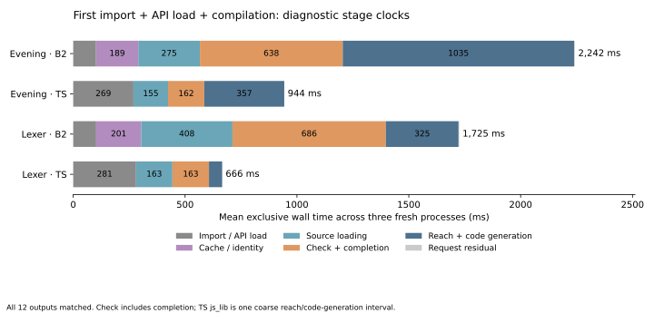

# First-request stage clocks

The largest measured category gap is **reach and code generation for Evening**: B2 averages 1,034.6 ms versus 357.4 ms inside TypeScript’s coarse `js_lib` call, a 677.2 ms difference. For **lexer**, checking and completion is the largest gap: 685.6 versus 163.4 ms, a 522.3 ms difference. These categories contain different internal pipelines; neither difference is a measured removable cost.

All 12 fresh-process observations passed and reproduced their complete prepared output bytes: three rotated rounds, two inputs, and B2/TypeScript. The selected B2 is Phase58 last01 (`a73daccf…`), with unchanged compiler/API bytes. Only a private driver copy and the worker’s existing TypeScript call sites have clock hooks.

## Additive breakdown

All entries below are arithmetic means in milliseconds. Every event contributes its **exclusive** time exactly once; the six categories sum to each mean total before rounding. TypeScript’s graph analysis, definitions and host exports remain together inside `js_lib`. Its cache column is zero because this request path has no separate Base-cache stage; loading/parsing Base is included in `book_load`.

| Category | Evening B2 | Evening TS | Lexer B2 | Lexer TS |
| --- | ---: | ---: | ---: | ---: |
| Import / API load | 102.0 | 269.2 | 102.5 | 280.8 |
| Cache / identity | 188.9 | 0.0 | 201.2 | 0.0 |
| Source loading | 275.4 | 154.6 | 408.0 | 162.7 |
| Check + completion | 638.4 | 162.2 | 685.6 | 163.4 |
| Reach + code generation | 1,034.6 | 357.4 | 325.1 | 59.0 |
| Request residual | 2.9 | 0.3 | 2.7 | 0.3 |
| **Total** | **2,242.2** | **943.6** | **1,725.3** | **666.1** |

B2’s import/API load is about 102 ms on both inputs, versus 269–281 ms for TypeScript imports. The first-request pipeline accounts for the larger combined duration. These diagnostic totals do not replace the unchanged clean timing results in [measurements.md](measurements.md).

| Combined import + API load + first request | Median (ms) | Range (ms) |
| --- | ---: | ---: |
| Evening B2 | 2,239.1 | 2,222.0–2,265.4 |
| Evening TS | 937.3 | 934.2–959.4 |
| Lexer B2 | 1,661.4 | 1,657.4–1,856.9 |
| Lexer TS | 670.0 | 655.1–673.4 |

The medians and ranges describe complete observations. They are not added to derive the chart or total; in particular lexer B2’s mean is above its median because one of the three observations is slower.

## What the larger B2 stages contain

| B2 stage, exclusive mean (ms) | Evening | Lexer |
| --- | ---: | ---: |
| `compiler.check-and-complete` | 638.4 | 685.6 |
| `compiler.emitted-reach` | 553.2 | 152.3 |
| `compiler.library` | 312.5 | 101.4 |
| `compiler.source-completion` | 144.1 | 204.9 |
| `driver.source-graph` | 123.7 | 149.8 |
| `compiler.layout-proof` | 65.8 | 10.1 |
| `compiler.annotation` | 41.6 | 6.2 |

`check_program_diagnostic` includes checking, live-instance processing, assembled specialization and TODO completion through [`driver_program_checked`](../../selfhost/src/driver/api.bend). Thus the 638.4/685.6 ms interval is not a pure type-comparison measurement. TypeScript `book_valid` also performs live-instance checking, but does not expose identical internal stage boundaries.

Evening’s emitted-reach stage (553.2 ms) exceeds its final library call (312.5 ms). Lexer spends 152.3 and 101.4 ms respectively. Emitted reach includes analysis of actual generated dependencies; the unsplit library call still includes context/SCC construction, definitions and host exports. The clocks establish where these requests spend wall time, not which internal operation is redundant. Source completion and host source-graph assembly are also material, especially for lexer.

Cache/identity work costs 188.9 ms for Evening and 201.2 ms for lexer. The Base-cache read alone takes 177.2/189.6 ms **inclusive**, containing cache validation at 112.6/121.9 ms, which itself contains the Base span walk. These inclusive numbers overlap and must not be added. The chart instead assigns all of those exclusive child and parent residuals once to cache/identity. Span validation of newly loaded sources belongs to source loading.

This is ordinary request work: API/Base hashing, cache JSON parsing, reserialization for the recorded hash and graph/source-span validation. It is distinct from untimed benchmark provenance checks. A fresh process with a primed disk cache does not imply a persistent decoded book or permission to reuse completed specialization. See the [source and stage map](../../selfhost/tools/performance/phase59/stages/README.md) for exact call boundaries.

## Scope and retained evidence

Clock intervals cover host import, API load and exactly the first ordinary compilation. Post-return output validation, hashing and saves are outside the three roots. No compiler probe or warm request precedes that first compilation. Hooks, diagnostic function `try/finally`, garbage collection and any resulting JIT changes can affect these wall times. This is not CPU attribution, a stage-isolated profile or a speedup experiment.

The readback independently verified 70 unique input identities, all 12 successful executions/output oracles, nested parent/child containment, zero incomplete events, and equality between summed exclusive times and the three nonoverlapping roots. The [data-only summarizer](../../selfhost/tools/performance/phase59/stages/summarize-v2.py) records per-sample stages and both mean/median/range summaries.

- Run: `selfhost/build/phase59/stages01/report.json`.
- Aggregate: `selfhost/build/phase59/stages-analysis01/report.json`.
- Aggregate SHA256: `ec046a8fc893e091805461e2f5c15cdbf9984bda6b1e884a35b529b4cef536da`.
- The first summarizer had a Python reserved-keyword parser error before reading target inputs or creating analysis outputs. Its exact bytes remain in `summarize.py`; `stages-analysis-failure01/report.json` binds that failure and the corrected successor. No target rerun was needed.

The next useful investigation is internal attribution of the existing check/completion and emitted-reach intervals, alongside the separate first-window CPU/allocation evidence. These measurements do not authorize skipping validation, introducing persistent memoization or changing compiler semantics.
