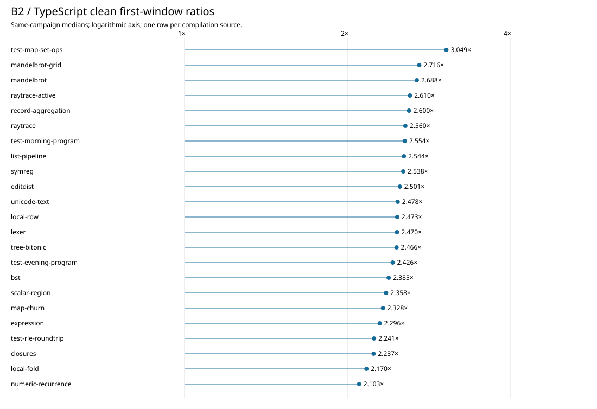

# Phase60: compiler performance across the full benchmark source corpus

The unchanged compiler written in Bend takes **2.46× TypeScript** for import,
API loading and the first ordinary library compilation across the maintained
corpus. Individual source ratios range from **2.10× to 3.05×**. The slowdown
previously measured on Lexer and Evening therefore extends across this corpus.
This is compiler-request performance, not execution speed of generated programs.

All **45 runtime benchmark points** map to **23 distinct compilation inputs**.
The clean comparison completed **138 fresh processes / 552 compilations**, with
every output matching its role's previously qualified complete raw module.
Runtime values are inherited through exact artifact identity; this survey did
not execute the benchmark programs again. The compiler, runtime, ordinary
driver and installed Phase58 last01 release remain unchanged.

## Results and interpretation

| Clean window | Equal-source geometric mean B2 / TS |
|---|---:|
| Import + API loading + first compile | 2.461× |
| First compile alone | 3.794× |
| Three later requests, still warming | 2.495× |

B2 starts faster than TypeScript, so including startup reduces the relative
gap. Every source's third later B2 request is faster than its first later
request; these observations do not establish steady-state throughput.

[Full measurements](measurements.md) retain every source, distribution, absolute
time gap, later-call position and measurement limitation. The largest absolute
gap is MapSet: **2.779 seconds B2 / 0.912 seconds TS**, or **3.049×**.
The ratio of summed source medians is **2.485×**; that time-weighted measure
differs from the equal-source geometric mean above.

The diagnostic stage screen finds two useful patterns. Checking/completion is
the largest individual B2 interval on **22 of 23 inputs**, taking **611–726 ms**
despite large variation in input size. Cache/identity work takes **188–212 ms**.
Backend work explains much of the upper tail: MapSet spends roughly **746 ms**
rendering the library and **497 ms** finding emitted dependencies. These are
single instrumented observations, not stage means or demonstrated removable
costs.

The [source audit](common-frontend.md) explains some shared work: the cached Base
book avoids parsing/elaboration, but the ordinary ABI2 request rebuilds a checking
world and checks its declarations again. The existing source-only cache does not
contain enough state to skip that work safely. The full checking interval also
contains user declarations, specialization, allocation and first-process V8
work; the audit does not assign the entire interval to Base.
TypeScript also loads and checks Base on each measured request. Rechecking Base
is therefore shared work, not by itself an explanation of the relative gap;
the implementations and B2's additional cache-validation path differ.

The separate profiles show which earlier leads recur. These counts mean at
least 5% of a profile's observed self-frame mass, not 5% removable wall time:

| B2 frame-name family | CPU profiles | Sampled-allocation profiles |
|---|---:|---:|
| Index | 23/23 | 23/23 |
| String | 10/23 | 18/23 |
| Substitution | 1/23 | 22/23 |
| Primitive table / lookup | 4/23 | 0/23 |

Active raytrace is a useful new example: **60.7%** of its sampled cumulative
allocation falls in String-named frames, compared with **1.2%** for numeric
recurrence. Exact emitted-reach and library-render ancestry covers **71.1%**
versus **4.2%**, respectively.
Those overlapping views must not be added. MapSet allocates an estimated
**1,238.7 MB** cumulatively versus TypeScript's **126.0 MB**; cumulative allocation
includes collected objects and is not simultaneous live memory.

This supports general String/reconstruction and index investigations across
different programs. Primitive-table rebuilding remains a bounded secondary
lead; a checked-Base state cache would require a much stronger correctness
contract. See [diagnostics and all-source diagrams](diagnostics.md) and
[ranked next experiments](bottlenecks.md). No speedup from these proposals has
been demonstrated here.

## Methods and scope

The [design](../../design/phase60/broad-compiler-survey.md),
[catalog](../../selfhost/tools/performance/phase60/catalog.json), and
[measurement recipes](../../selfhost/tools/performance/phase60/latency/README.md)
bind the exact source/options/imports, whole output modules, adapters and
inherited runtime oracles. Size/seed variants get one compilation weight per
source. The generic-row observer is a post-emission adapter, not another input.

The subject is genuine Phase58 B2
`a73daccf86a807092a334d5f3121745e0b91c3054164c25462f1658644b7b081`;
the installed checked B1 remains unchanged. TypeScript is pinned at
`018751270e800bc222a93dad7f257083ee53a5f7`. Node is 24.18.0. Root runs targets
serially on CPU3 under the existing 1 GiB heap / 2 GiB process-tree RSS guard;
agent source and data analysis use CPU0.

Private Base disk caches are primed outside timing. The first-request clock
includes actual import, B2 API loading and ordinary compilation, but excludes
provenance preflight, process launch and output validation. Fresh processes do
not mean cold filesystems. Three cyclically rotated clean rounds retain three
later requests per worker. CPU, sampled allocation and stage clocks use separate
first-request processes and never contribute to clean ratios.

The corpus is a maintained set of pure library benchmark sources, not the full
space of Bend programs or compiler workloads. This pass does not measure a
whole compiler self-image, new conformance coverage or generated-program speed.
No optimization, release or upstream PR comment is part of this phase.

## Practical iteration cost

The selected first-request screens passed with exact whole-module output checks:

| Screen | Inputs / repetitions per compiler | Observed whole command |
|---|---|---:|
| 20-second screen | Numeric recurrence + MapSet / 1 | 17.529 s |
| 60-second confirmation | Those two + active raytrace / 2 | 49.510 s |

These times include the runner's CLI preflight and exclude prior compiler-image
generation, reusable private preparation and the outer wrapper's plan audit.
They are observed costs on this host, not guaranteed budgets or equivalent
precision to the broad survey. Lexer and Evening remain held-out checks, and
all 23 sources remain the population gate. No subset performance number replaces
the all-source result. See [tested commands and selection](fast-loop.md).

[Process accounting](../../selfhost/build/phase60/accounting01/report.json)
deduplicates reused preparation records. Across preparation, pilot, broad clean,
three diagnostic campaigns and the two screens, **300 target processes** passed
with **712 observed compilation requests** (298 first, 414 later). Their recorded
wall times total **1,246.100 seconds / 20.77 minutes**. Peak observed process-tree
RSS was **630.91 MiB**, below the unchanged 2 GiB guard.

| Campaign | Target processes | Sum of target wall seconds | Runner wall seconds |
|---|---:|---:|---:|
| Private preparation | 2 | 7.453 | 9.853 |
| First-only pilot | 6 | 18.552 | 23.867 |
| Broad clean | 138 | 638.806 | 759.460 |
| Stage clocks | 46 | 135.784 | 176.359 |
| CPU profiles | 46 | 172.928 | 213.090 |
| Allocation profiles | 46 | 222.675 | 262.962 |
| 20-second screen | 4 | 12.398 | 15.935 |
| 60-second confirmation | 12 | 37.502 | 47.962 |

Runner times contain the target times and must not be added to them. Runner
clocks exclude initial CLI preflight, unlike the whole-command screen figures.
These measurements reached their accounting cutoff 37.17 minutes after the
recorded resumption at 04:58:02 UTC on October 7. That interval also includes
tool preparation, data analysis, source investigation and review; publication
follows it. The October 6–7 usage-limit interruption is excluded, not charged as
experiment time. Agent computation/effort is not inferred from process totals.

## Review, preservation and publication

[Independent review](review.md) checked the corpus, measurement methods, clean
statistics, diagnostic classification, figures and cost accounting. All target
workers passed. Eight CPU timestamp-weighted views were refused under the
existing policy; all-source comparisons consistently use sample counts. One
138,000-byte TS allocation sample lacks a V8 tree node and remains unattributed.
The original reader failure is preserved alongside its reviewed successor;
no target rerun or guessed attribution was needed.

Final preservation confirms **30,687 closed Phase58/59 files, seven installed
files and 103 unrelated working files unchanged**. Raw writers closed at
05:42:28 UTC on October 7. The verified [evidence archive](../../selfhost/tools/performance/phase60/artifacts/raw/README.md)
contains **2,286 files / 463,038,119 raw bytes**, compressed to **18,788,706 bytes**.
Its SHA-256 is
`a02e1bed02335b8bb35451cd129f2c85fe23484ca0f4f68da2daaa30a0b9ef6b`.
Links into ignored `selfhost/build/phase60` resolve after restoring that capsule;
the archive index retains every member identity.
