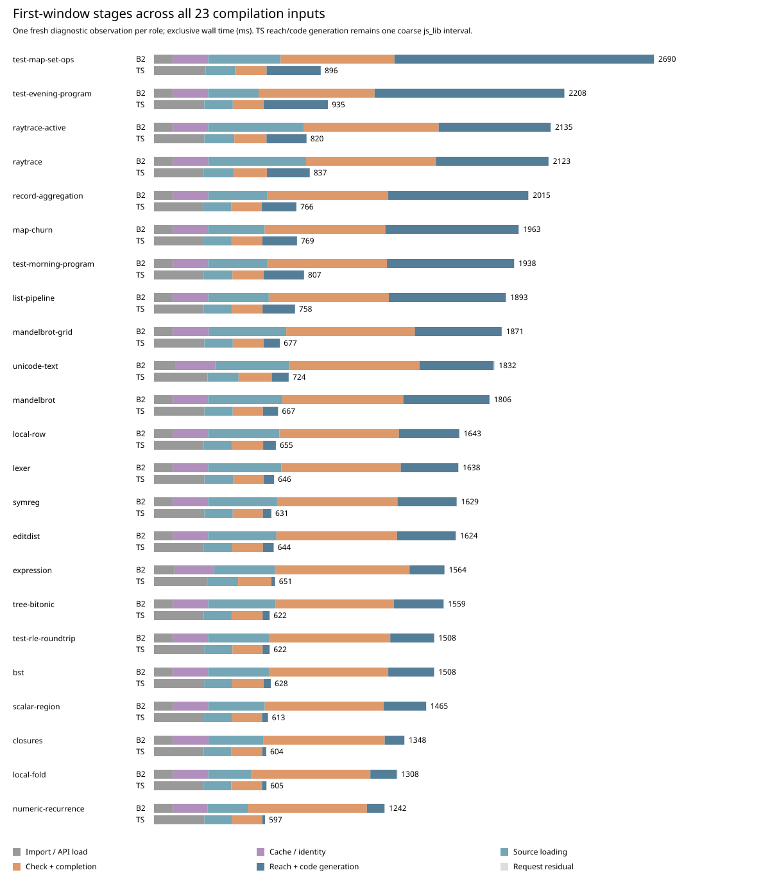
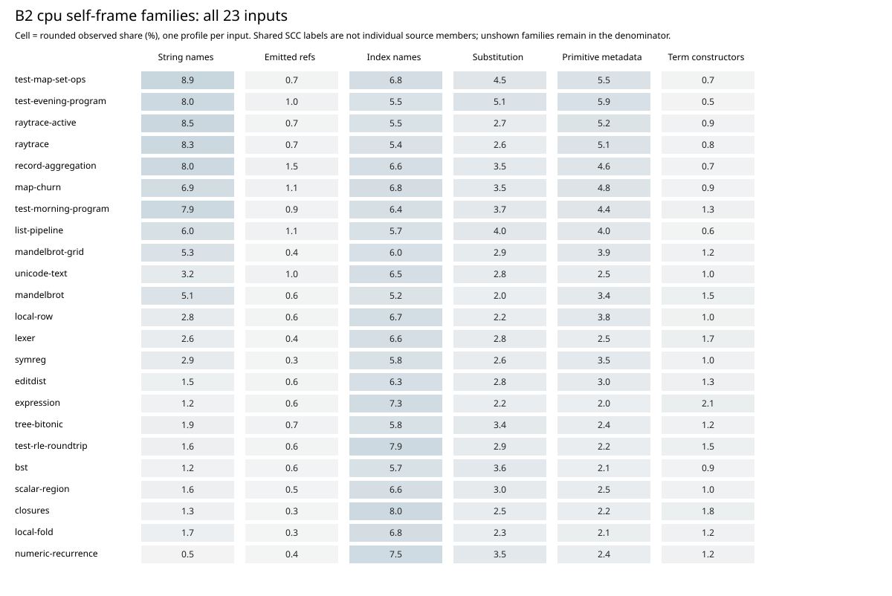
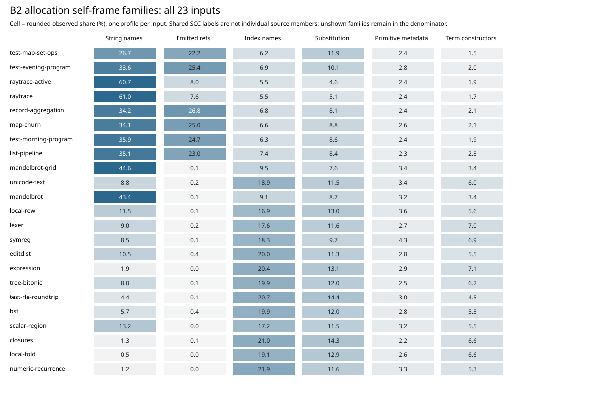

# Broad first-window diagnostics

All 23 source inputs passed both-role stage, CPU and allocation captures: **138 fresh diagnostic workers**, with each emitted module matching its prepared role-specific bytes. The 45 runtime points are inherited qualification evidence, not 45 independent compilations or fresh runtime executions. The compiler/source stayed unchanged. [Clean three-round results](measurements.md) are separate from these one-observation diagnostic screens.

## Common cost and source-dependent work

Checking plus completion is B2’s largest individual instrumented interval in **22 of 23** sources, spanning **611–726 ms**. MapSet is the exception: its library rendering takes **746 ms**, compared with **611 ms** for checking/completion. In the coarse B2-minus-TypeScript partition, checking/completion is the largest absolute excess in **19 of 23** inputs; reach plus code generation is largest in the other four.

The [source audit](common-frontend.md) explains what is inside these intervals: both ordinary pipelines check Base on every request. B2’s ABI2 checking call includes specialization and output completion; its separate source-only Base cache does not restore a checked world. Cache/identity work takes **188–212 ms** here and includes deserialization, hashing and ancestor-correct span validation. None of these measurements isolates Base checking or establishes that the whole interval can be removed.

Each bar sums exclusive wall time for that single diagnostic request; nested cache/span work is assigned once by ancestry. TS `js_lib` stays one coarse interval, while B2 exposes reach, annotation, layout and final rendering. The clocks include hook overhead and first-process compilation. They are not precision estimates, clean latency, or equivalent internal pipelines.

## Recurring sampled work

All family shares below use the complete profile denominator. CPU is **sample count**, consistently across every input and role; 38 timestamp-weighted views were admitted and 8 were refused, so weighted and count views are never mixed. Allocation is sampled cumulative allocated bytes, including collected objects, rather than retained heap, exact physical allocation, or time.

| Observed B2 self-frame family | CPU ≥5%: inputs /23 | CPU range | Allocation ≥5%: inputs /23 | Allocation range |
| --- | ---: | ---: | ---: | ---: |
| String | 10 | 0.5–8.9% | 18 | 0.5–61.0% |
| Emitted references / uses | 0 | 0.3–1.5% | 8 | 0.0–26.8% |
| Indexes | 23 | 5.2–8.0% | 23 | 5.5–21.9% |
| Substitution | 1 | 2.0–5.1% | 22 | 4.6–14.4% |
| Primitive metadata | 4 | 2.0–5.9% | 0 | 2.2–4.3% |
| Term / definition constructors | 0 | 0.5–2.1% | 12 | 1.5–7.1% |

The 5% flag is a descriptive screen, not a significance threshold or an absence test. Names ending in `$scc` identify shared dispatchers; a leader name does not identify every executing member. Family shares, API-ancestor shares and wall clocks overlap conceptually and must not be added.

Indexes recur across the entire population; substitution exceeds 5% of sampled allocation in 22 inputs. String-named allocation is substantial in 18 inputs, but differs sharply between numeric recurrence (1.2%) and active ray tracing (60.7%). Primitive metadata is visible throughout, at 2.0–5.9% of CPU samples and 2.2–4.3% of sampled allocation; it is not the dominant allocation family. Emitted-reference/use names exceed 5% of allocation in eight inputs despite only 0.3–1.5% CPU self shares. Allocation volume and CPU self-sample shares therefore give different priorities.

Concrete saved frames sharpen these families without turning them into source-operation counts. Numeric recurrence attributes 19.0 MB to `index_node`, 17.6 MB to the shared `subst$scc` dispatcher and 12.3 MB to `index_remove`. MapSet attributes 290.9 MB to `String.contains.if$scc` and 274.6 MB to `jd_reach_refs_unique$scc`. Active ray tracing attributes 599.4 MB to the String dispatcher and 79.3 MB to the reach-reference dispatcher. These are sampled self-frame estimates, not exclusive claims about all members of those source routines.

## All-source scale

Source sizes span **556–14,680 bytes**; B2 output modules span **14,917–132,866 bytes**. Observable definition counts are not recorded by this ordinary result protocol, so generated function names are not used as a substitute. B2 sampled allocation spans **179.8–1,238.7 MB**, versus **56.1–126.0 MB** for TS. The ratios below compare single diagnostic observations, not confidence intervals.

| Source | Source bytes | B2 / TS module bytes | B2 / TS sampled MB | Allocation ratio |
| --- | ---: | ---: | ---: | ---: |
| test-map-set-ops | 5266 | 132866 / 69178 | 1238.7 / 126.0 | 9.83× |
| raytrace | 14223 | 50830 / 28974 | 1018.8 / 111.3 | 9.15× |
| raytrace-active | 14680 | 52082 / 29926 | 997.0 / 110.9 | 8.99× |
| test-evening-program | 2152 | 99795 / 62658 | 884.7 / 120.5 | 7.34× |
| record-aggregation | 1651 | 82645 / 48905 | 774.6 / 100.0 | 7.75× |
| test-morning-program | 3077 | 83112 / 48892 | 767.9 / 104.7 | 7.33× |
| map-churn | 1703 | 83422 / 46419 | 745.8 / 97.2 | 7.67× |
| list-pipeline | 3249 | 71824 / 40351 | 678.7 / 92.5 | 7.34× |
| mandelbrot-grid | 7395 | 34843 / 17412 | 477.3 / 78.0 | 6.12× |
| mandelbrot | 6576 | 32152 / 15442 | 453.7 / 75.3 | 6.02× |
| local-row | 6245 | 26543 / 12457 | 255.0 / 68.7 | 3.71× |
| editdist | 5874 | 25614 / 11907 | 251.4 / 71.5 | 3.52× |
| unicode-text | 5277 | 28570 / 15109 | 249.5 / 70.5 | 3.54× |
| symreg | 5406 | 27254 / 12815 | 248.4 / 67.1 | 3.70× |
| lexer | 7134 | 28426 / 14110 | 236.9 / 69.9 | 3.39× |
| tree-bitonic | 4633 | 23386 / 10593 | 221.2 / 66.8 | 3.31× |
| bst | 3051 | 20983 / 9080 | 218.0 / 64.6 | 3.38× |
| scalar-region | 1496 | 17811 / 6552 | 214.1 / 58.9 | 3.64× |
| test-rle-roundtrip | 2743 | 19976 / 8728 | 210.6 / 62.4 | 3.38× |
| expression | 1522 | 16771 / 5977 | 197.0 / 56.1 | 3.51× |
| local-fold | 768 | 15742 / 5191 | 193.3 / 56.7 | 3.41× |
| closures | 1392 | 16130 / 5416 | 182.2 / 57.1 | 3.19× |
| numeric-recurrence | 556 | 14917 / 4699 | 179.8 / 58.2 | 3.09× |

## Unknowns and preserved reader failure

Exact API-boundary ancestry leaves **18.9–34.9%** of B2 CPU samples and **12.5–32.9%** of its sampled allocation unassigned. This includes work outside the selected boundaries, such as import/cache/host/GC work, as well as unmatched call paths. Raw frame names and locations remain available; no helper-name guess fills the gaps. TS unassigned shares are 22.0–32.7% CPU and 9.3–19.7% allocation.

One TS local-fold allocation sample has no matching V8 tree node: **138,000 bytes**, node 3481, in a total of **56,663,672 bytes**. The original profiler already preserved and warned about it. The first data reader incorrectly assumed every sample had a node and failed after classifying 137 rows; its [failed analysis](../../selfhost/build/phase60/diagnostic-analysis01/report.json) and tool remain unchanged. The reviewed successor retains those bytes in the denominator and explicit unattributed bins, without inventing a frame or call path. **This was one analysis-tool failure and zero failed target workers.** No target rerun was needed.

## Reproduction and evidence

- [Completed diagnostic classification](../../selfhost/build/phase60/diagnostic-analysis02/report.json), SHA256 `e33425ffbb452f1e1527783588af2e17ae5e9766f2872f530564ccfe8774ca89`: all 138 rows, zero classification failures; source/producer/method/profile/output joins and final input rehashes.
- [All-source view and figure data](../../selfhost/build/phase60/bottleneck-view01/report.json), with stage totals, absolute coarse excess, source/output sizes and full family recurrence.
- [Reader successor and preserved-parent derivation](../../selfhost/tools/performance/phase60/analysis/summarize-v2.derivation.json); [analysis policy](../../selfhost/tools/performance/phase60/analysis/README.md).
- [Next discriminators](bottlenecks.md) and [qualified fast replay](fast-loop.md).

No optimization, compiler modification, runtime performance gain or release decision is established by this survey.
