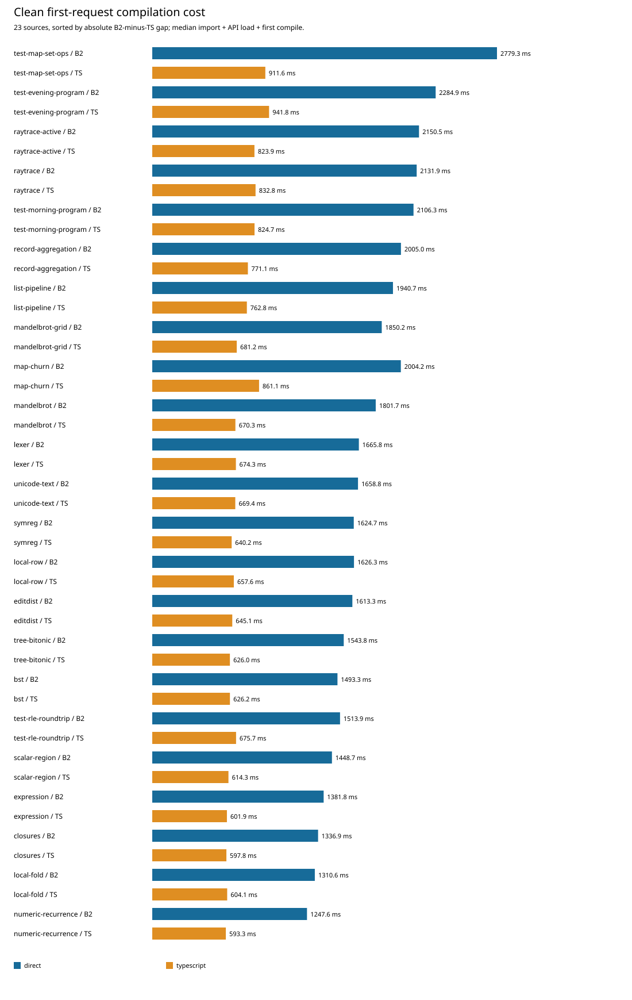

# Compilation across all 23 sources

The unchanged Phase58 direct B2 takes **2.461× TypeScript** for the combined first compilation window, using an equal-source geometric mean. The ratio of summed source medians is **2.485×**. Every source is slower in this run; source ratios range from **2.103× to 3.049×**. The broad result extends the first-request gap seen on Lexer and Evening to the entire maintained compilation corpus. It does not identify a single cause.

All **23 sources × 2 roles × 3 rounds = 138 fresh processes** passed, each with a first compile and three later compiles: **552 successful requests**, with no failed, missing or excluded sources. Every fresh output matches its role’s qualified raw module bytes. The **45 runtime points** remain mapped to these 23 compilation inputs; their successful runtime observations are inherited through exact artifact identity, not newly executed here.

## Population measures

Ratios are B2 / TypeScript; lower is better for B2. Each source contributes one median per role, computed from its three fresh processes. No runtime size/seed variant receives a second compilation weight.

| Window | Equal-source GM ratio | Ratio of summed medians | Sum of B2 medians | Sum of TS medians |
|---|---:|---:|---:|---:|
| Import + API load + first compile | 2.4613× | 2.4848× | 40.520 s | 16.307 s |
| First compile alone | 3.7943× | 3.7792× | 38.150 s | 10.095 s |
| Three later calls, still warming | 2.4950× | 2.5189× | 17.614 s | 6.993 s |

The equal-source geometric mean is `exp(mean(log(B2_median / TS_median)))`. The ratio of sums is `sum(B2_median) / sum(TS_median)`: equivalently, an arithmetic mean of source ratios weighted by each TypeScript median’s share of total TypeScript time. These answer different questions. The summed medians describe one representative request per source and are not the survey’s elapsed wall time.

| Combined first-window distribution | Minimum | P10 | P25 | Median | P75 | P90 | P95 | Maximum |
|---|---:|---:|---:|---:|---:|---:|---:|---:|
| B2 / TS | 2.103× | 2.237× | 2.343× | 2.473× | 2.557× | 2.672× | 2.713× | 3.049× |
| B2 milliseconds | 1247.551 | 1345.902 | 1503.593 | 1658.812 | 2004.585 | 2146.792 | 2271.425 | 2779.290 |
| TS milliseconds | 593.293 | 602.355 | 626.096 | 670.281 | 797.470 | 855.412 | 906.582 | 941.776 |
| B2 minus TS milliseconds | 654.258 | 747.309 | 852.660 | 989.430 | 1205.920 | 1321.144 | 1341.439 | 1867.651 |

Quantiles interpolate linearly at `(n − 1) × p` over the 23 source values. They are population descriptions of these inputs, not confidence intervals. No source is within ±20% of TypeScript for the combined first window.


## Source costs and rankings

The largest absolute gap is MapSet: **2,779.290 ms B2 versus 911.639 ms TS**, a **1,867.651 ms** difference and **3.049×** ratio. Next by absolute gap are Evening (+1,343.082 ms), active raytrace (+1,326.654 ms), raytrace (+1,299.105 ms), and Morning (+1,281.636 ms). Ranking by ratio instead puts Mandelbrot-grid and Mandelbrot second and third. Absolute cost and proportional slowdown therefore select different investigation priorities.



All 23 compilation inputs follow in catalog order. “Points” counts the mapped inherited runtime points, not fresh compiler repetitions. Later medians are the median of each process’s three later request times, followed by the median over the three processes.

| Source | Source bytes | Points | B2 combined ms | TS combined ms | B2 / TS | Gap ms | B2 later ms | TS later ms |
|---|---:|---:|---:|---:|---:|---:|---:|---:|
| mandelbrot | 6,576 | 1 | 1,801.696 | 670.281 | 2.688× | 1,131.416 | 781.395 | 288.476 |
| editdist | 5,874 | 3 | 1,613.347 | 645.120 | 2.501× | 968.227 | 674.418 | 253.246 |
| tree-bitonic | 4,633 | 3 | 1,543.812 | 626.006 | 2.466× | 917.806 | 617.553 | 253.815 |
| lexer | 7,134 | 3 | 1,665.776 | 674.283 | 2.470× | 991.493 | 700.257 | 284.729 |
| symreg | 5,406 | 3 | 1,624.658 | 640.198 | 2.538× | 984.460 | 639.661 | 245.098 |
| test-morning-program | 3,077 | 1 | 2,106.293 | 824.657 | 2.554× | 1,281.636 | 1,026.840 | 374.326 |
| test-evening-program | 2,152 | 1 | 2,284.859 | 941.776 | 2.426× | 1,343.082 | 1,095.781 | 438.556 |
| test-rle-roundtrip | 2,743 | 1 | 1,513.923 | 675.679 | 2.241× | 838.244 | 665.026 | 277.254 |
| test-map-set-ops | 5,266 | 1 | 2,779.290 | 911.639 | 3.049× | 1,867.651 | 1,402.476 | 416.170 |
| raytrace | 14,223 | 1 | 2,131.866 | 832.761 | 2.560× | 1,299.105 | 1,016.324 | 374.855 |
| local-row | 6,245 | 2 | 1,626.345 | 657.619 | 2.473× | 968.727 | 669.316 | 256.150 |
| local-fold | 768 | 3 | 1,310.642 | 604.086 | 2.170× | 706.556 | 511.549 | 221.687 |
| scalar-region | 1,496 | 2 | 1,448.655 | 614.303 | 2.358× | 834.352 | 600.903 | 246.362 |
| mandelbrot-grid | 7,395 | 2 | 1,850.237 | 681.196 | 2.716× | 1,169.042 | 785.879 | 298.974 |
| raytrace-active | 14,680 | 2 | 2,150.523 | 823.869 | 2.610× | 1,326.654 | 1,034.880 | 405.708 |
| closures | 1,392 | 2 | 1,336.921 | 597.761 | 2.237× | 739.160 | 517.966 | 218.220 |
| list-pipeline | 3,249 | 2 | 1,940.691 | 762.786 | 2.544× | 1,177.905 | 780.409 | 368.867 |
| bst | 3,051 | 2 | 1,493.262 | 626.186 | 2.385× | 867.077 | 642.808 | 261.264 |
| unicode-text | 5,277 | 2 | 1,658.812 | 669.382 | 2.478× | 989.430 | 708.139 | 266.670 |
| expression | 1,522 | 2 | 1,381.826 | 601.923 | 2.296× | 779.904 | 513.750 | 241.088 |
| map-churn | 1,703 | 2 | 2,004.164 | 861.074 | 2.328× | 1,143.089 | 867.480 | 392.611 |
| numeric-recurrence | 556 | 2 | 1,247.551 | 593.293 | 2.103× | 654.258 | 529.424 | 209.545 |
| record-aggregation | 1,651 | 2 | 2,005.006 | 771.071 | 2.600× | 1,233.934 | 831.519 | 399.040 |

## Lexer and Evening anchors

B2 startup remains shorter than TypeScript startup. These columns are separate medians: the median sum need not equal the sum of component medians.

| Input / role | Import + API load ms | First compile ms | Combined first ms | Later 1 ms | Later 2 ms | Later 3 ms |
|---|---:|---:|---:|---:|---:|---:|
| lexer / B2 | 101.506 | 1,564.270 | 1,665.776 | 871.029 | 700.257 | 561.348 |
| lexer / TS | 269.302 | 407.964 | 674.283 | 284.729 | 302.436 | 238.598 |
| test-evening-program / B2 | 108.904 | 2,175.175 | 2,284.859 | 1,440.875 | 1,095.781 | 923.229 |
| test-evening-program / TS | 268.808 | 673.868 | 941.776 | 438.556 | 506.056 | 356.086 |

Current combined ratios are **2.470× for Lexer** and **2.426× for Evening**. The subject compiler bytes are identical to Phase59. This is a new campaign, with case-specific artifact preflight; between-run drift and preflight effects prevent interpreting differences from Phase59 as a compiler change.

B2’s third later request is faster than its first later request on every one of the 23 sources. Three later requests do **not** establish steady state. The report retains each position and each process’s individual values rather than merging them with first-request timings.

## Boundaries, correctness and cost

The measured first window starts at actual compiler module import, includes explicit B2 API loading and one ordinary library compilation, then stops before output validation, hashing and saving. Source books are fresh for every compile. Private Base disk caches are prepared beforehand; this is a fresh compiler process, not a cold filesystem. Provenance preflight and process launch are outside the measured clock, and their effects on process/OS state are not eliminated.

The catalog joins whole raw modules, source/options/import closure and the retained Phase58 qualification. The complete generic-row observer is a post-emission adapter, not a separate compiler input. Preparation verifies inherited qualified artifacts; this phase does not relabel their runtime values as fresh executions. The reader requires all 138 workers before emitting population metrics; failed and skipped cells would remain visible and suppress the full-population result.

Targets ran serially on CPU3 under the maintained guard: Node 24.18.0, 1 GiB heap, 2 GiB process-tree RSS, 4 GiB available-memory floor and 4 MiB stack. The clean campaign took **759.460 seconds** overall; its 138 successful child-process wall times sum to **638.806 seconds**. Maximum observed process-tree RSS was **590,680,064 bytes (563.32 MiB)**. The remainder includes controller work and is not classified as compiler time or waiting. Original private preparation workers took 6.310 seconds B2 and 1.144 seconds TS; preparation was reused outside this campaign’s clocks.

The JSON retains per-source, per-role complete-process wall medians/min/max for practical future-loop budgeting. Those costs include preflight and all four requests; they must not be confused with request-only medians or a differently configured first-only replay. Three cyclically rotated rounds with two roles are not perfectly position-balanced. CPU/allocation and stage diagnostics are separate runs and are excluded from all numbers above.

## Evidence and replay

- [Completed clean campaign](../../selfhost/build/phase60/clean01/report.json).
- [Exact corpus and 45-point mapping](../../selfhost/tools/performance/phase60/catalog.json).
- [Data-only analysis](../../selfhost/build/phase60/clean-analysis01/report.json), SHA-256 `bcfb5bd0f4099862b819435c461a5b2adfd2f0870ece7fc623dd1efbadbc3f52`.
- [Reviewed reader](../../selfhost/tools/performance/phase60/analysis-clean.py), SHA-256 `f2e45d91efa33c8605e1e69a8adcfeefc89931baa66249ed55c0f70d8d81f070`.
- [Exact SVG-copy receipt](../../selfhost/tools/performance/phase60/evidence/clean-measurement-artifacts.json).

The genuine B2 identity remains `a73daccf86a807092a334d5f3121745e0b91c3054164c25462f1658644b7b081`; compiler source is `85454aab7a6ef25d1e78970b1c24d68ac2a90a23a4b39b64a30de311c2fc5091`. TypeScript is pinned at `018751270e800bc222a93dad7f257083ee53a5f7`. No production compiler, runtime, ordinary driver or installed release was changed for the survey.

Replay the read-only analysis into a fresh directory; this command executes no compiler or generated program:

```sh
taskset -c 0 python3 -B selfhost/tools/performance/phase60/analysis-clean.py \
  --report selfhost/build/phase60/clean01/report.json \
  --out selfhost/build/phase60/clean-analysis-replay01
```
