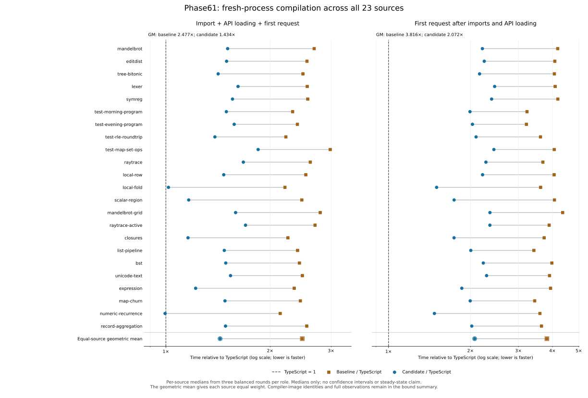

# Phase61 state08: installed release and compiler results

**Phase61 state08 is installed and verified as a checked B1 release.** Its
separately qualified genuine B2 passes a balanced 23-source compiler campaign
with all 207 fresh workers: combined-first B2/TS improves **2.476542× → 1.433877×**,
and compilation-only **3.816429× → 2.071828×**. The checked-B1 matrix, fresh B2
own-source check, B2/B3 equality, B2 semantics, legacy42 and default24 CLI gates
pass. Phase58 and state06 measurements remain separately identified historical
evidence; this campaign does not add new generated-program runtime timings.
The [compiler-request guide](../../docs/self_hosted/compiler-request-pipeline.md)
explains the source mechanisms and fallback boundaries.

State08 retains state06 plus private childless-term reuse and maximum-bound
hoisting. The state07 backend telescope cursor was reverted after mixed B1
results. No B2 speed or isolated-pass claim is inferred from that experiment.
Cross-context emission caching was deferred despite matching diagnostics on 23
sources; binary transport was rejected on measured codec/validation cost.

The [final qualification index](../../selfhost/build/phase61/final-state08/qualification.json)
reconciles the complete selected gates with preserved failed/incomplete wrappers,
and binds the installed B1, source and separate B2 identities. The [closed evidence capsule](../../selfhost/tools/performance/phase61/artifacts/README.md)
preserves this campaign independently from its semantic and release gates.

## Exact selected artifacts

| Artifact | Identity |
|---|---|
| Checked attempt | [`checked-state08`](../../selfhost/build/phase61/checked-state08/attempt.json) |
| Complete Bend source SHA256 | `268b3cf2e1f1c2810c372925ccd1ad7eb91225853d432ca9517f05f2ecefd42e` |
| Derived checked B1 API SHA256 | `97f412afb692cc9f187144e418fb153f35f62fb6ff5eda698e28ebc3eaf260c8` |
| Genuine B2 SHA256 | `23bd6a48b9ed48b58bdc81245c3e40978735f8386c3eb6029b92701511986477` |
| B2 bytes / explicit roots | 3,978,248 / 86 |
| Maintained workflow SHA256 | `cdd71b72cb2efeec31fdaac322fc3267644f4c6c51fd6575ea0b37e8920be27c` |

The [six-command bootstrap](../../selfhost/build/phase61/final-state08/bootstrap-execution/report.json)
passes in **132.873596 stage seconds**. Full emission is **73.272635 internal
seconds / 73.458295 supervised seconds**; these are nested within the stage,
not extra time to add again. Tiny split/unsplit equality and all
[eight ordinary-driver observations](../../selfhost/build/phase61/final-state08/bootstrap/driver-comparison.json)
pass. Emission inherits exact-source checking from the checked B1 attempt; this
bootstrap alone is not a fresh B2 own-source check or a B2/B3 fixed point.

The [source footprint](source-footprint.md) counts 27,753 physical lines, 22,799
code lines, 3,192 definitions and 114 manifest modules. Runtime, host helpers,
generated images and research/test tooling are accounted for separately.

## Current qualification matrix

| Gate | Actual checkpoint result |
|---|---|
| [Checked build](../../selfhost/build/phase61/checked-state08/validation-001/report.json) | PASS 36 strict paired probes, zero exact differences; 58.679 supervised seconds |
| [Private leaf controls](../../selfhost/build/phase61/leaf-controls-state08/report.json) | PASS 14 cases; 9.044 seconds |
| [Carrier/bound controls](../../selfhost/build/phase61/prefix-carrier-controls-state08/report.json) | PASS 29 world rows + five producer + eight maximum-bound cases; 44.113 seconds |
| Genuine B2 / ordinary driver | PASS six bootstrap commands and eight driver observations |
| [Composition retry](../../selfhost/build/phase61/final-state08/checked/composition-controls-retry02/report.json) | PASS 18 independent composition observations |
| [Overapplication](../../selfhost/build/phase61/final-state08/checked/overapplication-controls/report.json) | PASS two observations |
| [Final checked-B1 matrix](../../selfhost/build/phase61/final-state08/checked-resolution.json) | PASS all 13 resumed commands plus the preserved initial acquisition: 14 logical steps; 96 source, 34 numeric, 18 composition and two overapplication observations, eight maintained suites and direct census |
| [Native retention](../../selfhost/build/phase61/final-state08/checked/native3/report.json) | PASS three exact complete C outputs and stdout oracles; selected native coverage only |
| [Generated-program smoke](../../selfhost/build/phase61/final-state08/checked/program45-smoke/report.json) | PASS 45 points; correctness smoke, no new runtime-speed claim |
| [Pre-release preservation](../../selfhost/build/phase61/preservation-pre-release-state08.json) | PASS seven installed files, 32,973 closed historical files and 103 protected files unchanged |
| [Fresh B2 own-source check](../../selfhost/build/phase61/final-state08/self-check/report.json) | PASS type acceptance; 11.397 s check request, 17.248 s internal / 17.385 s supervised; expected trust refusal for 3,192 unsafe declarations |
| [B2/B3 reproduction](../../selfhost/build/phase61/final-state08/fixed-point/report.json) | PASS complete byte equality at `23bd6a48…`; 34.386 s internal / 34.568 s supervised |
| [B2 program equality](../../selfhost/build/phase61/final-state08/b2-program-equality/report.json) | PASS 23 fresh raw modules and their 45-point observer mapping equal selected B1; no new program execution |
| [Final genuine-B2 semantic matrix](../../selfhost/build/phase61/final-state08/b2-semantics-resume02-execution/report.json) | PASS seven resumed commands: 96 source, 34 numeric, 18 composition and two overapplication observations; known TS oracle defects retained |
| [Balanced broad compiler measurements](evidence/state08-broad3.json) | PASS 207 first-only workers, 23 sources × three roles × three rounds; all raw modules exact |
| [Release admission](../../selfhost/build/phase61/final-state08/release-admission.json) | PASS; installs the selected checked B1 with B2 self-hosting and timing separately bound |
| [Legacy installed CLI](../../selfhost/build/phase61/final-state08/release/legacy42/launcher.json) | PASS 42 steps; complete child receipts retained after daemon interruption |
| [Default/relocated installed CLI](../../selfhost/build/phase61/final-state08/release/default24/report.json) | PASS 24 steps |
| [Final CLI resume](../../selfhost/build/phase61/final-state08/release-resume02-execution/report.json) | PASS default24 and verify-after; installed identity verified before and after |
| [Final preservation](../../selfhost/build/phase61/preservation-final.json) | PASS seven selected installed files, exact prior-release copies, 32,973 closed historical files and 103 protected files |

The original [composition report](../../selfhost/build/phase61/final-state08/checked/composition-controls/report.json)
remains **FAIL**. All 36 role launches recorded `spawnSync ... node EPERM`, despite
matching saved values/errors/event traces. They were not admitted as healthy
executions. The unchanged controller's fresh permission-corrected retry passes
18 observations. The completed 13-command resume supplies the remaining matrix
results without rewriting that failed receipt. Its successful initial acquisition
was reused with its identities.

The fresh own-source check starts with an empty private Base cache. Its actual
request accepts types; all 3,192 definitions remain explicitly unsafe, so the
expected proof-trust refusal and `kernelChecked:false` are separate from type
acceptance. Reproduction is an exact emission fixed point on the pinned source
and export closure, not a kernel proof or installation result. These supervised
correctness durations are not primed-cache latency samples.

The [original B2 stage](../../selfhost/build/phase61/final-state08/b2-stage-execution/report.json)
remains failed after its successful self-check and reproduction: the first
semantic acquisition succeeded, but the following receipt validator rejected
extra `canonicalPath` metadata despite matching file hashes. The separately bound
[identity-normalized retry](../../selfhost/build/phase61/final-state08/b2-semantics-resume02-execution/report.json)
passes all seven resumed commands in 105.044043 stage seconds. Its source and
numeric controls retain one and six known TS oracle defects respectively; no
new candidate mismatch is waived. No Bend source change or original-stage PASS
is inferred. The independent program-equality command completed successfully.

## Release and preserved interruptions

The package contains checked B1 `97f412af…`, built from the selected state08
source; the genuine B2/B3 image `23bd6a48…` supplies separate self-hosting and
compiler-measurement evidence. Direct JavaScript remains the default, with
explicit legacy JavaScript and native C retained.

The [original release queue](../../selfhost/build/phase61/final-state08/release-execution/report.json)
is still incomplete. Installation and verify-before returned successfully, and
the legacy42 child completed all checks, before a daemon restart interrupted
the enclosing receipt's final write. The
[recorded resume](../../selfhost/build/phase61/final-state08/release-resume02-plan.json)
reuses those healthy receipts and runs the two unstarted steps. Its independent
execution passes default24 and verify-after. This completes release qualification
without inventing a finish time or changing the original queue to PASS.

The selected runtime and all 23 raw programs plus 45 observation modules retain
exact qualified bytes. Existing generated-program performance evidence transfers
only to those identical artifacts; no fresh 669-sample timing campaign or new
program-speed gain is claimed. The executed 45-point smoke supplies current
correctness observations separately.

## Closed evidence publication

The [archive manifest](../../selfhost/tools/performance/phase61/artifacts/raw/archive.json)
and [publication receipt](../../selfhost/tools/performance/phase61/artifacts/raw/publication.json)
record **17,386 files / 882,650,258 uncompressed bytes**. The single
90,979,618-byte capsule has SHA256
`0f3ceb5a8f90686a05469af2bf0ab2b18e9b479e11a14ad18a7f23461ee62d43`.
It was reopened and every member verified, with input stability confirmed.
The [restoration guide](../../selfhost/tools/performance/phase61/artifacts/README.md)
explains replay. Failed, interrupted and rejected attempts remain in the closed
snapshot with their original statuses. No raw writer remains open; later
publication metadata and documentation are outside the archived raw tree.

## Balanced broad compiler measurements

The [canonical JSON](evidence/state08-broad3.json), [per-source CSV](evidence/state08-broad3.csv)
and [original campaign](../../selfhost/build/phase61/state08-b2-latency01/broad420/report.json)
retain all 207 successful requests. Each source has three fresh requests per
role. Rotations put each role in each execution position once; source order
remains fixed. The earlier short confirmation and state06 campaigns are separate.

These are **genuine B2 requests in fresh processes using prepared persistent Base
caches**. Preparation, post-return byte validation and oracles are outside clean
clocks. Operating-system/page caches are not claimed cold. The package remains
checked B1; this is not a measurement of installed-CLI latency.

| Equal-source geometric mean of per-source medians | Phase58 B2 / TS | State08 B2 / TS | State08 / Phase58 |
|---|---:|---:|---:|
| Import + API load + first compilation | 2.476542 | 1.433877 | 0.578984 |
| First compilation only | 3.816429 | 2.071828 | 0.542871 |

Every source improves versus the same-campaign Phase58 B2 median on both
metrics. The combined ratio falls by 42.10%; compilation-only by 45.71%.
State08's combined B2/TS ratios range from **0.994869** for Numeric recurrence to
**1.846615** for MapSet; 22 of 23 remain above TS. Compilation alone remains
slower on every source, ranging from **1.474594** for Numeric to **2.453492** for
Lexer. Near parity on Numeric's combined clock does not establish backend or
compiler-only parity.

Across source cells, the median observed relative range `(max−min)/median` of
combined samples is 1.50% / 1.68% / 1.56% for old B2 / state08 / TS. The respective
maxima are 10.30%, 9.51% and 12.02%. These describe three samples; they are not
confidence intervals or significance tests. Different source and driver/cache
implementations are compared together, so the improvement is not apportioned
among individual mechanisms. A different weighting, ratios of summed source
medians, gives combined B2/TS **2.493272 → 1.467327**; it is not the headline GM.

Median-of-source-median worker maximum RSS is **163.031 / 154.672 / 135.945 MiB**
for old B2 / state08 / TS; maximum observed values are **214.336 / 169.957 /
153.340 MiB**. These cover complete worker lifetimes, including untimed checks,
not compiler-only allocation. Campaign wall is **327.660806 seconds**, including
orchestration; no new wall-time extrapolation follows.

All 207 raw-module comparisons pass. The 45 runtime values remain inherited
qualification within this compiler campaign, not freshly timed workloads. The
separate final checked-B1 smoke above executes all 45 points for correctness.
No new generated-program speed result is claimed.

The [final timing account](timing-account.md) records a 7 h 47 min campaign
window through the target-work cutoff, with 58.577315 min of observed supervised
process occupancy. Uncovered time is not labelled waiting, and later publication
work is excluded. Correctness/build/process durations remain separate from the
clean compiler-request clocks above.

## Result and remaining practical opportunities

The selected changes reduce repeated work across the request: prepared Base
freshening/checking state, compact persistent indexes, bounded dependent-term
substitution, export-local primitive/type facts and structured emission transport.
The broad campaign measures their combined effect with the selected host/cache
path. It does not isolate each pass or identify a single cause for the reduction.
After these changes the equal-source compilation-only ratio remains 2.071828×
TS, so substantial compiler work remains even where the combined clock is near
parity. Earlier sampled CPU/allocation views locate possible work; their shares
are overlapping observations, not additive removable time.

The next useful work is bounded by the negative results already obtained:

- [Base patch representation](base-patch-opportunity.md): the saved state06 frame
  has 296 body-only checked patches. A concrete body-patch byte model removes
  549,292 serialized bytes (9.69% of that frame), but reconstruction, validation
  and whole-request cost are unmeasured. Require full-definition fallback and
  exact replay before considering a format successor.
- [Dependent-term work](frontend-next.md): private childless-term reuse is now
  selected; larger change-aware substitution still needs proofs for eager beta
  work, quantities, spans and inserted-value order. The mixed state07 B1 screen
  does not support reinstating its backend cursor without a new discriminator.
- [Reach/final-emission reuse](backend-types-next.md): the 23-input diagnostic
  finds equal retained text and facts, but pruning and SCC/context changes still
  prevent a general safe cache key. Establish that key and context invariance
  before caching emission; finite equality alone is insufficient.
- [Cache transport](cache-transport.md): segmented JSON remains selected. Binary
  decode plus required validation was 2.260389× JSON and is rejected. A smaller
  payload or faster isolated decoder must demonstrate end-to-end request value.

These are practical research directions, not selected follow-up changes or
promised gains. Preserve the same source/image/helper bindings, exact-output
checks and first-request timing boundary for a future experiment.

## Earlier short compiler-request measurements

[Method06](../../selfhost/build/phase61/latency-method06/derivation.json) binds the
actual maintained workflow and relocates one historical audit dependency to its
exact frozen bytes. The clean timing window is unchanged from method05. The
[analysis](../../selfhost/build/phase61/state08-analysis01/clean.json) verifies
worker/image joins and full emitted bytes; its exploratory campaigns are separate.
These are **genuine B2 requests in fresh processes using prepared persistent Base
caches**. Preparation and post-return oracle checks are outside the clocks.
No cold operating-system/page-cache claim is made. The packaged release is
checked B1; these B2 numbers are not installed-CLI latency measurements.

[Preparation](../../selfhost/build/phase61/state08-b2-latency01/preparation/report.json)
passes in 13.159379 campaign seconds, outside clean clocks. The
[two-source screen](../../selfhost/build/phase61/state08-b2-latency01/screen45/report.json)
passes 6/6 fresh workers in 10.384859 seconds. The separate
[confirmation](../../selfhost/build/phase61/state08-b2-latency01/confirm90/report.json)
passes 18/18 in 31.276166 seconds: three sources × three roles × two rounds,
first request only. Two rounds do not fully balance three role positions.

Confirmation medians for **host import + API load + first compilation**, ms:

| Input | Phase58 B2 | State08 B2 | TypeScript |
|---|---:|---:|---:|
| Numeric recurrence | 1,241.409 | 588.798 | 589.285 |
| MapSet | 2,720.868 | 1,673.803 | 898.392 |
| Active raytrace | 2,237.232 | 1,337.284 | 812.454 |

The equal-source B2/TS geometric mean is **2.599648 → 1.452451**;
state08/baseline is **0.558711**. Near-equal Numeric combined clocks do not
establish compiler-only parity. The same observations' **compilation-only**
medians exclude compiler import and API load:

| Input | Phase58 B2 | State08 B2 | TypeScript |
|---|---:|---:|---:|
| Numeric recurrence | 1,148.513 | 482.728 | 329.213 |
| MapSet | 2,626.991 | 1,564.711 | 637.150 |
| Active raytrace | 2,137.919 | 1,231.351 | 548.188 |

Compilation-only B2/TS is **3.828061 → 2.007350**; state08/baseline is
**0.524378**. These are medians followed by equal-source geometric means, not
ratios of summed times or a statistical-significance claim. No samples are
pooled with the earlier screen, state06 or the state07 B1 campaign. The changes
are combined; these measurements do not identify each mechanism's saving.

Every fresh short-screen output matches its complete qualified raw module.
No generated workload ran during these compiler measurements. Preparation, byte
validation and reporting remain
outside the clean request windows; campaign wall includes orchestration. The
three-source results remain separate from the later balanced broad campaign
and do not justify wall-time extrapolation.
