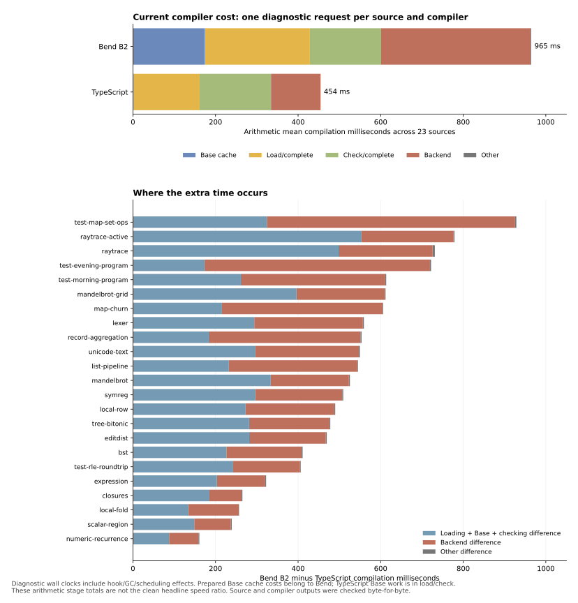

# Phase62: explaining the remaining compiler-speed gap

**The remaining gap is mainly prepared-state/loading work and backend work.**
The standalone checker boundary now takes about the same time as upstream,
although its workload differs because Bend reuses checked Base state. The same
Bend compiler source runs faster when compiled by itself than through its
TypeScript bootstrap on the four-input comparison. Allocation and arity caching
alone do not explain the full gap.

This is an investigation of unchanged Phase61 state08, not a compiler release
or optimization. The installed artifact remains checked B1; measured B2 is the
separately qualified self-emitted image. Upstream stays pinned at
`018751270e800bc222a93dad7f257083ee53a5f7`. No upstream PR comment was posted.

[Design](../../design/phase62/compiler-parity-investigation.md) ·
[Experiment](../../experiments/phase62/P62-001-remaining-compiler-cost.md) ·
[Generation comparison](generations-results.md) · [Stages](stages-results.md) ·
[CPU/allocation](profiles.md) · [Work counts](work-counts.md) ·
[Scaling](scaling.md) · [Artifacts and replay](artifacts.md).

## What the investigation measured

| Evidence | Executed scope | Result |
|---|---|---|
| Clean generation comparison | Four sources × B1/B2/TS × three balanced rounds | 36/36 complete output-byte checks |
| CPU and sampled allocation | 23 sources × B2/TS × two separate profile modes | 92/92 complete output-byte checks |
| Exclusive stage clocks | 23 sources × B2/TS, plus a two-source pilot | 50/50 complete output-byte checks; exclusive partitions close |
| Repeated ordinary requests | Four sources × B2/TS × two fresh workers, four requests each | 16 workers / 64 complete output-byte checks |
| Logical work counters | 23 paired inputs plus the initial four paired inputs | 54 complete output-byte checks; all overlapping counts agree |
| Synthetic scaling | Eight sources × B2/TS | 16/16 workers; 1,488 fresh exact numeric execution checks |

Preparation and output checks stay outside request clocks. Fresh-process tests
use prepared persistent Base caches and do not claim cold operating-system
caches. Profilers and counters are diagnostics, not clean speed measurements.
The old balanced 23-source headline remains **1.433877× combined-first and
2.071828× compilation-only**; the new four-source study does not replace it.
The 23 sources underlie the existing 45 runtime points. Those user-program
runtime timings were not rerun or improved by this investigation.

Root serialized compiler jobs on CPU3 under the existing 1 GiB heap / 2 GiB
process-tree RSS / 4 GiB available-memory policy. Seven agents independently
prepared measurements, analyzed data, researched sources and reviewed tooling;
data/source work used CPU0. No agent launched a compiler target independently.

## 1. Where the extra milliseconds go

The diagnostic arithmetic equal-source means are:

| Comparable broad work | B2 ms | TS ms | Excess ms |
|---|---:|---:|---:|
| Prepared state, source loading and checking | 600.43 | 334.44 | 265.99 |
| Backend analysis and emission | 361.31 | 119.75 | 241.55 |
| Other request work | 2.90 | 0.25 | 2.65 |
| **Compilation** | **964.64** | **454.44** | **510.20** |

Within the first row, B2 spends 173.42 ms reading/admitting Base state, 255.07 ms
loading/completing source and 171.94 ms checking. TS spends 161.53 ms loading and
172.91 ms checking, including its Base work. Thus the narrow check boundary is
similar in elapsed time; this does not establish equal checker operation costs.

Prepared-state cost is mostly JSON parsing/conversion (**88.77 ms**) and tree
validation (**52.02 ms**). Actual cache file reading is **1.75 ms**. Faster disk
or merely fewer serialized bytes is therefore not the main opportunity.

Backend reachability and final library generation together take **257.65 ms**,
about 27% of B2 compilation time in this diagnostic mean. They contain overlapping
analysis, type processing, document construction and export conversion. The
entire amount is not avoidable. Backend excess accounts for about 47% of the
measured overall gap; frontend transport/loading/checking accounts for about 52%.

These are one-sample diagnostic means, not clean performance ratios or gain
predictions. Instrumented active raytrace was 10.7% above its clean B2 median;
the detailed report preserves per-source differences and boundaries.

## 2. The self-hosted code generator is not a universal handicap

Across Numeric, MapSet, Lexer and active raytrace, B2 uses **12.82% less
compilation time than B1** by equal-input geometric mean. B2/TS is 2.089×;
B1/TS is 2.396×. B2 improves three inputs and is approximately equal on Lexer.
MapSet is 1,580.78 ms under B2 versus 2,230.71 ms under B1 and 643.54 ms under TS.

B1 and B2 implement the same Bend source; their generated images, equality
profile and runtime/ABI machinery differ. This comparison cannot assign a gain
to one code-generation pass. It does show that changing the source language or
blaming the self-hosted emitter generally is not supported by this subset.

TS startup includes significant Node TypeScript stripping (22.16% of its mean
CPU sample counts). This explains part of why combined-first comparisons look
better than compilation-only comparisons. Keep both metrics visible.

## 3. The backend repeatedly computes facts that TS caches

All 23 inputs repeat the five inspected signature helpers in both emitted
reachability and final emission. B2 `jd_arity` visits are **4.42–24.62 times**
TS's actual `FUNS` cache misses. This is a comparison of work counts, not a
speed ratio or proof that all calls have interchangeable inputs.

For MapSet there are **1,453 arity visits versus 108 TS function-fact misses**.
TS actually receives many signature requests too, but its function-fact cache
hits frequently. It bundles related information rather than repeatedly walking
the same type/body for arity, live parameters and parameter descriptions.

More than half of B2 substitution visits occur in reachability plus final emission
on **19/23 inputs**. MapSet is 73.6%; its checker accounts for only 1.3%. Ray tracing
has a different distribution, with checking and annotation more prominent.

However, the arity family averages only about **2.3% of whole-profile CPU counts**.
Eliminating that family alone cannot plausibly establish compilation parity.
The promising larger question is whether one immutable per-definition analysis
and document can serve multiple backend consumers under a sound context contract.

## 4. Allocation is a workload-specific issue

Sampled cumulative B2/TS allocation has a geometric mean of **1.185×**, ranging
from 0.822× to 2.116×. B2 allocates less on five sources. Numeric uses about
46 MB versus TS's 54 MB despite compiling more slowly; MapSet uses about
247 MB versus 117 MB. GC averages 3.02% of B2 CPU sample counts.

Map substitution/environment-substitution ancestry accounts for 22.18% of sampled
allocation but 4.93% of CPU counts. Those fractions are not interchangeable. Preserve the useful allocation
work, but do not predict a 22% time gain from eliminating 22% of allocation.

Five CPU profiles refuse weighted timestamp attribution and retain count views;
two TS allocation samples lack their tree nodes and remain explicitly unassigned.
No missing weight is discarded to improve a result.

## 5. Warm requests and scaling change the priorities

The equal-input B2/TS ratio across repeated ordinary requests is **2.114 →
1.577 → 1.293 → 1.380×**. Both compilers keep changing; four requests do not
establish a plateau. This mixes VM warming and in-process compiler behavior,
and does not isolate JIT cost. Ordinary library inspection still rereads and
decodes Base; the existing persistent inspector admits only parse/check modes.

A persistent compilation session could therefore improve real iteration latency
without first solving cold-start parity. That would be a separately measured
lifecycle change with unchanged-file/changed-file and invalidation controls.
It must retain private checked-state admission and cache-byte/API/Base identity
checks, freeze the Base book and both prefix states, and freshly discover source
and import edits. A content hash establishes identity, not checking. Extending
the current inspector requires an ownership audit through annotation and emission;
removing its parse/check mode guard alone is insufficient.

The synthetic screen finds a larger marginal cost, not observed quadratic growth:
8→512 independent definitions grows the B2/TS first-compilation ratio from
1.42× to 3.23×; width 2→64 grows it from 1.64× to 2.49×. Interval slopes decline
over this tested range. These simple sources also grow output/export work and
are not a claim about all dependent programs. They reveal that fixed overhead
alone does not explain the residual gap on larger inputs.

## Research and the next experiments

[Term-processing research](../../research/compilers_architecture_and_techniques/phase62-term-processing.md)
inspects pinned Lean, Lean4Lean and smalltt code. Our compiler already has graph
reduction; the useful missing distinctions are subtree summaries, unchanged-node
reuse, per-traversal DAG memoization, and residual lambda-body substitution.
A no-occurrence shortcut is unsafe when rebuilding an App can beta-reduce.
Compact metadata must fail conservatively on overflow.

[Query-reuse research](../../research/compilers_architecture_and_techniques/phase62-query-reuse.md)
compares current Bend with TS `TELES`/`FUNS` and object-identity caches, plus Rust
query dependencies and LLVM analysis preservation. It favors coarse immutable
facts with cheap identities over a generic persistent query framework. Earlier
generic argument-identity memoization and the backend telescope cursor remain
rejected evidence; this investigation does not relabel them successful.

| Next experiment | Measured reason | Decision rule and limit |
|---|---|---|
| Preserve an admitted immutable Base world for library sessions | About 141 ms first-request parse/validation with prepared caches; ordinary later requests still decode | Measure real repeated/edit latency and changed-cache/API/Base invalidation. A warm-session improvement is not fresh-process parity; frozen state must remain valid through emission. |
| Analyze/lower definitions once, reuse facts and documents across backend consumers | Backend contributes 242 ms mean excess; reach plus final costs 258 ms | Trace actual type/book dependencies and normalize ownership/context boundaries before reuse. Require all current outputs/refusals and budget behavior. Existing 23-source matching text is insufficient proof. |
| A small per-definition signature bundle as the first reuse prototype | Repeated arity/domain/live-parameter/parameter walks on all 23 sources | Prove the immutable scope; count traversals removed and include cache construction cost. Narrow CPU opportunity is only a few percent; reject if whole-request improvement is absent. |
| Reduce completion/freshening reconstruction | Completion 161 ms and freshening 63 ms despite prepared prefix state | First count visited/rebuilt/unchanged composite nodes, then apply a summary or sharing rule only with eager-beta, origin and binder-order preservation. These times are ceilings, not predicted savings. |
| Compact or lazily materialize validated prepared state for fresh processes | A nearly fixed 166–198 ms Base admission floor | Prototype representation plus mandatory admission together. The rejected binary codec was slower; no renewed attempt without a different mechanism and a falsifier. |

For scale: halving the entire 361 ms backend would save about 181 ms, or 19%
of the diagnostic B2 mean. Eliminating all 141 ms of cache parse/validation would
save about 15%, an unrealistic perfect-elimination ceiling rather than an
implementation estimate. Neither alone closes the 510 ms compilation gap.
Warm sessions address a different and immediately useful developer-loop target.

The next large change should combine a coherent prepared-state lifecycle with a
backend that computes and carries facts once. The small signature prototype can
test the latter architecture cheaply before a larger refactor. Keep the current
10-second screen, 31-second confirmation and 5.5-minute broad clean campaign as
separate selection gates, with diagnostics used to explain results.

## Remaining measurement limits

No fresh source-edit incremental experiment, empty-cache end-to-end comparison,
dependent-telescope scaling, full compiler-source profile or stable warm plateau
was collected. Logical entries do not count unchanged rebuilt subtrees or
distinct node identities. Those are focused next measurements, not implied by
the present results. No full conformance or reproduction rerun was necessary:
production compiler code and installed images were unchanged.

The ten serial collection workflows took **401.90 seconds (6 minutes 42 seconds)**
in total, including their preparation, preflight and output verification. This
is not total session elapsed or target CPU time; parallel research, tooling,
review and publication are outside it. [Accounting and preservation](evidence/accounting-preservation.json)
also verifies all 110 inherited unrelated files and seven installed files unchanged.
