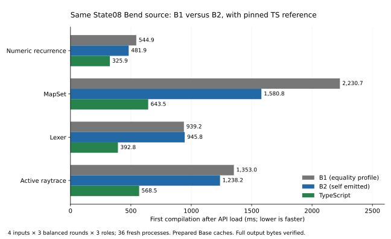
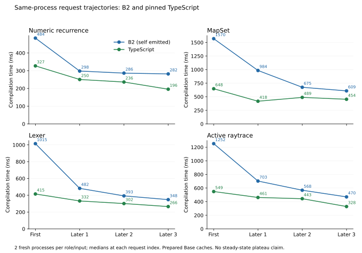

# Same-source generations: initial results

The self-emitted State08 B2 uses **12.82% less compilation-only time** than
the selected checked B1 on this four-input comparison: equal-input geometric
mean B2/B1 is **0.871798**. Both remain slower than the hand-written TypeScript
compiler. This is evidence against the self-hosted emitter being the general
cause of the remaining gap on these inputs; the Bend implementation's shared
algorithms, representations and host workflow remain important suspects.

[Audited compact evidence](evidence/generations-clean36.json) ·
[Method and caveats](generations-method.md) ·
[Raw campaign](../../selfhost/build/phase62/generations01/clean36/report.json).

## First request, after API load

Each value is a median of three fresh processes, milliseconds. B1 and B2 use
the same State08 Bend source and host snapshots. B1 is the checked
**equality-profile derivative** of TS bootstrap output, rather than untouched
TS-generated output. B2 is its genuine compiler self-emission.

| Input | B1 ms | B2 ms | TS ms | B2 / B1 | B2 / TS |
| --- | ---: | ---: | ---: | ---: | ---: |
| Numeric recurrence | 544.868 | 481.936 | 325.928 | 0.885× | 1.479× |
| MapSet | 2,230.708 | 1,580.779 | 643.539 | 0.709× | 2.456× |
| Lexer | 939.215 | 945.791 | 392.844 | 1.007× | 2.408× |
| Active raytrace | 1,352.968 | 1,238.208 | 568.550 | 0.915× | 2.178× |
| Equal-input geometric mean of ratios | — | — | — | **0.871798×** | **2.089013×** |

B1/TS is **2.396214×** on the same compilation-only aggregate. MapSet accounts
for the largest B2-over-B1 improvement; Lexer is close. Three samples per cell
are descriptive, not a claim of statistical significance or universal behavior.

## Import + API load + first compilation

| Input | B1 ms | B2 ms | TS ms | B2 / B1 | B2 / TS |
| --- | ---: | ---: | ---: | ---: | ---: |
| Numeric recurrence | 600.059 | 582.159 | 589.293 | 0.970× | 0.988× |
| MapSet | 2,285.726 | 1,691.287 | 907.780 | 0.740× | 1.863× |
| Lexer | 994.757 | 1,054.328 | 659.691 | 1.060× | 1.598× |
| Active raytrace | 1,408.497 | 1,348.014 | 842.019 | 0.957× | 1.601× |
| Equal-input geometric mean of ratios | — | — | — | **0.923761×** | **1.473121×** |

B1/TS combined is **1.594701×**. B2's initialization is more expensive than
B1's on these measurements, so its compilation-only advantage is partly offset
in the combined window. These boundaries are the prepared-cache first-request
boundaries already used in Phase61; they are not cold OS-cache or installed-CLI
measurements. This quartet does not replace the earlier 23-input headline.

## Execution and checks

All **36/36** measurement workers pass, with three position-balanced role
rounds per source and fixed source order. Whole measurement-campaign wall is
**52.438569 s**, with preparation excluded. Complete raw emitted module bytes
match each role's previously qualified oracle after every timed request. The
data-only summary reopens every result receipt, checks its recorded identity
and output hashes, and confirms common B1/B2 source, Base, driver and host
runtime identities. Their embedded generated runtime and ABI code still differ.

CPU3, Node 24.18.0, 1 GiB heap, 2 GiB process-tree RSS and the 4 GiB available
memory floor remain enforced by the existing runner. No compiler-source change,
installed-image change or new generated-program runtime measurement occurs.

The result supports investigating shared work duplication and representation
cost next. It does not prove that B2 has no backend opportunities: a local
hotspot can remain even when the whole image is faster than B1. A pristine B1
comparison would be a separate diagnostic if individual generated-code effects
become the proposed cause.

## Later requests in the same process

A separate two-role campaign passes **16/16 fresh workers**, each with one first
request followed by three later requests: **64 checked compilations and full
raw-output byte comparisons**, zero failures, **42.802939 s** campaign wall.
Each source/role has two fresh processes, with the role order rotated. Its first
request samples stay separate from the earlier clean36 campaign.

[Audited trajectory evidence](evidence/generations-warm16.json) ·
[Raw campaign](../../selfhost/build/phase62/generations01/warm16/report.json).

The table gives milliseconds, median at each request index over two processes.
The arrows denote first → later 1 → later 2 → later 3.

| Input | B2 trajectory, ms | TS trajectory, ms | Later 3 B2 / TS |
| --- | --- | --- | ---: |
| Numeric recurrence | 483.824 → 297.966 → 286.391 → 281.942 | 327.172 → 250.472 → 236.195 → 195.644 | 1.441× |
| MapSet | 1,570.223 → 984.478 → 674.883 → 608.537 | 647.934 → 418.107 → 488.570 → 453.954 | 1.341× |
| Lexer | 1,014.727 → 482.346 → 392.942 → 348.159 | 415.461 → 332.422 → 301.578 → 265.614 | 1.311× |
| Active raytrace | 1,252.294 → 702.700 → 567.827 → 469.966 | 548.607 → 461.461 → 443.377 → 328.318 | 1.431× |

Equal-input B2/TS compilation-only ratios are **2.114227× → 1.577275× →
1.292976× → 1.379801×**. Reusing the process helps both compilers and reduces
their relative gap substantially on this subset. The final ratio rises from
the preceding request, and several times continue falling: **there is no
steady-state plateau claim**. Two processes per cell are a descriptive screen.

These are ordinary `D.inspect` calls retaining the loaded API, not calls through
a persistent library-compilation service. The driver does not retain a fully
decoded Base cache between these ordinary library requests; its explicit
persistent-inspector path serves parse/check modes. Therefore the observed gain
must not be attributed to an already implemented persistent decoded-world cache.
This experiment also does not isolate JIT compilation, deoptimization, GC or OS
cache effects. It demonstrates that request lifecycle matters and motivates a
controlled persistent-session design plus a longer, separately measured warmup
trajectory. The gap remains on every final request in this subset.

The root invoked the unchanged relocated runner with roles `b2,typescript`,
the same four cases, `--rounds 2 --warm-requests 3`, and the existing Phase62
preparation receipt. Its exact plan and arguments are retained with the raw
campaign. No method, image or compiler-source change separates the first and
later calls.
