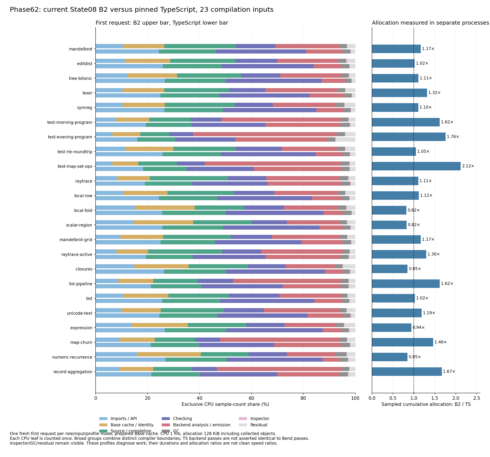

# Current State08 CPU and allocation survey

The remaining compilation gap is spread across frontend work and backend work;
it is not a universal excess-allocation or GC problem. The broad profiles also
show that a cache for arity queries alone is too small an observed opportunity
to explain parity. For the heavier programs, removing repeated backend analysis
and emission is the stronger architectural question.

The independent [exclusive stage survey](stages-results.md) puts the two
opportunities in elapsed-time context: the arithmetic mean compilation gap is
510.20 ms, split into 265.99 ms in prepared-state/loading/checking and 241.55 ms
in the backend. The standalone checker boundary is already similar in time,
but B2's prepared Base state moves work outside that boundary. CPU percentages
below explain operations within those costs rather than replacing that account.

This is an unchanged-compiler investigation. Genuine State08 B2 is
`23bd6a48b9ed48b58bdc81245c3e40978735f8386c3eb6029b92701511986477`, with Bend
source `268b3cf2e1f1c2810c372925ccd1ad7eb91225853d432ca9517f05f2ecefd42e`.
Upstream TypeScript stays pinned at `018751270e800bc222a93dad7f257083ee53a5f7`.
Every profiled request reproduces its qualified complete raw module bytes.
No compiler source, generated program, installed image or historical result was
changed by collecting or analyzing these profiles.

## Coverage and timing boundaries

Both [CPU46](../../selfhost/build/phase62/generations01/cpu46/report.json) and
[allocation46](../../selfhost/build/phase62/generations01/allocation46/report.json)
pass: 23 inputs × two roles, one first request in a fresh process per observation.
These are the 23 compilation inputs underlying the maintained 45 runtime points;
the runtime programs themselves are not timed here. Private Base caches are
prepared before capture. Compiler import, API load and one compilation are
inside capture; byte validation follows inspector stop. CPU sampling is 1 ms;
allocation sampling is 128 KiB, including objects collected by both GC kinds.

The two whole campaigns took **70.818 s** and **94.103 s**, respectively, with
preparation reused. Profile durations are diagnostic and are not clean compiler
speed measurements. Root runs targets serially on CPU3 with the established
1 GiB heap, 2 GiB tree RSS and 4 GiB available-memory floor. Readers and plotting
run on CPU0 without executing a compiler.

[Compact published evidence](evidence/profiles-summary.json) ·
[Publication copy verification](evidence/profiles-publication.json).
[Audited analysis](../../selfhost/build/phase62/profile-analysis02/report.json)
contains all 92 observations, raw and tool identities, per-source partitions,
ancestor unions, intersections, unresolved stacks and accounting. The
[reader and replay instructions](../../selfhost/tools/performance/phase62/analysis/README.md)
describe exact admission and ancestry rules. The earlier
[CPU-only V1 readback](../../selfhost/build/phase62/profile-cpu-analysis01/report.json)
is preserved. V2 only adds exact Node TypeScript-stripping ancestry, resolving
previously unassigned Amaro/WASM samples without changing weights or B2 rules.

[SVG](figures/cpu-allocation.svg) ·
[Figure data and provenance](../../selfhost/build/phase62/profile-figures01/report.json).
Every bar uses its own complete CPU sample-count denominator. Equal bar lengths
do not imply equal elapsed times. Broad groups combine different compiler
boundaries; upstream `file_book` is not asserted identical to any single Bend
pass. GC, inspector and residual mass remain visible.

## CPU work across the population

The following are arithmetic means of the **23 per-source CPU count shares**,
giving each input equal weight. They are not weighted-time shares, ratios of
clean elapsed time or percentages of the excess versus TS.

| B2 disjoint stage | Mean CPU count share |
|---|---:|
| Base cache read/validation | 14.94% |
| Source completion | 14.73% |
| Checker | 14.18% |
| Initial emitted reach | 12.16% |
| API load | 10.70% |
| Final library excluding host wrapper | 4.98% |
| GC | 3.02% |
| Annotation | 2.98% |
| Host wrapper | 2.79% |
| Frontend error scans | 2.73% |
| Source loading outside completion | 2.28% |
| Graph freshening | 2.26% |
| Layout validation | 2.13% |
| Book context | 2.01% |
| Base identity | 1.59% |

Remaining named stages and residual bins account for the rest. The unclassified
generated-image share averages **2.77%**, with another **0.38%** in other host,
Node and unassigned locations. Thus the old roughly 25% Other bin was largely
an incomplete boundary map, not evidence for 25% unexplained VM execution.
GC and inspector are now explicitly separated. Frontend `fpe_*` traversals
inspect errors; their names do not mean prefix comparison.

Upstream spends **22.16%** of its mean CPU counts under Node's TypeScript
module-stripping ancestors and **1.36%** in other module compilation. These
include the Amaro/WASM implementation actually observed in Node 24.18.0. B2's
API-load share is 10.70%. This helps explain why the combined first-request
comparison looks better for B2 than the compilation-only comparison. It does
not establish the exact startup saving; use the independent stage clocks and
clean timings for elapsed-time comparisons.

Five CPU profiles fail the pre-existing weighted timestamp admission policy:
TS mandelbrot, Evening, expression and map-churn; B2 active raytrace. Their raw
signed deltas and count views remain available. Population comparisons use
counts consistently across all 46 observations. Weighted microseconds are
retained only for admitted individual profiles; they are never substituted
into count-based population means.

## Allocation is uneven, and does not directly predict CPU cost

The equal-source geometric mean of B2/TS sampled allocation is **1.184916×**.
B2 allocates less on five inputs and more on eighteen, ranging **0.821886× to
2.116415×**. This is cumulative sampled allocation, not retained heap or peak
RSS. All 23 pairs are shown in the figure and its data receipt.

| Input | B2 sampled MB | TS sampled MB | B2 / TS |
|---|---:|---:|---:|
| Numeric recurrence | 46.135 | 54.489 | 0.847× |
| Local fold | 49.395 | 60.099 | 0.822× |
| Lexer | 88.708 | 67.354 | 1.317× |
| Active raytrace | 140.595 | 108.521 | 1.296× |
| Evening | 222.793 | 126.858 | 1.756× |
| Map/Set | 247.219 | 116.810 | 2.116× |

The allocation profiles retain two samples whose V8 allocation-tree nodes are
absent: **138,000 bytes for TS raytrace and 135,728 bytes for TS Numeric**.
Their original weights contribute to totals and an unassigned bin; no missing
stack is invented. Sampling variability is separate from those exact recorded
missing-node weights.

Substitution and environment substitution together account for **22.18% of
Map's sampled allocation but 4.93% of its CPU counts**; Evening is **24.31% versus
7.83%**. Numeric is **1.14% versus 0.40%**. An allocation-reducing substitution
change could still help, including through GC, but the allocation fraction is
not a direct elapsed-time gain estimate. Index ancestry similarly averages
18.90% of allocation and 5.80% of CPU counts. These inclusive unions overlap
other operations and must not be summed.

## What the backend profiles say

The [scoped backend leaf census](../../selfhost/build/phase62/backend-leaves01/report.json)
retains exact leaf names and locations for Map/Set, Evening, Lexer and Numeric,
in both roles. It partitions initial reach, final library, host, annotation and
layout validation independently. A `$scc` name identifies a shared generated
worker; its representative name does not prove which source member executed.

For Map's admitted weighted profile, initial emitted reach contains 396.801 ms
of sampled weight. Its largest individual leaves each represent only a few
percent of that stage: `wnf` 4.4%, `jd_text_scan` 4.3%, `tg` 3.4%, `norm_eval`
3.4%, `subst` 3.4%, specialization 3.3%. Final library excluding host contains
191.509 ms: `jd_text_raw` is 11.5% of that stage, ordered expression construction
6.7%, with text scanning, substitution, normalization, strings and many smaller
leaves sharing the rest. Host generation is separate, at 122.236 sampled ms.
These profile units are not the independent stage timer's milliseconds.

The combined arity/domain/live-arity/parameter-query ancestor union averages
**2.25% of whole-request CPU counts**, reaching 5.55% on Evening and 5.50% on Map.
For their admitted weighted views it is 7.07% and 6.01%, respectively. A cheap
safe cache could be useful, but these observed shares do not support parity
from that cache alone. Normalization ancestry averages 7.16% of CPU counts and
substitution ancestry 2.45%; those also overlap and exclude work lacking an
unambiguous real named wrapper.

The larger question is whether we can avoid running whole portions of backend
analysis and emission twice, or compute reusable function facts while traversing
each definition once. That can remove many small leaf costs together. It still
requires an exact context/dependency invariant: the initial annotated context
and final retained context differ. Phase61's equal-output reuse probe was not a
proof of safe reuse. A new prototype should record dependencies, preserve budget
and error behavior, and test retained/unretained aliases before timing a cache.

The measurements support prioritizing architecture-level redundant work over a
single small helper. They do not establish a universal backend optimization or
a promised speedup. Combine them with the new exclusive stage clocks to rank
actual excess milliseconds; preserve the clean, cold/prepared and warm-request
comparisons as separate measurements.
