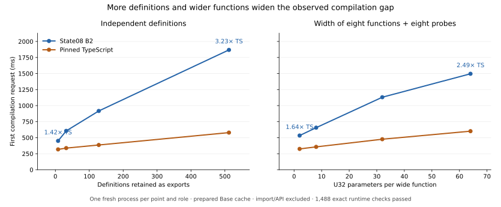

# Synthetic scaling investigation

The purpose is to test whether declaration count or ordinary telescope width
exposes disproportionate work in the selected State08 compiler. This report
does not claim a production optimization or representative speedup.

The bounded screen uses the genuine prepared State08 B2 and pinned upstream
TypeScript compiler through their ordinary checked library APIs. It generates
eight sources, executes one fresh process per source and role, and validates
every generated fixture export against an independent numeric oracle outside
the compilation clocks. The compiler sources and historical artifacts are
unchanged. See [tool protocol](../../selfhost/tools/performance/phase62/scaling/README.md).

Declaration counts are 8, 32, 128 and 512. Each independent one-argument
function computes its argument plus a distinct constant; all user exports are
retained. Telescope widths are 2, 8, 32 and 64, with eight functions plus eight
calling probes at each width. Balanced addition trees reduce expression-depth
confounding, and calling probes require the complete application to be checked.
These are U32 parameters, so this family does not isolate dependent substitution.

The plan separates fixed import/API cost from first-request time. Later requests
are optional and remain separate. One screening round is useful for finding
large trends, but cannot prove a complexity class; growing source bytes, checking,
emitted bytes and export wrappers must be considered before assigning causality.

The root-owned guarded campaign `selfhost/build/phase62/scaling01` completed all
**16 workers in 32.44 seconds**, with no failure and **1,488 exact runtime value
checks passed**. Each compiler checked 744 fixture export invocations: 680 from
the declaration family and 64 from the width family. Every invocation called an
actual generated export; the checks were neither inherited nor merely compared
between compilers. No generated-program execution speed was measured.

The [compact evidence](evidence/scaling.json) binds the complete raw report,
source and output hashes, actual compiler images and preparations, per-role
timings, memory high-water marks and exact-check counts. Its producer checks the
raw oracle values against the independently generated arithmetic expectations.



| Family / size | B2 first compile (ms) | TS first compile (ms) | B2 / TS compile | B2 / TS import + API + compile |
|---|---:|---:|---:|---:|
| Definitions 8 | 449.9 | 317.2 | 1.42× | 0.97× |
| Definitions 32 | 605.6 | 337.5 | 1.79× | 1.18× |
| Definitions 128 | 916.5 | 385.8 | 2.38× | 1.55× |
| Definitions 512 | 1,868.4 | 579.1 | 3.23× | 2.29× |
| Width 2 | 533.2 | 324.9 | 1.64× | 1.07× |
| Width 8 | 656.0 | 356.5 | 1.84× | 1.21× |
| Width 32 | 1,130.6 | 475.9 | 2.38× | 1.60× |
| Width 64 | 1,496.1 | 601.3 | 2.49× | 1.80× |

These are one observation per cell, not estimates with confidence intervals.
The 0.97× combined result for the smallest input does not establish a speed
advantage: compilation itself remained slower, with lower B2 import cost
offsetting the difference.

The declaration family is a useful finding: increasing 8 to 512 very simple
definitions added **1,418.6 ms** to B2 versus **261.9 ms** to TS. The ratio of
those endpoint differences is **5.42×**. Increasing width 2 to 64 added **962.8
ms** versus **276.4 ms**, a **3.48×** endpoint-difference ratio. These differences
cover whole requests, including all growing parsing, checking, output and
wrapping work. They are not measured costs of an individual definition or a
substitution operation, and should not be substituted for the representative
23-input compiler metric.

There is **no observed quadratic explosion in these ranges**. B2's adjacent
declaration slopes decreased from 6.49 to 3.24 to 2.48 ms per added definition;
the width-family slopes decreased from 20.47 to 19.77 to 11.42 ms per added
parameter across the eight functions and their probes. This single-round
screen cannot establish the asymptotic class or distinguish JIT amortization
from algorithmic behavior. Its useful signal is substantial additional cost
for larger ordinary source, rather than evidence of an accelerating slope.

Growing emitted bytes are a confound but do not explain the result on their
own. Across the declaration endpoints, B2 output grew by 99,416 bytes versus
78,752 bytes for TS, a 1.26× growth ratio; the request-time growth ratio was
5.42×. Across the width endpoints, output growth was 49,584 versus 35,696 bytes,
or 1.39×, versus the 3.48× request-time growth ratio. This comparison does not
isolate emission CPU cost: producing each byte may require different work.

The next useful experiment is to attribute those extra milliseconds and term
visits to the existing stages, rather than enlarging the fixture grid or tuning
these example functions. In particular, the many-simple-definitions case can
expose repeated book traversal, per-export fact computation, or repeated
emission with little source-language complexity. The width family can expose
parameter/body traversal and host-wrapper costs. The data do not yet identify
which of these mechanisms dominates, so no compiler change is selected here.

To regenerate the evidence and figures without executing a compiler:

```sh
taskset -c 0 python3 selfhost/tools/performance/phase62/scaling/analyze.py \
  selfhost/build/phase62/scaling01/report.json \
  implementation/phase62/evidence/scaling.json \
  implementation/phase62/figures-scaling
```
