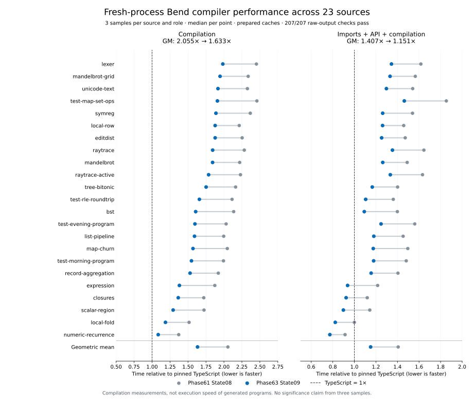

# Phase63 State09: reusable compiler state and one lowering pass

State09 reduces genuine B2 compilation time by **20.55%**, from **2.05505× to
1.63275×** the pinned TypeScript compiler. Startup/API import plus first
compilation falls **18.18%**, from **1.40665× to 1.15092×**. All 23 sources improve
against the previous selected compiler under both clocks; compilation alone is
still slower than TypeScript on every source.

The principal finding is that repeated reconstruction was a substantial part of
the gap. The compiler now retains an authenticated prepared Base world and parser
indexes, lowers each reachable definition once in one immutable context, and
carries already computed local facts to their consumers. A specialized validated
cache decoder makes that retained state economical in a fresh process. Compiler
algorithms remain implemented in Bend.

**Release status: installed and verified.** State09 compiler source is frozen at commit `0d7934a`.
The full checked matrix, genuine B2 construction, fresh own-source type check,
exact B2/B3 reproduction and final broad timing campaign pass. The B2 semantic
validator retry also passes. All five release stages pass, including 42 legacy
and 24 default ordinary/relocated CLI checks. The installed package is the
equality-derived checked B1; the performance figures above measure genuine B2.

## Performance result and what it measures

The [final compact receipt](evidence/state09-broad3.json) binds the exact raw
campaign, plans, inputs and output oracles. It passes **207/207 workers**:
23 independent source programs × three compiler roles × three rounds. Each role
occupies every position once per source. Compute the median of each role/source's
three samples, then the equal-source geometric mean of ratios.

| Fresh-process metric | Previous Phase61 B2 / TS | State09 B2 / TS | State09 / previous |
|---|---:|---:|---:|
| Source loading, checking and library compilation | 2.05505× | **1.63275×** | 0.79451× |
| API import plus first compilation | 1.40665× | **1.15092×** | 0.81820× |

State09 compilation/TS ratios range from **1.08537×** on Numeric recurrence to
**1.98448×** on Lexer. Including import, **5/23** sources are faster than TS;
combined ratios range from 0.77272× to 1.46335×. This reflects the different import
costs as well as compilation work and must not be described as compiler parity.

Each sample is a new process with a prepared persistent Base cache. Preparation,
output validation and receipt construction are outside the clocks. Every emitted
module matches its complete qualified raw-byte oracle. These are genuine
self-hosted **B2** measurements, not installed checked-B1 CLI timings, repeated
warm requests, OS-cold storage tests or generated-program execution timings.
The catalog represents 23 compilation inputs and 45 runtime points; those points
are not 45 independent compilation sources. Three rounds describe variation,
not statistical significance or all possible Bend programs.

The campaign took **267.31 seconds**, with 231.06 seconds of closed worker
occupancy and a maximum supervised worker-tree RSS of 177,102,848 bytes. Thus the
broad confirmation takes about four and a half minutes once images and caches
exist; it need not be the inner optimization loop.

The intermediate [State06 campaign](evidence/state06-broad3.json) independently
passed 207 workers: compilation 2.07151× → 1.67547× and combined 1.41480× → 1.17557×.
Those figures use that campaign's own baseline. They support the main pipeline
improvement but must not be subtracted from State09's independent campaign to
assign a precise gain to the final small changes. The direct State06/09 B1 screen
was essentially flat on Numeric and Lexer and reduced Map by 3.43%; its scope is
separate from the final B2 result.

## What changed

| Change | Repeated work removed | Preserved boundary |
|---|---|---|
| Prepared checker world | Rebuilding raw/checked Base lookup worlds and replaying established prefix events | Exact producer/API/Base/source coupling; suffix chronology, bounds, collision fallback and full public checking remain |
| Prepared frontend state | Rebuilding parser name/constructor indexes and rediscovering completed suffix fragments through Base | Actual completed fragments, name/constructor precedence, source origins and private loader admission |
| Shared graph transport and fixed constructors | Duplicated serialized terms and generic reconstruction/validation dispatch | Schema, child types, ranges, digests, backward references and optional-state fallback |
| Owned `JDPlan` | Second call-graph construction and repeated lowering of retained definitions | One canonical annotated context; original demand, runtime references, source/SCC order and refusal budgets |
| Shared host field conversion | Constructing the same field converter during both tail selection and field emission | Same telescope, fuel, direction, order and last-self-tail rule |
| Retained arity facts | Recomputing a completed ordinary definition's arity during emission and host wrapping | Original demand point; native/foreign/missing fallback; public raw `jd_arity` unchanged |

The important backend change is ownership of a context, not a general
cross-context cache. Historically, reachability used all selected annotated
aliases while final emission reoverlaid only retained definitions. The plan keeps
one canonical annotation overlay throughout. Six adversarial real-source controls
compare old pruned emission, fresh canonical emission and saved-plan emission,
including aliases, dependent types, native/recursive host layouts, erased demand
and unequal-arity mutual SCCs. All **45 runtime observations** pass for State09.
Finite controls and byte equality qualify the tested cases; annotations alone
are not a universal proof that arbitrary contexts may be interchanged.

The arity change reuses the existing call-fact index; it introduces no eager
prepass or mutable cache. The exact-query controller passes **558 comparisons**,
including **484 fact hits and 74 fallbacks**, then reproduces identical complete
modules with reuse disabled. Map's admitted queries avoid 7,692 lexical WNF
entries inside this controller. That work count is diagnostic evidence, not an
isolated whole-request speed attribution.

Detailed contracts and retained candidates are in [Base world](base-world.md),
[frontend](frontend.md), [transport](cache-host.md), [backend plan](backend-plan.md)
and the [arity experiment](../../selfhost/tools/performance/phase63/call-arity/README.md).

## Correctness and self-hosting

| Gate on the final State09 source/image | Recorded result |
|---|---|
| Strict checked build and exact export admission | Pass: 36 checked cases, 94 roots |
| Emitted arity differential | Pass: 558 raw-query comparisons and complete fallback-module equality |
| Frontend differential | Pass: 16 sources plus producer/order/public-seed controls |
| Backend context differential | Pass: six sources, 45 expected runtime observations |
| Full checked semantic matrix | Pass: 96 source, 34 numeric, 18 composition and two overapplication cases; maintained suites/direct census, native3 and runtime45 smoke |
| Genuine B2 construction and driver comparison | Pass |
| B2 checks its exact complete source with an initially empty private cache | Pass for type acceptance; expected proof-trust refusal remains |
| Exact B2/B3 self-reproduction | Pass: identical 4,029,799-byte images |
| Final B2 broad performance/output campaign | Pass: 207 workers, all complete module-byte oracles |
| Final B2 semantic matrix | Pass: 96 source, 34 numeric, 18 composition and two overapplication cases through the metadata-validator successor |
| B2 emitted-program equality | Pass: 23 freshly checked sources, 23 raw modules and all 45 runtime-point artifacts equal checked B1 |
| Release admission, installation and installed CLI/legacy gates | Pass: install, identity verification before/after, legacy42 and default24 including relocation |
| Cache-helper release integrity | Pass: five installed/copied/missing/tampered/omitted-inventory controls |

Primary receipts: [checked matrix](../../selfhost/build/phase63/final-state09/checked-stage-execution/report.json),
[own-source check](../../selfhost/build/phase63/final-state09/self-check/report.json),
[fixed point](../../selfhost/build/phase63/final-state09/fixed-point/report.json),
[arity](../../selfhost/build/phase63/state09-arity-controls01/report.json),
[frontend](../../selfhost/build/phase63/state09-frontend01/report.json),
[context controls](../../selfhost/build/phase63/state09-contexts01/report.json) and
[SCC successor](../../selfhost/build/phase63/state09-contexts02/report.json).

The fresh B2 source check reports **11.87 seconds** for checking. Its complete
3,235-definition source remains explicitly unsafe: `typeAccepted:true`,
`proofTrust:"failed"`, `kernelChecked:false`. The reproduction probe reports
**30.10 seconds** and exact B2/B3 equality. These bounded diagnostic clocks are
not repeated throughput measurements or a mathematical correctness proof.
The source oracle retains the known upstream signaling-NaN discrepancy rather
than rewriting expectations: candidate source 96/96, upstream source 95/96.

The first B2 semantic validator receipt remains failed: it compared differently
shaped identity metadata despite matching file/hash values (`canonicalPath`
present on one side). A successful acquisition or plausible explanation does
not make that parent pass. The [corrected successor](../../selfhost/build/phase63/final-state09/b2-semantics-resume02-execution/report.json)
passes all seven remaining commands. It validates optional canonical paths and
byte counts before comparing file/hash identities; the four semantic controllers
remain byte-for-byte unchanged. The [separate output-equality remainder](../../selfhost/build/phase63/final-state09/b2-program-resume-execution/report.json)
also passes. Successful own-source checking, fixed-point construction and the
initial composition acquisition were reused without repeating them.

The [final qualification index](evidence/state09-qualification.json) joins the
selected receipts without rewriting failed parents. Release validation is in
the [five-stage execution](../../selfhost/build/phase63/release-state09-execution/report.json)
and [helper controls](../../selfhost/build/phase63/release-state09-helper-integrity/report.json).
The packager needed one additional static dependency: `base-cache-graph.mjs`.
The reviewed [packaging delta](../../selfhost/tools/performance/phase63/release/PLAN-ADAPTER.md)
binds that helper to genuine checked-build provenance and includes it in relocated
release inventories. Compiler source, API, driver, Base and runtime hashes stay
bound to the frozen State09 snapshot; only the packaging tool differs by the
recorded exact patch. Missing, changed or omitted helpers are rejected.

## Size and complexity cost

Counts below read only the **114 manifest-listed Bend modules** from each frozen
checked snapshot and verify every module against its recorded SHA256. Physical
lines use `splitlines`; code excludes blank and comment-only lines. Declarations
count line-start `def`, `law` and `type`. Generated assemblies, runtime/host code,
fixtures, experiment tooling and documents are excluded.

| Compiler source metric | Phase61 State08 | Phase63 State06 | Phase63 State09 |
|---|---:|---:|---:|
| Physical lines | 27,753 | 28,126 | **28,115** |
| Code lines | 22,799 | 23,092 | **23,075** |
| Definitions | 3,192 | 3,238 | **3,235** |
| Laws | 642 | 642 | **642** |
| Types | 112 | 116 | **117** |
| UTF-8 bytes | 1,260,521 | 1,281,624 | **1,280,814** |

Relative to the prior release, this is **+362 physical lines (+1.30%)**, +276 code
lines, +43 definitions and five data types. State09 itself removes **11 physical
lines** and 17 code lines versus State06: the small arity extension and explicit
completion carrier are offset by four removed host traversals and suffix carry.
The five added types describe prepared checker/frontend state, the lowering
plan, retained host fields and indexed completion. This is a bounded architecture
increase, not a claim of reduced overall concept count.

Host support is separate: `typed-driver.mjs` grows from 908 to 983 lines;
`base-cache-graph.mjs` adds 156 lines; the 200-line workflow helper changes bytes
without growing. The ordinary and direct runtime hashes remain unchanged.
The generated B2 grows from 3,978,248 to 4,029,799 bytes; generated-image size is
not Bend source size.

Final identities:

- Checked B1 API: `4a208bffcf47b5d19f8ff18be1fc01b2faf988b37d38e7f5db9e6bd42d79905f`.
- Exact assembled source: `0ebe491e727721857ce981ff5a2167a52d1e040f5674915a3349fea33bed8ed5`.
- Genuine B2/B3: `e838cbab6e6543d1785da0474c50c1c33ab91e6806d2e6796cfcbeabf5b98003`.
- Upstream remains `018751270e800bc222a93dad7f257083ee53a5f7`; Node 24.18.0.

## Rejected ideas and measurement corrections

The generic shared-graph decoder improved a warm microbenchmark but regressed
fresh-process admission. Fixed-field constructor decoding, with the same
validation, survived a separate fresh-request comparison and 206 valid/1,331
malformed differential controls. Sharing and smaller bytes were useful, but
insufficient on their own.

The owned positional-ABI proposal targeted work that actual named-layout B1/B2
images did not perform: profiling found zero adapter encodings. It was not
selected. Checker-annotation call-spine reuse passed 389 exact argument-result
comparisons but gave no useful request-time gain; its 49-line change was removed.
JavaScript identity memoization exposed repeated arity queries, but general WNF
memoization saved less and combining them added no clear benefit. No diagnostic
host-language compiler memo became production code.

The first Numeric memo baseline prepared its cache, contaminating that timing.
Its receipt is retained and excluded from comparisons; v2 requires preexisting,
unchanged cache bytes and blocks preparation during measurement. Early bootstrap
syntax/inference failures, the invalid ordinary-recursion fixture, overstrict
controllers, and the permission-failed State06 composition parent also remain
failed records. Corrected source states and successor receipts are separate.

## Iteration cost and preservation

From 20:04:24 to 21:47:43.997 UTC on October 7, elapsed work was **103 minutes
20 seconds**. The union of completed supervised intervals was **38 minutes
9 seconds (36.92%)**, including failures and without double-counting copied or
nested receipts. The other 65 minutes 11 seconds are unclassified wall time,
not measured waiting or CPU utilization. This accounting includes source/tool
work, review and analysis only through its cutoff; final documentation and
publication occur afterward. See the [timing account](../../selfhost/build/phase63/time-account-final.json).

All 110 inherited unrelated files remain unchanged. All seven previous installed
artifacts are preserved under the old API's release-history directory. Failed
source states, rejected ideas, incorrect controllers and superseded receipts
remain in the [closed evidence capsule](../../selfhost/tools/performance/phase63/artifacts/README.md),
with member-by-member byte verification and a restoration guide.

## What the remaining gap suggests

At 1.63275× TS, parity still requires approximately **38.75% less compilation
time** on this catalog; 0.5× would require roughly 69.38% less. Combined first
request needs about 13.11% less to reach parity, but optimizing that metric alone
would not eliminate the compilation gap.

The next useful work is to profile the selected State09 image across a small,
contrasting set—Numeric, Lexer and Map—then confirm the changed distribution
across all 23. Phase62/early Phase63 profiles are motivation, not current
attribution. The strongest remaining directions are:

1. **Retain more checked/emission facts at their original demand point.** Typed
   signature/telescope, instantiated layout and host conversion facts should be
   owned by the same immutable plan that consumes them. Test an exact local
   oracle and whole-request allocation/time; avoid rebuilding equivalent facts
   or materializing a second generic IR merely to cache them.
2. **Reduce the remaining frontend scans.** Lexer remains the worst compilation
   ratio. Count actual bytes/events visited by header discovery, completion and
   provenance; evaluate a single carried source view with exact diagnostic/order
   controls before widening it. The suffix-carry result demonstrates the useful
   pattern but does not establish that all such scans can disappear.
3. **Separate fixed admission cost from source-proportional work.** Preserve
   validated shared state and measure fresh and persistent requests separately.
   New transport must beat decode plus required validation in fresh processes;
   an unchecked or warm-only win is insufficient.

Use one guarded target executor, cheap source/profile analysis in parallel,
checked-B1 local controls and a two/three-source screen before rebuilding B2.
Reserve the roughly 4.5-minute broad campaign and full semantic/reproduction
matrix for candidates that survive those screens. Every candidate needs a
measured budget large enough to matter and an explicit deletion/rejection rule.

This phase makes the compiler faster while preserving qualified emitted bytes.
It provides **no new generated-program execution-speed result**, no broader
language-conformance claim, and no justification for treating self-reproduction
as proof validity.
