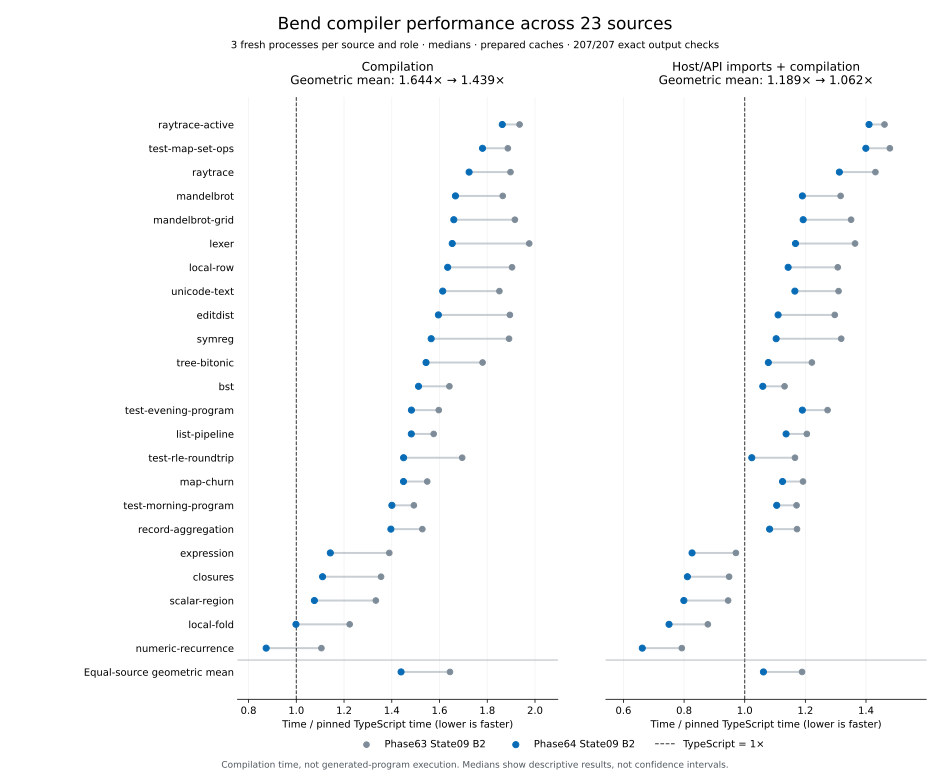

# Phase64 State09: cheaper prepared state and retained facts

Phase64 State09 reduces genuine B2 compilation time **12.47%**, from
**1.64387× to 1.43894× TypeScript** in the same controlled campaign. Including
host/API import, the first compilation improves **10.72%**, from **1.18920× to
1.06173×**. All 23 sources improve against the previous compiler on both clocks.

**Installed and verified.** Compiler source is committed at `4e5fe70`.
All compiler, performance and release gates pass, including 42 legacy and 24
default/relocated CLI checks plus five cache-helper integrity controls. The
packaged compiler is equality-derived checked B1; the headline measures genuine
B2. The previous seven installed artifacts are retained unchanged.

## Measured result

| Fresh-process metric | Phase63 State09 B2 / TS | Phase64 State09 B2 / TS | Time reduction |
|---|---:|---:|---:|
| Source loading, checking and library compilation | 1.64387× | **1.43894×** | **12.47%** |
| Host/API import plus first compilation | 1.18920× | **1.06173×** | **10.72%** |

The [complete compact receipt](evidence/state09-b2-broad.json) validates all
**207/207 workers** and exact full output oracles. Individual compilation gains
range from 3.74% to 20.95%. Candidate/TS compilation ratios range from 0.87374×
to 1.86289×; two sources fall below 1×, including one at 0.999× that should be
read as near parity. Including imports, five sources are faster than TS.

The campaign takes **218.52 seconds** (3 minutes 38.5 seconds), with maximum
supervised worker-tree RSS **166.18 MiB**. This is the final confirmation loop,
not the default cost of every source edit. The previous release's independently
measured headline was 1.63275×; the table deliberately uses its new same-campaign
1.64387× baseline, avoiding attribution of between-run drift to the change.

Compilation parity still requires approximately **30.5% less time** from the
selected version. The 0.5× aspiration requires about **65.3% less time**. The
combined clock being close to parity does not erase the compilation-only gap.

## What this phase measures

The primary comparison uses genuine self-hosted B2 images: the previously
qualified Phase63 State09, this phase's selected State09, and the same pinned
upstream TypeScript compiler. There are 23 independent compilation sources,
three compiler roles and three position-balanced rounds: 207 fresh processes.
The 45 runtime benchmark points are not 45 independent compilation sources.

For each role/source, take the median of three samples, then the equal-source
geometric mean of ratios. The two clocks remain separate: source loading,
checking and library compilation; and host/API import plus first compilation.
Prepared persistent Base caches exist before timing. Preparation, full output
verification and receipt construction are outside the clocks. This is neither
OS-cold storage measurement nor repeated warm-request throughput.

Compiled-program speed is a separate concern. Exact complete emitted modules
and unchanged runtime bytes allow the tested artifacts to inherit their prior
execution performance evidence. They do not establish universal equivalence
for every possible Bend program, and compiler latency cannot substitute for
program runtime measurements.

## Changes retained

| Change | Work removed | Contract retained |
|---|---|---|
| Original Base TODO count | Recounting completion holes in the unchanged original prefix | Count describes original finalized events; full fallback, first errors and suffix completion remain |
| Host telescope heads | Repeated normalization of the same absent-instantiated host signature | Raw/formal and host signatures remain distinct; demand, fuel, conversion order and malformed cases remain |
| Owned-name candidates | Refiltering native definitions during 14 reserved-name scans | Original duplicate/order precedence and foreign-book collision checks remain |
| Two exact name classifiers | Allocating constant-set membership searches for ordinary native/Array names | Delimiter-containing names retain the exact historical substring behavior |
| Tail-admission argument shape | Rendering arguments whose strings admission immediately discarded | Same WNF/substitution/rest/missing-argument decisions; actual emission retains ordered argument lowering |
| Checked Base bound | Rescanning the known checked prefix during context construction | Exact checked bound, actual assembled suffix including synthesized instances, same admitted world and checker result |
| Indexed frame4 transport | JSON row parsing and intermediate record reconstruction for prepared Base | Complete eager structural validation, identities, alias sharing, typed backward references and strict fallback rules |

The compiler algorithms remain in Bend. Frame4 is host-side serialization of
the same prepared values, not a new host-language compiler. The compiler's
semantic representation remains unchanged by this transport change. See
[prepared Base artifacts](../../docs/self_hosted/prepared-base-artifacts.md).

Frame4's main finding is **cheaper reconstruction**, not markedly smaller files.
The isolated experiment reduced median read/hash/validate/materialize time from
129.25 ms to 71.16 ms while wire size fell only 3.21%. Its production B1 test uses
the exact same compiler API on both sides: State09 versus State08 reduced
complete compilation by 17.59% on Numeric, 6.44% on Lexer and 1.35% on Map
(8.72% equal-source geometric mean). These isolate host transport better than
comparing different generated APIs, but final B2 results are the release metric.

The arena reader validates all records eagerly, including unused records. It
does not implement lazy checking. The new writer validates unsigned scalar
values before interning, so negative zero cannot be hidden by a prior positive
zero. Legacy frame1/2/3 readers and the public frame2/3 writer remain. Explicit
preparation upgrades a valid old cache to frame4. A corrupt present newest frame
is refused rather than silently bypassed; corrupt optional capabilities fall
back to the validated mandatory book.

## What did not work, and what remains uncertain

Avoiding child type reconstruction beneath annotations passed 259 consumer
comparisons and full-module equality, but made the three-source B1 screen 2.34%
slower overall and Map 6.58% slower. It was removed. Fewer substitution calls
were not enough: the additional control flow and generated code shape matter.

Compact annotations were deferred after their producer accounted for only
0.8–4.1% of sampled allocation. The isolated proposal is retained for inspection
but is not production code. General owned arenas and lazy materialization are
also not implemented. Historical requests read 95.5–96% of prepared nodes;
removing full-prefix scans improves the opportunity, but does not itself prove
a profitable lazy representation.

Small local B1 results of roughly 1–3% are provisional. An identical-image A/A
control produced an apparent 3.82% difference, and absolute Map times drifted
between campaigns despite identical staged source and semantic cache payloads.
Do not multiply the microbenchmark gains or assign the combined result to each
small change. The final balanced B2 campaign measures the whole selected bundle.

Two diagnostic controllers initially referenced private helpers pruned from the
actual emitted API. Their failed receipts remain; successors exercise reachable
paths or explicitly pinned reference helpers. An unconsumed context controller
was corrected for the empty-book no-scan case before use. These are methodology
corrections, not passing results retroactively assigned to failures.

## Correctness and self-hosting

| Gate | Result |
|---|---|
| Strict checked build and source-backed export admission | Pass: 36 checked cases, 95 roots |
| Selected focused contracts | Pass: original-prefix completion, host telescopes, reserved-name filtering/classification, tail-argument shape, exact context bound |
| Cache format and migration | Pass: 87 strict-domain controls, 79 host controls, four real migration steps |
| Full checked matrix | Pass: source96, numeric34, composition18, overapplication2; direct26, maintained8, native3, runtime45 |
| Genuine B2 construction and driver comparison | Pass: actual Bend-produced image and eight driver observations |
| Fresh B2 own-source check | Type acceptance passes; unsafe proof-trust refusal remains expected |
| Exact B2/B3 reproduction | Pass: identical 4,040,799-byte images |
| Full B2 semantic matrix | Pass: source96, numeric34, composition18, overapplication2 |
| B2 emitted-program equality | Pass: 23 complete modules and 45 runtime-point artifacts match checked B1 |
| Broad timing/output comparison | Pass: 207 exact-output workers |
| Installed release | Pass: install, identity checks before/after, legacy42 and default24 including relocation |
| Packaged cache helper | Pass: five installed/copied/missing/tampered/omitted-inventory controls |

The fresh source check starts with an empty private cache and takes **11.90
seconds** for checking. Its 3,254-definition source remains explicitly unsafe:
`typeAccepted:true`, `proofTrust:"failed"`, `kernelChecked:false`. Exact
reproduction takes **33.42 seconds** in a separate bounded diagnostic request.
These single diagnostic clocks are not repeated throughput comparisons or a
mathematical correctness proof. The known upstream source discrepancy remains
visible: candidate source96/96, reference95/96; numeric candidate34/34,
reference28/34. Expectations were not rewritten to make the reference pass.

Complete tested modules and both runtime identities remain unchanged. Therefore
this phase preserves their prior generated-program execution evidence; it
claims no new generated-program speedup. Runtime45 was executed again on the
selected checked image, and B2 reproduced those exact artifacts.

The final receipt join explicitly relocates one historical State08 workflow
identity to its byte-identical frozen snapshot. Frame4 subsequently changed
the live workflow file. The old control remains unchanged and still binds its
original bytes; the live selected State09 identity is checked separately.
The first pending join plan and the explicit successor are retained.

The [compiler qualification](evidence/state09-qualification.json) and
[release receipt](evidence/state09-release.json) bind these distinct gates.
Final identities:

- Checked B1 API: `a2f8b021c20becc730cf91e8e7fd6db98f2bba8b743adec89154ff9c6217bd6f`.
- Assembled Bend source: `41ddb951470b9e80dd6650af7b99cb29ee05994d1bd96a5873e7b817e98a7d4e`.
- Genuine B2/B3: `b09fe54ad58d105d1c77ccb399f4076660d6109cf2a7f4b21e13933b89c22c2e`.
- Pinned upstream: `018751270e800bc222a93dad7f257083ee53a5f7`; Node 24.18.0.

## Complexity cost

The [hash-verified size audit](size.md) counts only the same 114 manifest-listed
Bend modules. Physical source grows **28,115 → 28,279 lines (+0.58%)**; code lines
grow 23,075 → 23,199. There are 19 additional definitions and one new type,
`JDHostSignature`. Prepared worlds gain two exact scalar facts. This is a small
complexity increase in exchange for measured time savings, not a simplification
result. The rejected child-type and compact-annotation prototypes are absent.

Host support is separate: the indexed cache helper adds 129 lines, and the
driver adds 13. Compatibility with legacy formats is a continuing maintenance
cost. The genuine B2 image grows 0.27%, to 4,040,799 bytes; the derived checked-B1
API grows to 1,970,019 bytes and admits the 95th private source-backed export.
Ordinary and direct runtime hashes remain unchanged. The report does not count
generated code, experiments or documents as compiler source.

## Remaining direction

The new format removes a substantial fixed cost; the remaining compilation-only
gap cannot be inferred from the import-inclusive ratio. Earlier phase profiles
still motivate sharing exact typed facts across backend consumers and avoiding
repeated source completion/normalization. The next useful discriminator is a
fresh selected-B2 stage and allocation survey, followed by a small intervention
that removes a whole repeated traversal. Changes must survive a complete-request
comparison; reduced work counters alone already gave a false lead this phase.

General typed plans, lazy materialization and compact semantic nodes remain
experiments requiring their own evidence. None is established by the frame4
transport result, and no sum of speculative stage gains establishes parity.

## Evidence and reproducibility

- [Registered design](../../design/phase64/typed-facts-and-compact-state.md)
- [Measurement methods](measurement.md), [Base facts](base-facts.md),
  [typed backend facts](typed-plan.md), and [cache transport](cache-artifact.md)
- [Focused controls](controls.md), [representation decision](representation.md),
  and [independent interpretation](interpretation.md)
- [Closed evidence and restoration](../../selfhost/tools/performance/phase64/artifacts/README.md)
- Fresh raw receipts: `selfhost/build/phase64/`; Phase63 raw evidence is closed
  and unchanged. All 110 inherited unrelated files are preserved.

Root runs one compiler target at a time on CPU3 under a process-tree guard:
1 GiB Node heap, 2 GiB tree RSS ceiling and 4 GiB available-memory floor. Agents
perform source, review and data tasks separately. Time accounting uses the union
of closed guard intervals, never the sum of overlapping or copied receipts.
Uncovered wall time is unclassified work, not measured idle time.

The [final time account](evidence/time-account-final.json) covers October 7 at
22:49:46 UTC through October 8 at 00:04:59 UTC: **75 minutes 13.5 seconds**.
The union of 669 closed guards occupies **36 minutes 22.6 seconds (48.36%)**,
including two failed diagnostic-controller runs. The remaining **38 minutes
50.9 seconds** includes source/tool work, analysis, review and unobserved work;
it is not measured waiting. No open or unreadable guard receipt remained.
Final documentation, archival and publication follow this cutoff.

[Preservation checks](evidence/closed-evidence-preservation.json) rehash every
one of the **16,691 closed Phase63 files**, its published archive, and all
**110 inherited unrelated files**. The old seven installed artifacts are
verified in both `selfhost/dist/release-history/4a208bff…/` and the Phase64
`previous-installed/` copy. Failed experiments and rejected candidates remain
in the sealed evidence rather than being removed from the history.
