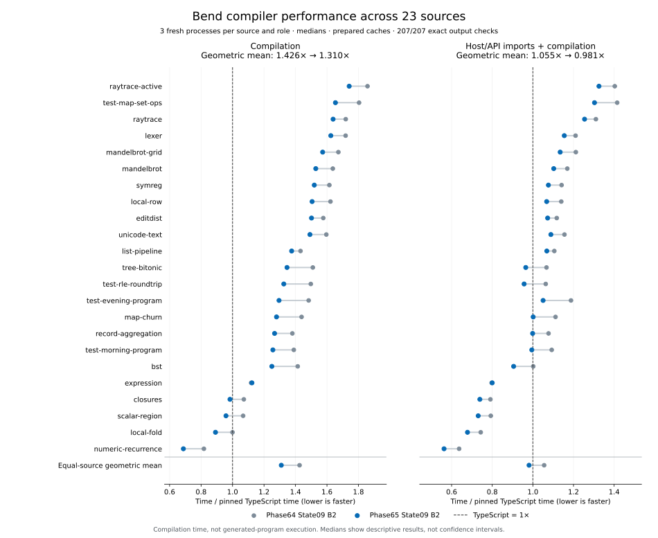

# Phase65 State09: compilation results

**Scope update:** these immutable measurements use State09 and the exact pinned
upstream Base. Before promotion, State10 is adding an explicit pinned-Base guard
to both optional-product production and consumption, so an arbitrary custom Base
cannot gain the product capability. State09's 207-worker result is not a
measurement of the corrected State10 host and is not a custom-Base correctness
claim. Selected-host qualification and a fresh screen remain separate.

The combined genuine-B2 candidate reduces compilation time by **8.15%** across
23 source programs, from **1.426× to 1.310× pinned TypeScript** in the same
balanced campaign. Including host/API import time, it changes **1.055× → 0.981×**.
The import-inclusive aggregate is slightly faster than TypeScript; the compiler
request itself is still **31.0% slower** on this equal-source metric. These are
compilation measurements, not generated-program execution measurements.

All **207/207 full emitted-module comparisons pass**. This report establishes
performance and exact output observations for the frozen candidate. Final
semantic, self-hosting and release qualification are separate gates; successful
performance measurements alone do not promote an installed compiler.

## Controlled result

The [compact matrix](evidence/state09-b2-broad.json) pins the raw report, images,
configuration and individual samples. Both Bend roles are actual compiler
images emitted by the checked Bend compiler. They are compared against the
same pinned upstream TypeScript compiler, with three fresh processes per source
and role and balanced role positions. Each source contributes equally through
the geometric mean of its within-source median ratios.

| Metric | Phase64 State09 B2 | Phase65 State09 B2 | Candidate / baseline |
| --- | ---: | ---: | ---: |
| Compilation / TypeScript | 1.42592× | 1.30976× | 0.91854× (−8.15%) |
| Host/API imports + compilation / TypeScript | 1.05549× | 0.98124× | 0.92965× (−7.03%) |
| Sources faster than TypeScript, compilation | 2/23 | 4/23 | — |
| Sources faster than TypeScript, import-inclusive | 5/23 | 10/23 | — |

**22 of 23 sources improve on both clocks.** On 18 sources, every candidate
sample is below every baseline sample on both clocks. The only median
regression is `expression`: compilation 343.13 → 344.69 ms (+0.45%), with
substantially overlapping ranges (baseline 330.84–344.92 ms; candidate
317.34–353.94 ms). Its import-inclusive change is +0.37%. These descriptive
ranges are not confidence intervals or proof that small regressions cannot
exist.

| Source | Baseline compilation | Candidate compilation | Change | Candidate / TS | With imports / TS |
| --- | ---: | ---: | ---: | ---: | ---: |
| mandelbrot | 601.09 ms | 561.32 ms | -6.62% | 1.529× | 1.103× |
| editdist | 549.59 ms | 523.49 ms | -4.75% | 1.502× | 1.073× |
| tree-bitonic | 492.57 ms | 439.05 ms | -10.86% | 1.346× | 0.965× |
| lexer | 600.78 ms | 567.90 ms | -5.47% | 1.624× | 1.155× |
| symreg | 538.96 ms | 507.01 ms | -5.93% | 1.519× | 1.076× |
| test-morning-program | 727.78 ms | 658.10 ms | -9.58% | 1.256× | 0.995× |
| test-evening-program | 901.22 ms | 786.81 ms | -12.69% | 1.295× | 1.050× |
| test-rle-roundtrip | 491.32 ms | 435.00 ms | -11.46% | 1.326× | 0.957× |
| test-map-set-ops | 1039.11 ms | 952.63 ms | -8.32% | 1.654× | 1.303× |
| raytrace | 845.66 ms | 806.09 ms | -4.68% | 1.639× | 1.254× |
| local-row | 567.01 ms | 526.19 ms | -7.20% | 1.505× | 1.068× |
| local-fold | 309.39 ms | 275.96 ms | -10.80% | 0.892× | 0.678× |
| scalar-region | 343.12 ms | 308.09 ms | -10.21% | 0.958× | 0.731× |
| mandelbrot-grid | 630.27 ms | 592.64 ms | -5.97% | 1.573× | 1.134× |
| raytrace-active | 896.95 ms | 840.75 ms | -6.27% | 1.741× | 1.325× |
| closures | 328.20 ms | 301.25 ms | -8.21% | 0.984× | 0.739× |
| list-pipeline | 693.32 ms | 666.00 ms | -3.94% | 1.375× | 1.069× |
| bst | 467.11 ms | 412.82 ms | -11.62% | 1.250× | 0.905× |
| unicode-text | 601.19 ms | 561.95 ms | -6.53% | 1.492× | 1.089× |
| expression | 343.13 ms | 344.69 ms | +0.45% | 1.123× | 0.800× |
| map-churn | 705.83 ms | 627.67 ms | -11.07% | 1.279× | 1.002× |
| numeric-recurrence | 243.36 ms | 204.57 ms | -15.94% | 0.688× | 0.563× |
| record-aggregation | 669.81 ms | 615.00 ms | -8.18% | 1.267× | 0.999× |

The candidate's compilation ratios span **0.688×–1.741× TypeScript**. The larger
remaining gaps are active raytrace (1.741×), Map/set operations (1.654×), raytrace
(1.639×) and Lexer (1.624×). The aggregate does not promise parity for each
program, and an import-inclusive ratio below one is not internal compilation
parity.

## What changed, and what the experiments show

H6 reorganizes the existing frame4 decoder into twelve small static constructor
readers. The binary format, eager domain validation, object layouts and graph
sharing remain unchanged. The initial attempt merely reduced unconditional
field reads; it made fresh decoding 4.7% slower and was rejected. V8 traces then
showed expensive repeated optimization of a large construction loop. Smaller
static readers reduced the isolated first complete decode from **64.47 to
27.13 ms**, passing the same 87 controls and eight workers. A separate same-B2
four-source helper-only experiment reduced complete compilation by **10.93%**
with all 16 modules identical. That experiment supplies a direct whole-request
falsifier before rebuilding the compiler. See [decoder findings](decoder.md).

H2 retains expensive checked Base annotations as an optional product. The Bend
implementation produces and admits the semantic facts. The host stores a
437,464-byte product body separately, reads its small identity/key header first,
and reads the body only for an eligible request. The threshold is a generic
64-body-term work estimate, not a list of benchmark program names. The existing
owned prepared-world checks and current stops still govern admission. The
focused owned controller proved actual reuse of seven Map annotations, complete
structural/output equality, and lazy no-hit/fallback behavior. Its B1 screen
showed a 5.56% Map improvement. See [Base products](base-products.md) and
[transport contract](cache-contract.md).

The final broad result measures **H6 and H2 together**. It does not attribute an
incremental B2 gain to H2: separate H6-only and combined campaigns use different
images, moments and sample sets. Their ratios must not be subtracted or
multiplied to infer a component contribution. A controlled same-image artifact
ablation is the appropriate discriminator for that narrower question.

That [separate ablation](evidence/base-annotations-incremental-b2.json) now passes
all 12 complete-output workers. With the actual combined B2, H6 helper, driver,
Base and frame unchanged, adding the sidecar changes Map 985.53 → 934.95 ms
(**−5.13%**) and map-churn 639.98 → 619.85 ms (**−3.15%**). Numeric's no-hit
request changes 191.32 → 190.43 ms (−0.46%), a small overlapping-range result.
The equal-source compilation change is −2.93% across these three selected
sources. This measures the incremental value of artifact presence with H2 code
retained in both roles; it is neither full H2 removal nor a 23-source estimate.
The ablation also uses State09's exact pinned Base, not arbitrary custom Bases.

Other hypotheses were rejected or deferred before expensive final validation:
normalized annotation heads had negligible whole-request benefit; constructor
indexing did not clear the screen threshold; the larger shallow-substitution
guard regressed Map; the Boolean and tiny-leaf variants had mixed B1 evidence;
and actual-B2 opportunity censuses found no eligible cases for the proposed
ordered-let and nested-closure fast paths. Their failed, rejected and unrun
receipts remain preserved. The [measurement report](measurement.md) records the
individual scopes and sample limitations.

## Iteration cost and qualification boundary

The integrated B2 passed the 16-worker fast four-source screen in **18.62 s**
after a shared three-role preparation taking **14.57 s**. The final 207-worker
campaign then took **213.18 s** (3 min 33 s), with maximum worker process-tree
RSS **161.20 MiB**. Preparation, image construction and semantic controls are
separate costs. Explicit Base preparation observed 2.733 s for the baseline and
3.640 s for the candidate in one process each; these are setup observations,
not balanced preparation-speed estimates. Request clocks exclude that setup.

These are fresh-process requests with prepared persistent artifacts and
explicitly separated host/API import and compilation clocks. Identity hashing
and exact output verification occur outside those clocks. The candidate's
optional sidecar is required and its bytes/membership are checked before and
after every worker, even on no-hit sources; the historical baseline's absence
is pinned. This is not an OS-cold filesystem benchmark. The 23-source catalog
covers the established 45-point generated-program suite through source mapping;
this campaign measures each unique source once per round, not 45 compilation
inputs or arbitrary language variability.

The selected source adds **117 physical Bend lines (+0.414%)**, 15 definitions
and one data type; all 114 old Bend modules remain byte-identical to Phase64.
This is a measured performance tradeoff, not a simplification claim. The
[size and concept audit](size.md) separates Bend, host support, generated code
and experimental tooling.

The genuine candidate image is
`239f79702c13339d1044e7fe497c4946299d36ce2d7b5eb7850d0d43514a8fae`;
its assembled source is
`310c9d077fcb0a4ba8ed42fec3882b1ef761709a65b2f1429aa501a158403e4c`.
The checked producer exports 99 validated roots. The baseline remains genuine
Phase64 State09 B2
`b09fe54ad58d105d1c77ccb399f4076660d6109cf2a7f4b21e13933b89c22c2e`.
No synthetic checked sidecar substitutes for actual B2 generation.

An external interruption of approximately **01:56–03:59 UTC** is recorded
[separately](evidence/interruption.json). That roughly two-hour interval must
not be described as optimization work or validation waiting. Final guarded
process accounting is deferred until all targets close.
