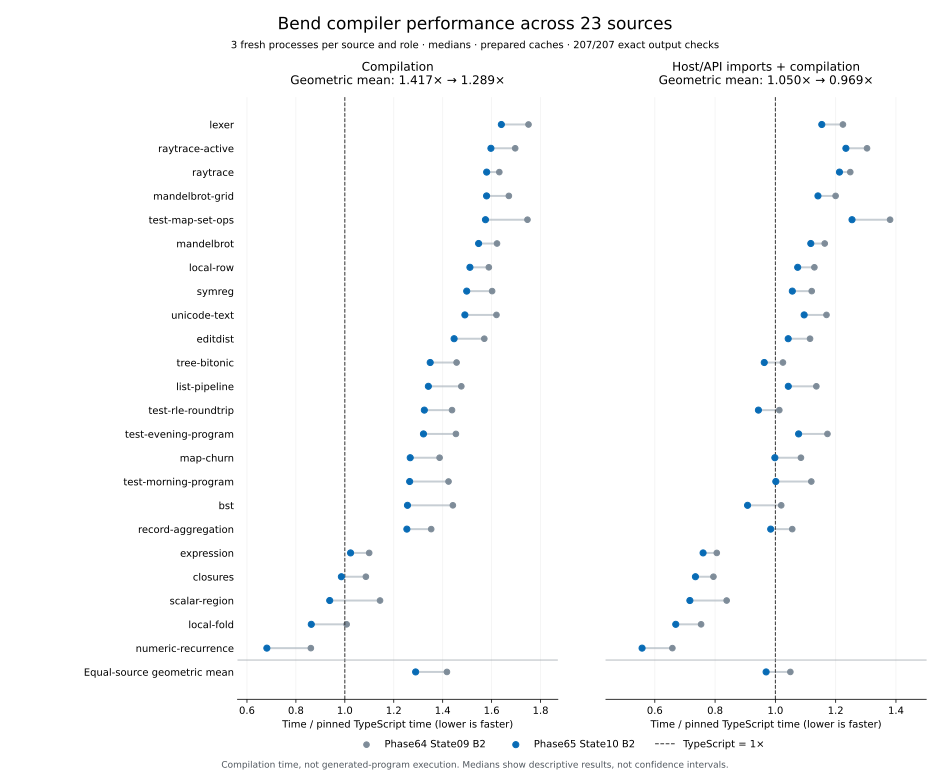

# Phase65 State10: selected compiler results

The selected State10 compiler takes **1.289× TypeScript's compilation time**
across the established 23-source suite, down from **1.417×** for Phase64 State09
in the same campaign. That is **9.03% less compilation time**, with every source
median improving. Including host/API imports, the ratio is **0.969× TypeScript**:
slightly faster overall on that separate clock, while compilation itself still
has a **28.9% deficit**. This measures compiler latency, not generated-program
execution.

The headline uses the **genuine B2 benchmark image**. The installed release is
the independently qualified **equality-derived B1** from the same selected Bend
source. Its API artifact and generation are distinct; the B2 latency numbers
must not be assigned to the installed B1 bundle.

All **207/207 complete emitted modules match** their qualified oracles. These
are measurements of the actual corrected State10 host and genuine B2 image;
they do not reuse or relabel the earlier State09 samples. The [compiler qualification join](evidence/state10-qualification.json) and the
[installed-release join](evidence/state10-release.json) now both pass. Release,
CLI and helper-integrity completion is backed by separate actual receipts.

## Final controlled comparison

Both Bend roles are genuine compiler images emitted by their checked Bend
compiler, compared with pinned upstream TypeScript on CPU3. Three fresh
processes per source and role rotate through balanced positions. Each source
contributes equally to the geometric mean of within-source median ratios.
The [complete compact matrix](evidence/state10-b2-broad.json) records the samples,
image identities, raw output checks and source receipt hashes.

| Metric | Phase64 State09 B2 | Phase65 State10 B2 | Change |
| --- | ---: | ---: | ---: |
| Compilation / TypeScript | 1.41737× | 1.28945× | −9.03% |
| Host/API imports + compilation / TypeScript | 1.04969× | 0.96926× | −7.66% |
| Sources faster than TypeScript, compilation | 1/23 | 4/23 | — |
| Sources faster than TypeScript, import-inclusive | 5/23 | 10/23 | — |

All **23/23 source medians improve on both clocks**. Twenty-one sources have
all candidate samples below all baseline samples on both clocks; `editdist`
and `unicode-text` have overlapping ranges. These are descriptive observations
from three samples, not confidence intervals. Per-source compilation reductions
range from **3.17% to 20.88%**.

| Source | Baseline compilation | State10 compilation | Change | State10 / TS | With imports / TS |
| --- | ---: | ---: | ---: | ---: | ---: |
| mandelbrot | 597.29 ms | 569.61 ms | -4.63% | 1.547× | 1.118× |
| editdist | 541.96 ms | 499.36 ms | -7.86% | 1.447× | 1.043× |
| tree-bitonic | 470.73 ms | 435.88 ms | -7.40% | 1.349× | 0.963× |
| lexer | 603.88 ms | 565.61 ms | -6.34% | 1.640× | 1.154× |
| symreg | 533.19 ms | 498.62 ms | -6.48% | 1.498× | 1.056× |
| test-morning-program | 742.39 ms | 659.59 ms | -11.15% | 1.265× | 1.001× |
| test-evening-program | 884.09 ms | 803.46 ms | -9.12% | 1.321× | 1.077× |
| test-rle-roundtrip | 467.83 ms | 431.01 ms | -7.87% | 1.325× | 0.944× |
| test-map-set-ops | 1047.40 ms | 944.50 ms | -9.82% | 1.575× | 1.254× |
| raytrace | 814.64 ms | 788.82 ms | -3.17% | 1.580× | 1.213× |
| local-row | 551.10 ms | 524.31 ms | -4.86% | 1.511× | 1.074× |
| local-fold | 313.06 ms | 268.14 ms | -14.35% | 0.863× | 0.669× |
| scalar-region | 364.06 ms | 298.61 ms | -17.98% | 0.938× | 0.716× |
| mandelbrot-grid | 625.75 ms | 591.61 ms | -5.46% | 1.579× | 1.141× |
| raytrace-active | 903.82 ms | 850.96 ms | -5.85% | 1.597× | 1.234× |
| closures | 331.24 ms | 300.71 ms | -9.22% | 0.986× | 0.735× |
| list-pipeline | 710.62 ms | 645.77 ms | -9.13% | 1.341× | 1.043× |
| bst | 468.58 ms | 408.30 ms | -12.87% | 1.256× | 0.908× |
| unicode-text | 652.39 ms | 600.41 ms | -7.97% | 1.491× | 1.095× |
| expression | 341.05 ms | 317.46 ms | -6.92% | 1.024× | 0.760× |
| map-churn | 683.19 ms | 624.05 ms | -8.66% | 1.267× | 0.998× |
| numeric-recurrence | 258.05 ms | 204.16 ms | -20.88% | 0.681× | 0.558× |
| record-aggregation | 662.12 ms | 613.44 ms | -7.35% | 1.254× | 0.984× |

State10's compilation ratios range **0.681×–1.640× TypeScript**. The remaining
large gaps include Lexer (1.640×), active raytrace (1.597×), raytrace (1.580×),
Mandelbrot grid (1.579×), and Map/set operations (1.575×). Import-inclusive
aggregate parity does not establish internal compilation parity or parity for
each program.

## Selected changes and the evidence for them

The [static frame4 decoder](decoder.md) separates twelve constructor readers
into small functions while preserving the binary format, eager validation,
object layouts and sharing. V8 diagnostics showed that the original large loop
repeatedly incurred costly compilation and deoptimization. The first attempted
load reduction regressed fresh decoding and was rejected. Splitting the
optimization units instead reduced isolated first decoding **64.47 → 27.13 ms**,
then improved actual whole compilation in a same-image four-source experiment.
This is host transport code; compiler algorithms remain written in Bend.

The [Base annotation product](base-products.md) retains expensive annotations
produced and admitted by Bend. It uses a generic body-size threshold of 64 terms,
with a small header checked before heavy product reading. The final host admits
this optimization only for the **exact pinned upstream Base**. Custom Base files
use ordinary annotation; arbitrary source/API injection does not grant access
to cached facts. Current stops and the authenticated prepared-world contract
remain authoritative. See [transport and admission](cache-contract.md).

A [separate same-image ablation](evidence/base-annotations-incremental-b2.json)
changes only product presence with the combined B2, decoder, driver and frame
unchanged. Its 12 exact-output workers show Map **−5.13%** and map-churn
**−3.15%**, with a small overlapping-range no-hit Numeric result. That measures
artifact value on three chosen sources with H2 code retained, not full removal
of H2 or its independent contribution to the final 23-source mean.

State09 first supplied a broad measured result. Review then identified the
need to restrict both product production and consumption to the exact pinned
Base before promotion. State10 adds that guard and removes only blank helper
lines. The actual Bend source, checked B1 and newly emitted B2 hashes are
identical between the two states; their host snapshots differ. A fresh State10
preparation, fast screen and full broad campaign remove ambiguity about which
host was measured. The [State09 report](state09-results.md), failed attempts and
all earlier receipts stay preserved. Differences between separate campaign
ratios are not attributed to a speed effect from the correctness guard.

## Cost, size and remaining qualification

One shared three-role preparation took **15.15 s**. The initial two-role,
four-source screen took **19.26 s**, with 16 exact outputs, before spending
**209.74 s** (3 min 30 s) on the final 207-worker broad comparison. Maximum broad
worker process-tree RSS was **169.34 MiB**. Explicit Base preparation observed
3.038 s for the baseline and 3.673 s for the candidate in one process each;
these are setup observations, not balanced preparation-speed estimates.

Request clocks exclude preparation, preflight identity hashing and post-clock
output verification. The persistent cache and candidate sidecar are prepared;
each worker is a fresh process. Sidecar presence/membership/bytes are verified
before and after every worker, even on no-hit inputs; historical baseline absence
is explicit. This is not an OS-cold storage measurement. The suite has 23 unique
compilation sources mapped to the established 45-point program benchmark, not
45 independently compiled sources or an exhaustive sample of the language.

The selected Bend source adds **117 physical lines (+0.414%)**, 15 definitions
and one data type. All 114 previous Bend modules are byte-identical; the new
module is `check/base-products.bend`. This is a small performance-oriented
increase in maintained concepts, not a simplification claim. The [size audit](size.md)
keeps Bend, host support, generated code and experimental tooling separate.

The actual selected B2 image is
`239f79702c13339d1044e7fe497c4946299d36ce2d7b5eb7850d0d43514a8fae`;
the assembled source is
`310c9d077fcb0a4ba8ed42fec3882b1ef761709a65b2f1429aa501a158403e4c`.
There are 99 validated exported roots. The baseline remains actual Phase64 B2
`b09fe54ad58d105d1c77ccb399f4076660d6109cf2a7f4b21e13933b89c22c2e`.
These images have genuine emission receipts, not synthetic checked sidecars.

The [compiler qualification join](evidence/state10-qualification.json) verifies
4,171 input identities and passes the selected compiler gates. It binds strict36,
99 exported roots, genuine emission, fresh B2 own-source type acceptance with
the expected unsafe proof-trust refusal, and exact B2/B3 fixed-point bytes.
The genuine-B2 semantic suites pass 96 source, 34 numeric, 18 composition and
two overapplication observations. These suites overlap and are finite; their
success is not full-language conformance or a mathematical proof of the compiler.

Selected-host program checks pass all 45 observations. The separate B2 output
gate checks 23 source modules and their 45-point mapping byte-for-byte; that gate
does not execute the generated programs. Focused checks include arena87,
actual-host79, optional-product-host60, actual B2 cached annotation reuse and
custom-Base fallback. Reused checked-compiler gates are admitted only through
explicit identical compiler-source/API proof and preserved successful resumes;
original failed receipts remain failed.

The [installed-release join](evidence/state10-release.json) passes all five
release jobs, 42 legacy CLI checks, 24 default CLI checks and five helper
integrity checks. It verifies 392 identities, the seven current release files,
seven prior files retained in history and raw copies, and the 110 inherited
protected files. The installed API is equality-derived B1
`3a7fedb77003aecc797cd9a9ac4c6d1bd15bd21dd1230806b6719565eca10f72`;
its separate genuine-B2 image supplies the performance headline above.

The [preservation audit](evidence/closed-evidence-preservation.json) independently
rehashes all **15,922 closed Phase64 files**, the published archive and all
**110 protected inherited inputs**, with no changes or errors. The closed
[Phase65 capsule](../../selfhost/tools/performance/phase65/artifacts/README.md)
preserves 17,894 raw files in two archive parts totaling 99,065,307 bytes.
Every archived member was reopened and hash-verified; the original inventory
and protected predecessors were verified unchanged after publication.

## Time accounting

The [final guarded account](evidence/time-account-final.json) covers 00:49:17 to
04:43:16.668 UTC: **3 h 53 min 59.7 s elapsed**. The [external interruption](evidence/interruption.json)
is approximately **01:56–03:59 UTC (123 min)**. About 65.2 s of closed target
intervals overlap those approximate boundaries, reflecting actual recorded
process work rather than inventing total inactivity.

Across 858 closed supervisor receipts, including four failed receipts preserved
in the evidence, the union of target intervals is **39 min
50.4 s**; nested supervisors/workers are not double-counted. Outside the
approximate interruption, the elapsed window is **1 h 50 min 59.7 s**, with
**38 min 45.2 s** of closed target occupancy (**34.9%**) and **72 min 14.5 s**
uncovered by target guards. Uncovered time is unclassified source/tool work,
analysis, review, coordination or waiting; it is not a measured idle-time or
active-effort total. This measures occupied wall intervals, not CPU utilization.
There are no open, late-finishing or unreadable target receipts at cutoff.

Final report edits, raw sealing, archive publication and Git work after that
cutoff are outside this account. The source and byte-identical raw account copy
were written before closure; later archive time is not silently added to them.
