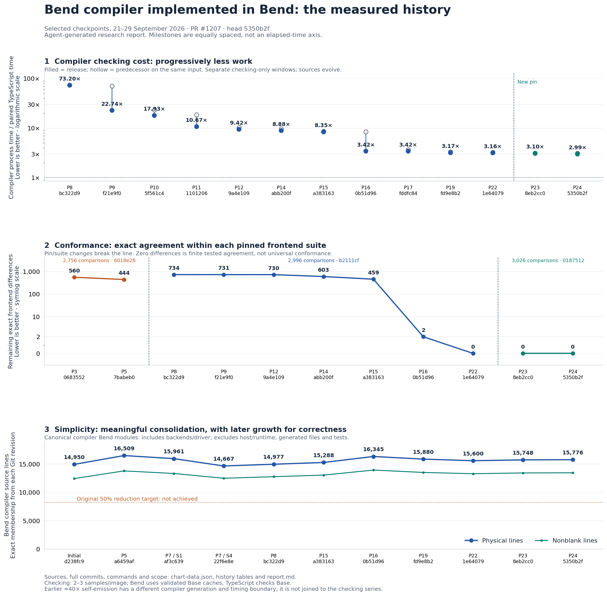
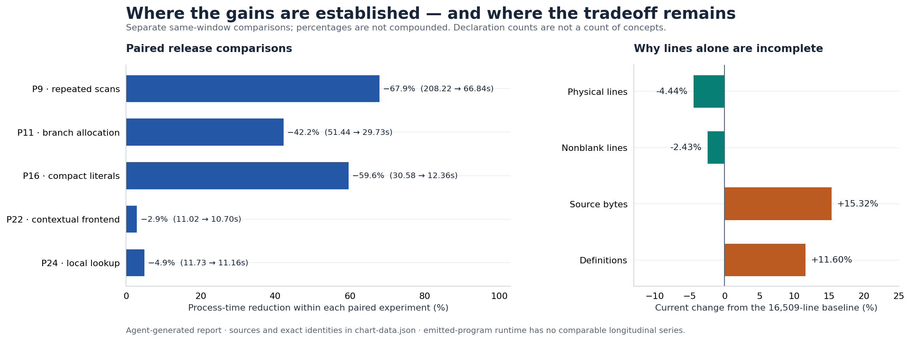
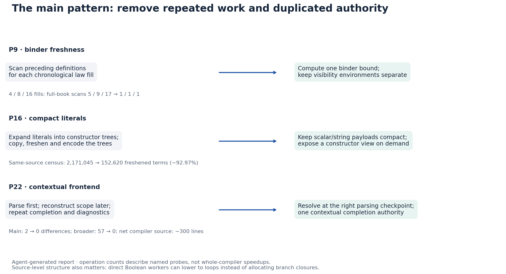

# Agent-generated technical report — Codex

*Prepared by the coding agent that worked on this fork. This is a retrospective synthesis of preserved reports, measurements and Git history, through [`5350b2f`](https://github.com/rom1504/bend/commit/5350b2fec8f6f8484c7a689e915b359d7ce86847).*

We implemented a Bend compiler in Bend and iterated on compilation cost, compatibility with the TypeScript reference, and implementation complexity. The most useful findings were about repeated work, representation, and the order in which parsing and checking demand information.

The current target is upstream [`0187512`](https://github.com/bendlang/bend/commit/018751270e800bc222a93dad7f257083ee53a5f7), following 2.0.34. Ordinary compilation runs the Bend implementation without a TypeScript fallback. The installed image is a guarded derivative of an upstream-checked bootstrap compiler. Earlier versions established self-emitted fixed points; the current release does **not** establish a new self-emitted fixed point.

| Metric | Current evidence |
| --- | --- |
| Compilation speed | 11.156s versus 3.737s for pinned TypeScript: **2.985× process time** on the frozen compiler-source checking workload. Request-only ratio: **4.043×**. |
| Development loop | About **27.6s** for a checked bootstrap, Base preparation and 36 focused checks; an observed development run, not an exclusive timing benchmark. |
| Frontend conformance | **3,026/3,026** exact main parse/check comparisons, plus **196/196** exact broader comparisons. These are finite, partly overlapping selections. |
| Backend conformance | Latest bounded pilot: **81/81 exact**, comprising 77 execution rows and four frontend boundary rows. Full backend coverage remains open. |
| Compiler source | **15,776 physical / 13,467 nonblank Bend lines**, 588,084 bytes, 60 modules. Excludes host/runtime, generated artifacts, tests and experimental archives. |
| Generated-program speed | No representative current longitudinal runtime benchmark series. Emission cost and generated source size have separate measured improvements. |

[Current report and scope](https://github.com/rom1504/bend/blob/5350b2fec8f6f8484c7a689e915b359d7ce86847/implementation/phase24/profile-and-coverage.md).

## The history, with measurement boundaries visible

Each speed checkpoint has its own paired TypeScript measurement and frozen input. The inputs, compiler generation, upstream pin and timing boundary evolved. Consequently, the early “about 40×” and current “about 3×” figures are useful historical landmarks, **not a controlled 13× speedup of one unchanged task**.

The early self-emitted compiler took 2,157s for a full library-emission run, against a separately sampled 48.7s TypeScript reference; small-program full-emission comparisons were around 35–36×. Later we made a checked bootstrap-derived image the ordinary development compiler, and then established a new checking-only baseline after the upstream migration. The plot deliberately keeps those different generations and workloads separate. [Early full-emission measurements](https://github.com/rom1504/bend/blob/5350b2fec8f6f8484c7a689e915b359d7ce86847/implementation/phase1/rapid_performance_experiments.md), [full-source historical comparison](https://github.com/rom1504/bend/blob/5350b2fec8f6f8484c7a689e915b359d7ce86847/implementation/phase1/report.md), [later baseline](https://github.com/rom1504/bend/blob/5350b2fec8f6f8484c7a689e915b359d7ce86847/implementation/phase8/checking-cost.md).

The strongest causal evidence is the **old and new compiler measured on the same input in the same window**:

| Release / commit | Before → after | Less process time | Main change |
| --- | ---: | ---: | --- |
| P9 / [`f21e9f0`](https://github.com/rom1504/bend/commit/f21e9f0a7bf098b48405fc300d8a676be28adae9) | 208.22 → 66.84s | 67.9% | Remove repeated binder-bound scans; smaller checking/equality repairs |
| P11 / [`1101206`](https://github.com/rom1504/bend/commit/1101206b62532ffce0e85b7f451d1c6d5fd6b0ac) | 51.44 → 29.73s | 42.2% | Avoid branch wrappers; reuse known constructor structure |
| P16 / [`0b51d96`](https://github.com/rom1504/bend/commit/0b51d965e2638048b5526b351047daae0c61ed7c) | 30.58 → 12.36s | 59.6% | Compact literal representation and integrated frontend changes |
| P22 / [`1e64079`](https://github.com/rom1504/bend/commit/1e640798c7b74c32a1d3f3335727d7be918795b9) | 11.02 → 10.70s | 2.9% | One contextual frontend, with measured lookup repairs |
| P24 / [`5350b2f`](https://github.com/rom1504/bend/commit/5350b2fec8f6f8484c7a689e915b359d7ce86847) | 11.73 → 11.16s | 4.9% | Skip provably absent local scans; use a direct membership worker |

These are combined release effects, not isolated attribution to a single helper. Most screens have two samples per image; the latest has three. They are bounded observations on one machine, not general speed guarantees. The recent protocol uses fresh processes, controlled execution order, recorded resource limits and input identities. Bend uses validated Base caches; TypeScript checks Base. Process time includes startup and provenance hashing; request time has a different boundary. The percentage gains must not be compounded across changed workloads.

## Main findings

**1. Repeated whole-book work mattered more than a blanket “Bend is slow” explanation.** Chronological law fills repeatedly scanned preceding definitions to compute a fresh binder bound. Computing that bound once reduced full-book scans on 4/8/16-fill probes from **5/9/17 to 1/1/1**, while keeping declaration visibility separate. Later index optimizations similarly needed a narrow invariant: an index miss can prove a local name absent, while an index hit must retain the original first-event lookup. Different indexes can choose different winners for duplicate names. [P9](https://github.com/rom1504/bend/blob/5350b2fec8f6f8484c7a689e915b359d7ce86847/implementation/phase9/checker_speed.md), [P24 review](https://github.com/rom1504/bend/blob/5350b2fec8f6f8484c7a689e915b359d7ce86847/implementation/phase24/profile-review.md).

**2. Compact values prevented downstream work from being created.** Expanded numeric/string literals produced constructor trees that were repeatedly copied, freshened and serialized. Compact literals with an on-demand constructor view reduced a same-source structural census from **2,171,045 to 152,620 freshened terms**, retaining all located terms. Constructor/list JSON fell from **337MB to 25.3MB**. The final release comparison reduced checking time by **59.6%** and peak RSS by **62.7%**. The structural census and final timing use separately identified source snapshots; they are not the same run. Keeping quantity presence, literal/constructor identity and specialization keys correct was essential. [P16](https://github.com/rom1504/bend/blob/5350b2fec8f6f8484c7a689e915b359d7ce86847/implementation/phase16/consolidation.md).

**3. Source shape can make the existing emitter do less work.** A Boolean passed to a small worker can allow recursive membership/lookup to lower into a loop, avoiding per-miss branch closures and trampoline messages. This is a promising small upstream benchmark: equivalent source shapes can have materially different allocation behavior. It does not by itself establish an upstream emitter bug. Larger transformations were less convincing: a selector prototype saved 10.6% but added enough maintained machinery that we deferred it. [Lookup worker](https://github.com/rom1504/bend/blob/5350b2fec8f6f8484c7a689e915b359d7ce86847/implementation/phase17/find-worker.md), [deferred rewriter](https://github.com/rom1504/bend/blob/5350b2fec8f6f8484c7a689e915b359d7ce86847/implementation/phase13/structured_rewriter.md).

**4. Exact compatibility required matching semantic checkpoints.** A largely context-free parse followed by later scope reconstruction could not reliably reproduce a parser that needs lexical information immediately. Error order is observable: a later syntax error must not replace an earlier completed-body error. One contextual frontend and one materializer eventually replaced duplicate scope/alias/completion paths. The first measured contextual candidate was **32.8% slower**; profiling, guarded lookups and a constructor index brought the final comparison to **2.9% less time** than its predecessor. The failed intermediate screens remain in the report. [P22](https://github.com/rom1504/bend/blob/5350b2fec8f6f8484c7a689e915b359d7ce86847/implementation/phase22/contextual-conformance.md).

**5. A fast validation loop enabled the investigation.** A historical self-reproduction stage took about **39.45 minutes**. We stopped using that as the routine edit gate: a checked bootstrap plus focused differential tests took about **40.5 seconds** early on and roughly **28 seconds** in the latest phase. This changes the validation task; it is not a 90× improvement in fixed-point reproduction. Broad suites and self-reproduction remain separate integration evidence. [Workflow measurement](https://github.com/rom1504/bend/blob/5350b2fec8f6f8484c7a689e915b359d7ce86847/implementation/phase2/report.md).

## Conformance: what reached 100%, and what did not

Exact comparison includes acceptance/refusal, phase, diagnostics and other recorded result fields. It is stronger than counting successful positive programs, but remains finite testing.

| Pinned target | Milestones | Remaining exact frontend differences |
| --- | --- | --- |
| `6018e28` / 2,756 comparisons | P3 → P5 | **560 → 444** |
| `b2111cf` / 2,996 comparisons | P8 → P9 → P12 → P14 → P15 → P16 → P22 | **734 → 731 → 730 → 603 → 459 → 2 → 0** |
| `0187512` / 3,026 comparisons | P23 → P24 | **0 → 0** |

The increase at the first migration reflects an updated target, suite and comparison contract, rather than a regression on a fixed corpus. Earlier failures included semantic gaps and exact diagnostic disagreements; all differences should not be interpreted as wrong acceptance of programs. [Earlier exact comparison](https://github.com/rom1504/bend/blob/5350b2fec8f6f8484c7a689e915b359d7ce86847/implementation/phase3/frontend-final.md), [migration](https://github.com/rom1504/bend/blob/5350b2fec8f6f8484c7a689e915b359d7ce86847/implementation/phase8/upstream_and_conformance.md).

Broader testing remained important even when the main suite was nearly exact. A neighboring 196-observation selection started at **128/196 exact**, progressed to **136**, then **139**, and reached **196/196** with contextual parsing. Later, the backend pilot exposed foreign/constructor collision handling and native identifier collisions despite perfect frontend agreement. Those were **bugs in our implementation**; the reference already handled them. The pilot improved **78/81 → 81/81 exact**, with 67 of 2,644 positive execution opportunities and all 10 expected-error execution opportunities acquired in this pilot. [Broader controls](https://github.com/rom1504/bend/blob/5350b2fec8f6f8484c7a689e915b359d7ce86847/implementation/phase22/contextual-conformance.md), [backend census](https://github.com/rom1504/bend/blob/5350b2fec8f6f8484c7a689e915b359d7ce86847/implementation/phase24/backend-census.md).

Thus “100%” here means the stated frontend observations match the pinned reference. It does not establish universal language equivalence, complete backend/device coverage, or independent proof-kernel validation. Raw runner failures remain visible where fixtures expect an error at a later emission stage; exact comparison is a separate result.

## Simplicity: fewer competing mechanisms, not a monotonic size reduction

The canonical Bend source went **14,950 → 16,509 → 14,667 → 16,345 → 15,776 lines** across the initial snapshot, pre-simplification baseline, dedicated cleanup, major conformance expansion, and current release. The cleanup achieved **11.16% fewer physical lines**, **9.40% fewer nonblank lines**, and **7.82% fewer bytes**. Current source is **4.44% fewer lines but 15.32% more bytes** than that baseline. The 50%/75% reduction targets were not achieved.

The useful conceptual reductions were concrete:

- Removed obsolete alternative algorithms: **548 lines**, with the selected generated compiler unchanged.
- Used one loader trace for provenance: **135 lines** removed and no reparsing to reconstruct source origins.
- Returned one structured checker result: **139 Bend lines** removed; diagnostics no longer rechecked a failing body repeatedly.
- Shared ordinary and live-instance checking instead of keeping a second semantic traversal.
- Used one contextual frontend: **300 net lines** removed while closing the remaining measured frontend gaps.

[Cleanup reports](https://github.com/rom1504/bend/blob/5350b2fec8f6f8484c7a689e915b359d7ce86847/implementation/phase7/s4-report.md), [shared live checking](https://github.com/rom1504/bend/blob/5350b2fec8f6f8484c7a689e915b359d7ce86847/implementation/phase19/live-checker-release.md), [contextual frontend](https://github.com/rom1504/bend/blob/5350b2fec8f6f8484c7a689e915b359d7ce86847/implementation/phase22/contextual-conformance.md).

Declaration counts are structural proxies, not a count of concepts. Many `law` declarations were forward signatures: removing redundant declarations does not mean removing proofs or language features. Generic traversal/evaluator experiments were sometimes larger, slower, or wrong under stronger demand-order controls, and were not promoted. [Rejected architectural experiments](https://github.com/rom1504/bend/blob/5350b2fec8f6f8484c7a689e915b359d7ce86847/implementation/phase7/architecture-report.md).

## Generated code and remaining opportunities

One concrete backend improvement, inspired by upstream's compact Nat lowering, reduced the C output for a `Nat 300` witness from **20,589,858 to 269,358 bytes**. C emission fell from **27.032s to 3.609s**, or **7.49× faster**. These measurements exclude Clang and execution of the resulting program. Conversely, the latest collision-free identifiers increased one saved C output by 22.27%. There is no basis for a general generated-program runtime speedup claim. [Native reconstruction](https://github.com/rom1504/bend/blob/5350b2fec8f6f8484c7a689e915b359d7ce86847/implementation/phase11/known_work.md).

The most useful follow-ups are small reproducible cases for source-shape allocation costs, continued backend differential acquisition, and representative emitted-program execution benchmarks. The retained experiment records include hypotheses, exact inputs, failed attempts and recovery instructions, so promising ideas and unsuccessful approaches can both be inspected. [Experiment method](https://github.com/rom1504/bend/blob/5350b2fec8f6f8484c7a689e915b359d7ce86847/experiments/README.md), [latest evidence index](https://github.com/rom1504/bend/blob/5350b2fec8f6f8484c7a689e915b359d7ce86847/implementation/phase24/evidence/README.md).
