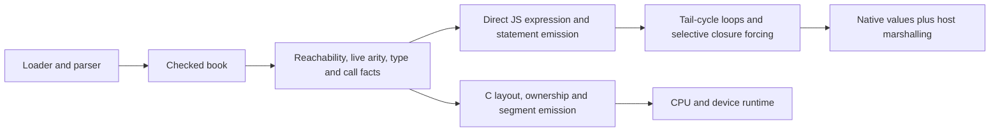

# Pinned Bend compiler implemented in TypeScript

Surveyed 2026-10-04 against `018751270e800bc222a93dad7f257083ee53a5f7`.
This means upstream Bend's compiler, **not Microsoft's TypeScript compiler**.
It is our benchmark reference, not a survey of upstream HEAD. No upstream update,
compiler build or performance measurement was performed for this document.

## Source evidence

The local tracked files were inspected directly and `git diff <pin> --
bend2/comp.ts` was empty. The compiler source SHA256 is
`3bd7ed49d33f1c61334d75a905e38c0345fb15a10b45d85884b77f49833dc5ee`.
Links below resolve to the exact reference revision.

| Source | Inspected responsibility and symbols |
| --- | --- |
| [bend.ts](https://github.com/bendlang/bend/blob/018751270e800bc222a93dad7f257083ee53a5f7/bend2/bend.ts) | `TermOf`, `HTerm`, `Book`, `parse_book`, `term_wnf`, `term_infer`, `term_check`, `book_valid`: language representation and front/check interface; this survey does not re-audit the kernel. |
| [comp.ts: caches and call spines](https://github.com/bendlang/bend/blob/018751270e800bc222a93dad7f257083ee53a5f7/bend2/comp.ts#L567) | `OPENS`, `USES`, `TELES`, `SPINES`, `FUNS`, `LOOPS`, `term_open`, `term_spine`, `call_eta`. |
| [comp.ts: function facts](https://github.com/bendlang/bend/blob/018751270e800bc222a93dad7f257083ee53a5f7/bend2/comp.ts#L1253) | `fun_of`, `def_raise`, `loop_of`, `file_book`: live arity/layout, tail components, reachable definitions. |
| [comp.ts: JavaScript generation](https://github.com/bendlang/bend/blob/018751270e800bc222a93dad7f257083ee53a5f7/bend2/comp.ts#L3042) | `js_call`, `js_expr`, `js_func`, `js_match`, `js_def`, `js_marshal`, `js_host`, `js_lib`. |
| [comp.ts: primitive templates](https://github.com/bendlang/bend/blob/018751270e800bc222a93dad7f257083ee53a5f7/bend2/comp.ts#L240) | Native Nat, String and Array operations; host representation is chosen at lowering. |
| [comp.ts: JavaScript runtime](https://github.com/bendlang/bend/blob/018751270e800bc222a93dad7f257083ee53a5f7/bend2/comp.ts#L6110) | `array_new`, `array_rmw`, `run_tail`, `run_clo`, `run_loop`, `run_lib`. |
| [comp.ts: C pipeline](https://github.com/bendlang/bend/blob/018751270e800bc222a93dad7f257083ee53a5f7/bend2/comp.ts#L2981) | `compile_book` iterates native ownership/layout facts and emits live segments. This is a different pipeline from `js_lib`. |

These are selected source regions of a compact shared implementation, not seven
independent source files. [Phase38's earlier inspection](../../design/phase38/research/bend-typescript.md)
documents the same pin before the general private backend was implemented.

## Architecture and representations



The source language has both first-order and higher-order term representations.
Compiler helpers expose lambda bodies using cached probes. The JavaScript
backend is a type-directed emitter over these terms and shared facts; it does
not expose an LLVM-like sequence of SSA optimization passes.

`term_spine` removes erased arguments and recognizes a saturated known target.
`fun_of` computes live arity and may expose lambdas under all arms of a function.
`loop_of` groups tail-call cycles. `file_book` establishes reachable definitions
and resets the relevant per-book caches. These facts are reused across emission.

The native pipeline is more involved: emission and ownership/layout inference
iterate until the counted facts stop changing. It then computes reachable
segments for the host/device partitions. Native borrowing, flat values and
segment optimizations must not be attributed wholesale to the JavaScript path.

## Why its generated JavaScript is often inexpensive

| Mechanism | Actual behavior | Phase45 selfhost comparison |
| --- | --- | --- |
| Known calls | A saturated known target becomes a positional JavaScript call. | JW now does this inside admitted first-order graphs; ordinary public execution retains descriptor handling. |
| Tail components | A loop/program counter handles a tail cycle, with fresh bindings each turn. | JW has exact SCCs, tail loops, and an additional bounded-native/non-tail continuation policy. |
| Closure calls | Unknown function values use JS closures; closure tail calls can produce bounce records. | Private function-value transport remains restricted; narrow callback/fusion paths already exist. |
| Selective forcing | After emission, a transitive tail fact determines which marked calls require `run_loop`. | Ordinary generic forcing and proof boundaries remain broader; do not remove them without a compatible fact. |
| Algebraic values | Ordinary ADTs use tagged objects with named fields; recognized native types use native representations. | JW has named private fields and direct native constructors, while public objects retain their ABI. |
| Naturals | Internal Number representation plus operation checks and host conversions. | Exact bounded Number Nat is now selected for qualifying complete private graphs. This is implemented, not a new proposal. |
| Arrays | Native JS arrays and direct get/set templates, with runtime helpers for particular operations. | A general typed Array/effect path is a substantial remaining coverage gap. |
| Shared analysis | Per-book maps cache opened terms, call spines, function facts and tail components. | Analysis and private emission still have opportunities for cross-root reuse. |

`js_lib` resolves its call markers only after all definitions have been emitted,
so it can avoid forcing results that cannot bounce. This is a small example of
carrying a semantic summary until the right decision point instead of imposing
runtime machinery on every call.

Its array operations also return and mutate particular source-level handles.
For example, read/size operations return a pair including the original array,
while update helpers preserve their own indexing and callback order. Replacing
our generic Array helper with an indexed load requires matching those semantics,
not merely matching a numerical checksum.

## What the short emitter does not establish

The two compilers do not expose identical internal host protocols. Selfhost's
public `G` entries and function descriptors expose mutable `code`, `env`, `bound`
and call behavior. The private worker must preserve supported mutation,
partial-application, demand and error observations when crossing that boundary.
A direct upstream call is evidence about a useful generated shape, not proof
that an arbitrary public selfhost call may bypass its descriptor.

Similarly, upstream's non-tail direct recursion is not a justification to delete
the selected worker's tested bounded-native/continuation stack policy. Borrowing
its output shape requires retaining that policy. Its marshalling may alter arrays or reconstruct objects;
that is not automatically a compatible implementation of our exported ABI.

No general-purpose JavaScript SROA, global value-numbering, escape-analysis or
loop-vectorization pipeline was found in the inspected JS path. Downstream V8
can perform optimizations after direct functions and native values are emitted.
This is a bounded source finding, not a claim that the entire compiler has no
related native transformations.

## Source size, with comparable scope

At the pin, physical line counts are `bend.ts` 3,869, `comp.ts` 6,468,
`main.ts` 908 and `safe.ts` 1,442. `comp.ts` includes shared analysis, multiple
backends and embedded runtimes. Its approximately 360-line JS emission section
is not comparable to selfhost's entire 23,007-line compiler source graph.
`safe.ts` includes proof-export functionality selfhost does not implement.
Formatting, source representation and runtime scope further limit LOC comparison.

Reproduce the counts without compiling:

```sh
python3 - <<'PY'
from pathlib import Path
for name in ['bend.ts', 'comp.ts', 'main.ts', 'safe.ts']:
    p = Path('bend2') / name
    print(p, len(p.read_text().splitlines()))
PY
```

## Best transfers now

1. **Complete known-call coverage through local functions**, with explicit
   capture arguments and one proved public entry. Phase45 already implements
   this for admitted complete first-order graphs; repeating it is not progress.
2. **Typed Array operations and separately proved result adaptation.** Their
   semantics should be visible to the IR rather than hidden in emitted text.
3. **Shared function/component summaries.** Compute live arity, target sets,
   effects, result representation and dependency identity once per valid scope.
4. **Preserve shape simplicity for V8.** Small direct helpers, stable fields and
   limited duplicate specialization are more useful than transplanting a native
   machine optimizer into the JavaScript backend.

The first experiment should count which current calls/allocations cannot receive
these treatments, then isolate one structural transformation. No new speedup
claim follows from this source survey. Current measurements and provenance are
in the [Phase45 report](../../implementation/phase45/README.md); proposed work is
ranked in [remaining opportunities](../../docs/remaining_opportunities/README.md).
